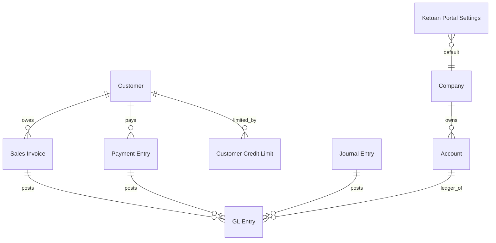

# Blueprint P0 — Portal Kế toán Tác nghiệp ("Bàn làm việc Công nợ & Quỹ")

> App: `ketoan` · Nền tảng: Frappe/ERPNext v16 custom app · Phong cách: NPP
> (nextcode + frappe-portal-spa + frappe-sales-analytics + frappe-app-shipping-gotchas)
> Trạng thái: **CHỜ DUYỆT** — chưa viết code app cho tới khi anh OK.

---

## Định vị (giữ trước khi đọc chi tiết)

- ERPNext v16 là **system of record**. Portal **không thay** ERPNext — nó là **lớp tác nghiệp**
  ngồi trên, **đọc dữ liệu thật** và **deep-link bấm thẳng xuống Desk** để thao tác ghi sổ.
- **Human-in-loop**: portal *phát hiện · phân tích · gợi ý*; người **quyết định và ấn nút** trong Desk.
  P0 **không** ghi sổ, **không** tạo bút toán tự động.
- P0 phủ **2 phân hệ**: **Phải thu** + **Tiền & quỹ**, theo 4 lăng kính
  (Chức năng nhẹ qua deep-link · Báo cáo sổ sách · Phân tích tác nghiệp · Cảnh báo).

---

## 1. Business model (`01`)

### Bối cảnh
- Đơn vị: doanh nghiệp phân phối (NPP), ~180+ nhà phân phối/khách hàng là đối tượng công nợ.
- Quy mô user: **phòng kế toán nhỏ 3–10 người**. Không multi-company phức tạp ở P0 (1 company chính).
- Pain hiện tại: số liệu công nợ/quỹ nằm rải trong Desk ERPNext, kế toán phải tự đi "đào sổ";
  rủi ro im lặng (NPP vượt hạn mức, nợ quá hạn, khoản thu treo, quỹ âm) không nổi lên thành việc.

### Actors & Roles
| Actor | Mô tả | Vai trò app |
|---|---|---|
| Kế toán công nợ / tác nghiệp | Theo dõi công nợ, quỹ, xử lý cảnh báo, thu tiền | `Ketoan Tac Nghiep` |
| Kế toán trưởng / phụ trách | Xem toàn cảnh + field nhạy cảm, cấu hình ngưỡng | `Ketoan Truong` |
| System Manager | Quản trị | (core) |

> Cả 2 role app đều **kế thừa quyền đọc** Accounts của ERPNext (Accounts User). Portal chỉ
> *đọc* và *điều hướng*; thao tác ghi vẫn qua quyền Desk sẵn có của user.

### Use cases P0
- **US-01**: Kế toán mở portal → thấy ngay "hôm nay" (tổng nợ, quá hạn theo rổ, quỹ, cảnh báo).
- **US-02**: Xem bảng kê công nợ theo NPP + tuổi nợ → bấm 1 khách → màn 360° công nợ khách đó.
- **US-03**: Từ 1 hóa đơn quá hạn → **deep-link** mở thẳng form Payment Entry (đã prefill khách) trong Desk.
- **US-04**: Xem sổ quỹ tiền mặt/tiền gửi: số dư, dòng tiền thu/chi theo ngày, list giao dịch.
- **US-05**: Trung tâm cảnh báo: NPP vượt hạn mức · nợ quá hạn >30/>60/>90 · khoản thu chưa khớp · quỹ âm.
- **US-06**: Tiện ích nhanh: tìm khách → 360°; xuất bảng kê/biên bản đối chiếu công nợ (in/PDF).

### Data sources (đều là DocType chuẩn — chỉ ĐỌC)
Sales Invoice · Payment Entry · Journal Entry · GL Entry · Customer · Customer Credit Limit · Account · Company.

### Integration scope P0
- **Không** API ngoài (MISA/bank để dành P1/P2). Không reconciliation tự động ở P0.

### Constraints
- Backend Python whitelisted method (không Server Script rải rác). Fieldname ASCII. Fixtures cho custom field/role.
- Verify py_compile + node --check + validator. Commit-per-feature. Push nhánh `claude/zen-babbage-0vj0eg`.

---

## 2. DocType strategy & ERD (`02`)

**Nguyên tắc: Reuse > Create.** P0 hầu như chỉ đọc DocType chuẩn → **0 DocType giao dịch mới**.
Chỉ thêm **1 Single** để cấu hình ngưỡng + vài Custom Field tùy chọn.

### DocType mới
#### Single: `Ketoan Portal Settings` (ketoan_portal_settings)
- Module: `Ketoan`. Is Single: Yes. Không submittable.
- Mục đích: cấu hình ngưỡng cảnh báo + tham số phân tích (không hard-code trong code).

| Fieldname | Label | Type | Options/Default | Notes |
|---|---|---|---|---|
| default_company | Công ty mặc định | Link | Company | dùng khi user không chọn |
| aging_bucket_1 | Rổ tuổi nợ 1 (ngày) | Int | 30 | mốc rổ aging |
| aging_bucket_2 | Rổ tuổi nợ 2 (ngày) | Int | 60 | |
| aging_bucket_3 | Rổ tuổi nợ 3 (ngày) | Int | 90 | |
| dso_window_days | Cửa sổ tính DSO (ngày) | Int | 90 | |
| cash_balance_warn | Ngưỡng cảnh báo tồn quỹ | Currency | 0 | tồn quỹ vượt mức ⇒ cảnh báo (P1) |
| enable_credit_limit_alert | Bật cảnh báo vượt hạn mức | Check | 1 | |
| cash_bank_account_filter | Lọc TK tiền theo account_type | Select | Cash and Bank\nCash\nBank | nguồn sổ quỹ |

> Không cần `Ketoan Alert Rule` ở P0 — rule cảnh báo nằm trong code (`api/alerts.py`),
> tham số ngưỡng lấy từ Single này. Nếu sau cần rule động → thêm DocType ở P1.

### Custom Fields (qua fixtures, ASCII fieldname)
| DocType | Fieldname | Label | Type | Lý do |
|---|---|---|---|---|
| Customer | `custom_npp_code` | Mã NPP | Data | mã NPP nội bộ (nếu chưa có); optional, chỉ tạo nếu anh xác nhận cần |

> Hạn mức tín dụng dùng **Customer Credit Limit chuẩn** của ERPNext — không tạo field mới.

### ERD (P0 — read model)


---

## 3. Permission matrix (`03`)

Portal = whitelisted method **role-gated**. Mọi method có `_guard()` ở dòng đầu kiểm role.
Dữ liệu đọc qua `frappe.db.sql`/`get_all` đã ngầm chịu quyền Accounts của user.

| Đối tượng | `Ketoan Tac Nghiep` | `Ketoan Truong` | System Manager |
|---|---|---|---|
| Báo cáo công nợ / quỹ (read API) | ✓ | ✓ | ✓ |
| Phân tích (aging, DSO) | ✓ | ✓ | ✓ |
| Cảnh báo | ✓ | ✓ | ✓ |
| Field nhạy cảm (vd: hạn mức, margin) | ẩn (permlevel) | ✓ | ✓ |
| `Ketoan Portal Settings` (R) | ✓ | ✓ | ✓ |
| `Ketoan Portal Settings` (W) | | ✓ | ✓ |

- Cả 2 role app **bundle** kèm `Accounts User` (read GL/Invoice/Payment). `Ketoan Truong` thêm `Accounts Manager`-tương đương quyền xem.
- P0 chỉ 1 company → **chưa** ràng buộc User Permission theo company; để mở ở P1 multi-company.

---

## 4. Workflow (`04`)

**Không có workflow ở P0** — portal không tạo/duyệt chứng từ. (Bút toán staging + duyệt là P2.)

---

## 5. Integration & hooks plan (`05`)

### hooks.py
```python
app_name = "ketoan"
# KHÔNG doc_events ghi sổ ở P0 (read-only + deep-link)
# website route: phục vụ SPA portal qua www/ page
fixtures = [
    {"doctype": "Custom Field", "filters": [["name", "in", ["Customer-custom_npp_code"]]]},
    {"doctype": "Role", "filters": [["name", "in", ["Ketoan Tac Nghiep", "Ketoan Truong"]]]},
    {"doctype": "Property Setter", "filters": [["module", "=", "Ketoan"]]},
]
# scheduler_events: (P1) daily snapshot cảnh báo + email digest
```

### Whitelisted API (module `ketoan.api.*`)
| Method | Lăng kính | Trả về |
|---|---|---|
| `dashboard.get_overview` | Tổng hợp | cards: tổng nợ, quá hạn theo rổ, #NPP vượt hạn mức, số dư quỹ, khoản thu treo |
| `receivables.get_ar_summary` | Báo cáo | bảng kê công nợ theo khách + tổng |
| `receivables.get_aging` | Phân tích | aging buckets theo rổ (Settings) |
| `receivables.get_customer_detail` | Báo cáo | 360° 1 khách: hóa đơn outstanding, payment, hạn mức |
| `receivables.get_dso` | Phân tích | DSO toàn bộ / theo khách, xu hướng |
| `cash.get_balances` | Báo cáo | số dư từng TK tiền mặt/tiền gửi (as-of) |
| `cash.get_cashflow` | Phân tích | thu/chi theo ngày/tuần |
| `cash.get_transactions` | Báo cáo | list giao dịch GL của TK tiền |
| `alerts.get_alerts` | Cảnh báo | gộp rule P0 (xem mục alert engine) |
| `links.build` (hoặc trả trong payload) | Chức năng | deep-link Desk: new Payment Entry prefill, mở Invoice… |

- Tất cả **read-only**, có `_guard()` role, `frappe.db.sql` kèm comment, tham số `company`/`as_of`/`from`/`to`.
- **Deep-link** sinh ở backend hoặc client: `/app/payment-entry/new?party_type=Customer&party=<C>&...`,
  `/app/sales-invoice/<name>`, `/app/general-ledger?account=<acc>&...`.

### Alert engine P0 (rule trong `api/alerts.py`, ngưỡng từ Settings)
| # | Rule | Logic (tóm tắt) | Mức |
|---|---|---|---|
| A1 | NPP vượt hạn mức | outstanding(customer) > credit_limit(customer, company) | đỏ |
| A2 | Nợ quá hạn theo rổ | Sales Invoice outstanding, due_date < today − {30/60/90} | vàng→đỏ |
| A3 | Khoản thu chưa khớp | Payment Entry party_type=Customer, unallocated_amount > 0 | vàng |
| A4 | Quỹ tiền mặt âm | balance(account_type=Cash) < 0 (chắc chắn sai dữ liệu) | đỏ |

> Semantics theo `frappe-sales-analytics`: dùng `outstanding_amount` chuẩn; aging theo `due_date`;
> DSO period-aligned; lưu ý hóa đơn `is_return`/`is_opening` xử lý đúng (opening **là** nợ thật → tính;
> return → âm). Chi tiết công thức chốt ở bước build.

---

## 6. Fixtures plan (`06`)

```python
fixtures = [
  {"doctype": "Role", "filters": [["name", "in", ["Ketoan Tac Nghiep", "Ketoan Truong"]]]},
  {"doctype": "Custom Field", "filters": [["name", "in", ["Customer-custom_npp_code"]]]},
  {"doctype": "Property Setter", "filters": [["module", "=", "Ketoan"]]},
]
```
- Roles: `Ketoan Tac Nghiep`, `Ketoan Truong` (desk access).
- Custom Field: chỉ `Customer-custom_npp_code` **nếu** anh xác nhận cần (mặc định **bỏ** nếu đã có mã NPP).
- `Ketoan Portal Settings` (Single) ship qua module, set default qua patch `v0_0_1`.
- Patches dự kiến: `v0_0_1.create_portal_roles`, `v0_0_1.set_portal_defaults`.

---

## 7. Kiến trúc SPA portal (theo `frappe-portal-spa`)

- Served từ `ketoan/www/ketoan.html` (+ `ketoan.py`), vanilla JS no-build, **hash router**.
- ES module **code-split** mỗi view, **import-map cache-bust**, **CSS prefix** (`kt-`), **Chart.js lazy**, mobile-first.
- Màn hình P0: `#/` Dashboard · `#/cong-no` Công nợ+aging · `#/khach/:id` 360° khách ·
  `#/quy` Sổ quỹ & dòng tiền · `#/canh-bao` Cảnh báo · `#/tien-ich` Tiện ích nhanh.
- Mỗi hàng/thẻ có nút **"Mở trong ERPNext"** (deep-link). Thiết kế dùng skill design chuyên nghiệp
  (modern-web-design): KPI cards, bảng dày dữ liệu, badge rổ nợ, trạng thái đèn (xanh/vàng/đỏ).

---

## 8. Phân kỳ

| Đợt | Nội dung |
|---|---|
| **P0 (đợt này)** | Phải thu + Tiền&quỹ: dashboard, bảng kê công nợ+aging, 360° khách, sổ quỹ+dòng tiền, 4 cảnh báo (A1–A4), tiện ích tìm khách + in bảng kê/biên bản đối chiếu, deep-link Desk. Read-only + Settings. |
| **P1** | Thuế&hóa đơn + Phải trả: bảng kê GTGT, deadline tờ khai, NCC đến hạn/trùng hóa đơn, khớp 3 chiều (read). Daily alert snapshot + email digest. Mở rộng cảnh báo (>quỹ định mức, lệch đối chiếu). |
| **P2** | Kho&giá vốn + Lương&BHXH + Tổng hợp&khóa kỳ. **Staging bút toán** (DocType nháp + workflow duyệt → đẩy Journal Entry khi người ấn nút). Tích hợp ngoài (MISA meInvoice, sao kê bank), reconciliation bán tự động. |

---

## Câu hỏi chốt trước khi build
1. Tên app `ketoan` (trùng repo) — OK? Module `Ketoan` — OK?
2. Có cần `Customer.custom_npp_code` không, hay đã có sẵn mã NPP ở field nào? (nếu có, cho tôi tên field)
3. Tên 2 role: `Ketoan Tac Nghiep` / `Ketoan Truong` — giữ hay đổi (vd dùng Accounts User/Manager sẵn có)?
4. "Tiện ích nhanh" P0: ngoài *tìm khách → 360°* và *in bảng kê/biên bản đối chiếu công nợ*, anh muốn thêm tiện ích nào ngay không?
```
