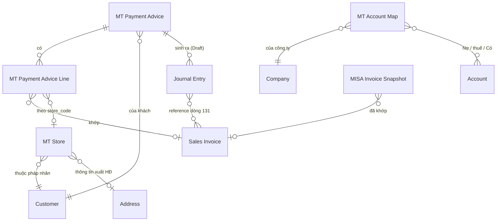

# Thiết kế MT-2 P1 — app `ketoan`, module MT

> Phạm vi: **MT2-A** (parser AEON + Fuji) · **MT2-C** (master `MT Store`) ·
> **MT2-D** (sinh Journal Entry Draft) · **MT2-E** (duyệt JE trên portal).
> Giai đoạn 1 (khai thác nghiệp vụ) bỏ qua — đã có `SOP_ke_toan_MT_RVHG.md` và
> `docs/blueprint/00_blueprint_p0.md`.
>
> Trạng thái: GĐ2 ✅ duyệt · **GĐ3–4 CHỜ DUYỆT** · GĐ5–6 chưa làm. Chưa viết code app.

---

## GIAI ĐOẠN 2 — DOCTYPE BLUEPRINT

### 2.0 Quyết định: tạo mới hay tái dùng

Nguyên tắc *Reuse > Create* của nextcode.

| Nhu cầu | Quyết định | Vì sao |
|---|---|---|
| Điểm siêu thị (store) + ánh xạ mã NCC → Customer | **DocType mới `MT Store`** | Có vòng đời riêng (mở/đóng điểm), nhiều bản ghi (Co.op ~120, LOTTE 19, CR 59 tên store), cần list/filter, là master được nhiều nơi tham chiếu |
| Số hiệu TK theo sự kiện × chuỗi | **DocType mới `MT Account Map`** | Nhiều bản ghi (sự kiện × chuỗi × công ty), kế toán tự sửa, không nhồi được vào Single Settings vì là bảng |
| Đánh dấu JE nào do MT sinh ra | **Custom Field trên `Journal Entry`** | Chỉ vài field, JE không có vòng đời riêng do ta định nghĩa — đúng tiêu chí Custom Field |
| Thêm chuỗi AEON, Fuji | **Sửa Select `chain` sẵn có** | Không phát sinh entity mới |
| Liên kết advice ↔ JE | **Custom Field trên JE, KHÔNG thêm bảng con vào advice** | Quan hệ 1-N từ phía JE; truy vấn ngược bằng index rẻ hơn, và JE bị hủy/xóa thì không để lại dòng con mồ côi |
| Ghi nhận thanh toán | **Journal Entry core** — KHÔNG Payment Entry | Ràng buộc SOP mục 0.4 |

**Không tạo**: DocType riêng cho "đợt thanh toán" (đã là `MT Payment Advice`),
DocType riêng cho phí (đã là dòng trong `MT Payment Advice Line`).

---

### 2.1 DocType mới: `MT Store`

- **Module**: MT
- **Naming**: `naming_series:` — `MT-STORE-.#####`
  *Vì sao không `format:{chain}-{store_code}`*: tên chuỗi có dấu chấm và khoảng
  trắng (`Saigon Co.op`, `Central Retail`) → docname xấu và dễ vỡ khi đổi tên
  chuỗi. Ràng buộc duy nhất `(chain, store_code)` ép ở `validate()`.
- **Is Submittable**: No · **Track Changes**: Yes
- **Title Field**: `store_name` · **Search Fields**: `store_code,store_name,vendor_code`

#### Fields

| Fieldname | Label | Type | Options | Reqd | InList | Filter | Ghi chú |
|---|---|---|---|---|---|---|---|
| `chain` | Chuỗi siêu thị | Select | (7 chuỗi, xem 2.4) | ✓ | ✓ | ✓ | |
| `store_code` | Mã điểm | Data | | ✓ | ✓ | | Giữ NGUYÊN VĂN kể cả số 0 đầu (`01019`, `8003`, `590072`) |
| `store_name` | Tên điểm | Data | | ✓ | ✓ | | |
| `customer` | Khách hàng | Link | Customer | | ✓ | ✓ | Pháp nhân xuất hóa đơn của điểm này |
| `address` | Địa chỉ / thông tin xuất HĐ | Link | Address | | | | Nguồn buyer info cho BKCK (MST chi nhánh LOTTE) |
| `tax_id` | MST của điểm | Data | | | | | Chỉ điền khi điểm có MST riêng (LOTTE). Đọc từ Address nếu trống |
| `vendor_code` | Mã NCC của mình tại chuỗi | Data | | | ✓ | ✓ | `7466` LOTTE · `100968` Emart · `2007766` Win · `0000003114` AEON · `27063` Mega · `3003172`/`3006634` CR |
| `active` | Đang hoạt động | Check | | | ✓ | ✓ | default 1 |
| `note` | Ghi chú | Small Text | | | | | |

#### Ràng buộc & tính toán

- `validate()`: `(chain, store_code)` **duy nhất**. Trùng → throw. Đây là khóa
  tự nhiên; thiếu ràng buộc này thì seed chạy hai lần là nhân đôi master.
- `store_code` chuẩn hóa: `strip()` + bỏ `\xa0`, **KHÔNG** ép số — mất số 0 đầu
  là hỏng khớp mã điểm (bài học §H.3 của contract).
- `tax_id` để trống thì đọc `Address.tax_id`/`gstin` khi cần; không sao chép sẵn
  để tránh hai nguồn sự thật lệch nhau.

#### Quan hệ

- Links to: `Customer`, `Address`
- Được đọc bởi: `mt._match_row`, `mt.detect_customer`, `mt_advice.detect_chain`
  (qua `vendor_code`), và MT2-B sau này (buyer info cho BKCK)

#### ⚠ Điểm phải chốt — `vendor_code` là của CHUỖI hay của ĐIỂM?

Đo trên file thật: `vendor_code` **giống nhau cho mọi điểm trong một chuỗi**
(LOTTE `007466` ở cả 19 store; AEON `0000003114` ở cả 6 sheet). Riêng Central
Retail có **hai** mã (`3003172`, `3006634`) nhưng đó là **hai pháp nhân EB**,
không phải hai điểm.

⇒ Đề xuất: giữ `vendor_code` trên `MT Store` (mỗi bản ghi lặp lại giá trị của
chuỗi mình) **và** truy vấn `DISTINCT` khi cần map chuỗi. Không tách bảng riêng
cho vendor_code vì sẽ đẻ thêm một master chỉ có 7 dòng.

---

### 2.2 DocType mới: `MT Account Map`

- **Module**: MT · **Naming**: `naming_series:` — `MT-ACC-.#####`
- **Is Submittable**: No · **Track Changes**: Yes

#### Fields

| Fieldname | Label | Type | Options | Reqd | Ghi chú |
|---|---|---|---|---|---|
| `event` | Sự kiện | Select | `Nhận thanh toán`⏎`Chiết khấu mình xuất`⏎`Phí chuỗi xuất` | ✓ | |
| `chain` | Chuỗi siêu thị | Select | (rỗng = áp cho MỌI chuỗi) | | Để trống là dòng mặc định |
| `company` | Công ty | Link | Company | ✓ | |
| `debit_account` | TK Nợ chính | Link | Account | ✓ | 112 / 5211 / 6411 |
| `tax_account` | TK Nợ thuế | Link | Account | | 33311 / 1331. Trống = không sinh dòng thuế |
| `credit_account` | TK Có | Link | Account | ✓ | 131 |
| `active` | Đang dùng | Check | | | default 1 |

#### Quy tắc tra cứu (quan trọng)

Tìm theo thứ tự, dừng ở dòng đầu tiên trúng:
1. `(event, chain, company)` khớp đủ
2. `(event, chain rỗng, company)` — dòng mặc định của công ty

Không tìm thấy → **throw**, KHÔNG lấy TK mặc định cứng trong code. Sinh JE vào
sai tài khoản còn tệ hơn không sinh.

#### Seed mặc định (patch, theo SOP mục 4)

| event | chain | debit | tax | credit |
|---|---|---|---|---|
| Nhận thanh toán | *(rỗng)* | `112` | — | `131` |
| Chiết khấu mình xuất | *(rỗng)* | `5211` | `33311` | `131` |
| Phí chuỗi xuất | *(rỗng)* | `6411` | `1331` | `131` |

Patch dò account theo **số hiệu đầu** trong Chart of Accounts của công ty
(`account_number LIKE '112%'`…). Không tìm được → tạo bản ghi với account để
trống + ghi log, KHÔNG đoán. Kế toán vào điền.

---

### 2.3 Custom Fields trên `Journal Entry` (qua `create_custom_fields` + patch)

| Fieldname | Label | Type | Options | Ghi chú |
|---|---|---|---|---|
| `custom_mt_source_dt` | Nguồn MT (DocType) | Data | | `MT Payment Advice` / `MT Bang Ke CK` |
| `custom_mt_source_name` | Nguồn MT (bản ghi) | Data | | `search_index=1` |
| `custom_mt_kind` | Loại bút toán MT | Select | `Thanh toán`⏎`Chiết khấu`⏎`Phí` | `in_standard_filter=1` |
| `custom_mt_fingerprint` | Vân tay chống trùng | Data | | `search_index=1`, `read_only=1` |

*Vì sao `Data` chứ không `Link` cho `custom_mt_source_name`*: JE là DocType core,
đặt `Link` trỏ vào DocType của app sẽ khóa việc xóa/đổi tên bản ghi MT và tạo
phụ thuộc ngược không cần thiết. Chỉ cần tra ngược được — `Data` + index là đủ.

**Vân tay** = sha1 của `(source_dt, source_name, kind, payment_date, tổng tiền,
danh sách SI đã sắp xếp)`. Có bản ghi JE mang cùng vân tay và `docstatus != 2`
→ **không sinh lại**. Đây là chốt chống sinh JE trùng khi bấm hai lần.

---

### 2.4 Sửa DocType sẵn có

#### `MT Payment Advice`

| Thay đổi | Chi tiết |
|---|---|
| `chain` Select | Thêm `AEON`, `Fuji` (và `Mega Market` để sẵn cho MT2-B) |
| `status` Select | Giữ nguyên 3 giá trị. **Ngữ nghĩa siết lại**: `Đã ghi nhận` chỉ được đặt khi MỌI JE liên quan đã `docstatus=1` |
| Field mới `je_state` | Select: *(rỗng)* ⏎ `Chưa sinh` ⏎ `Đã sinh nháp` ⏎ `Đã duyệt một phần` ⏎ `Đã duyệt đủ` — read_only, tính lại mỗi lần sinh/duyệt |

`chain` nằm trong DocType JSON (app-owned) → `bench migrate` tự đồng bộ.
`je_state` là field của DocType app, **không phải Custom Field** → cũng theo
migrate, không cần patch. Nhưng `custom_mt_chain` trên `Customer` **là** Custom
Field → **cần patch** để nới options.

#### `Customer.custom_mt_chain`

Nới options thêm `AEON`, `Fuji`, `Mega Market`. → patch mới.

#### Hằng `CHAIN_OPTIONS`

Hiện khai ở **3 nơi** phải khớp nhau: `mt.py`, `install.MT_CHAIN_OPTIONS`, và
Select `chain` trong DocType JSON. MT2-A sẽ **gom về một nguồn** (`install.py`)
và hai nơi kia đọc lại, kèm test khẳng định ba nơi bằng nhau — lệch một chỗ là
gán ra chuỗi không tồn tại.

---

### 2.5 ERD

---

### 2.6 ✅ BA ĐIỂM ĐÃ CHỐT (20/08/2026)

#### Q1 — JE phí: **một bút toán cả cục, ghi tham chiếu đầy đủ**

Ràng buộc "dòng 131 bắt buộc reference Sales Invoice" **chỉ áp cho JE thanh
toán**. Lý do dữ liệu: phí của Central Retail (`D1`), LOTTE (khoản `L`), Emart
(`I1`), AEON (`Costdet`) đều tính theo **kỳ** hoặc **phiếu giao**, không thuộc
hóa đơn bán nào — ép cứng thì 4/5 chuỗi không sinh được JE phí.

Chốt:

| Loại JE | Dòng 131 | Tham chiếu |
|---|---|---|
| **Thanh toán** | 1 dòng / Sales Invoice | `reference_type=Sales Invoice` + `reference_name` — **bắt buộc, không ngoại lệ** |
| **Phí chuỗi xuất** | **1 dòng gộp cả cục** | Không reference SI. Ghi ĐẦY ĐỦ vào `user_remark`: chuỗi · kỳ · số hóa đơn của chuỗi · danh sách khoản trừ · tên bảng kê nguồn |
| **Chiết khấu mình xuất** (MT2-B) | 1 dòng gộp | `user_remark` ghi số BKCK + số hóa đơn CK |

Hệ quả kế toán **phải biết**: JE phí gộp làm **giảm số dư 131 của khách** nhưng
**không giảm outstanding của từng hóa đơn**. Đúng bản chất — chuỗi trừ phí vào
tổng thanh toán của kỳ, không trừ vào một hóa đơn cụ thể. Câu này sẽ hiện ngay
trên màn duyệt JE, không giấu trong tooltip.

Riêng Co.op có 17,75% theo **từng hóa đơn**: vẫn gộp một dòng 131 theo quyết
định trên, nhưng `user_remark` liệt kê chi tiết từng hóa đơn + số tiền trừ, vì
dữ liệu có sẵn — "ghi tham chiếu đầy đủ" đúng nghĩa.

#### Q2 — 1 JE thanh toán / advice ✅

`MT Payment Advice` đã tách theo `payment_date` từ MT-1, nên `advice ×
payment_date` luôn là 1. Advice có nhiều `payment_date` ở dòng con → **throw**,
không tự tách: dữ liệu đã sai từ tầng đọc, sinh JE lên trên là chôn lỗi.

#### Q3 — Central Retail: tên store nằm trong **ngoặc** ở `shipping_address_name` ✅

Đây là nguồn TỐT HƠN file chuỗi: lấy từ **chính ERPNext**, có sẵn link Address,
và là dữ liệu mình kiểm soát.

Quy tắc seed CR:
- Quét `shipping_address_name` của Sales Invoice kênh MT thuộc Customer Central
  Retail (và/hoặc quét thẳng `tabAddress`).
- `store_name` = phần trong **cặp ngoặc cuối cùng** của tên address.
  Lấy ngoặc CUỐI vì tên address có thể chứa ngoặc khác ở giữa.
- `store_code` = tên đã chuẩn hóa (bỏ dấu, upper, khoảng trắng → `_`).
- `address` = chính Address đó → BKCK lấy được buyer info ngay.
- Không tìm thấy ngoặc → **bỏ qua và ghi log**, không lấy cả tên address làm
  store (sẽ đẻ ra store rác trùng nhau).

Với 4 chuỗi có mã thật (LOTTE, AEON, Co.op, Mega) vẫn seed từ file mẫu như cũ.

---

## GIAI ĐOẠN 3 — PERMISSION MATRIX

### 3.0 Nguyên tắc áp dụng cho MT-2

1. **DocType của app** (`MT Store`, `MT Account Map`) → DocPerm ghi thẳng trong
   DocType JSON. Convention "KHÔNG ship DocPerm qua fixtures" của repo nhắm vào
   DocType **core**; DocType do app sở hữu thì JSON chính là nguồn.
2. **DocType core** (`Journal Entry`) → cấp bằng `add_permission` trong
   `install.py`, đúng lối đã dùng cho Sales Invoice/Customer.
3. **Quyền GHI của nghiệp vụ tiền nằm ở kế toán trưởng.** Kế toán MT làm việc
   hằng ngày qua **portal** — nơi mọi thao tác ghi đều đi qua whitelisted method
   có `guard_manager()`. Cấp `write` trên Desk cho `Ke Toan MT` là **vô hiệu hóa
   guard** (đúng lỗi đã mắc và đã sửa ở MT-1 với `MT Payment Advice`).
4. **Không dùng permlevel** ở P1: không có nhóm field nhạy cảm nào cần che riêng
   trong 2 DocType mới. Thêm permlevel khi chưa cần là đẻ ra lỗi khó truy.

### 3.1 `MT Store`

| Role | Lvl | R | W | C | D | Report | Print | Export | If Owner |
|---|---|---|---|---|---|---|---|---|---|
| System Manager | 0 | ✓ | ✓ | ✓ | ✓ | ✓ | ✓ | ✓ | |
| Ke Toan Truong | 0 | ✓ | ✓ | ✓ | ✓ | ✓ | ✓ | ✓ | |
| Accounts Manager | 0 | ✓ | ✓ | ✓ | | ✓ | ✓ | ✓ | |
| Ke Toan MT | 0 | ✓ | | | | ✓ | ✓ | | |
| Accounts User | 0 | ✓ | | | | ✓ | | | |

*Vì sao `Ke Toan MT` không có `write`*: mở/đóng điểm siêu thị là việc **thưa**
(vài lần/năm) nhưng sai thì **định tuyến tiền sai** — store gắn nhầm pháp nhân
là cả kỳ công nợ chạy sang khách khác. Để trưởng chốt.

### 3.2 `MT Account Map`

| Role | Lvl | R | W | C | D | Report | Print |
|---|---|---|---|---|---|---|---|
| System Manager | 0 | ✓ | ✓ | ✓ | ✓ | ✓ | ✓ |
| Ke Toan Truong | 0 | ✓ | ✓ | ✓ | ✓ | ✓ | ✓ |
| Accounts Manager | 0 | ✓ | ✓ | ✓ | | ✓ | ✓ |
| Ke Toan MT | 0 | ✓ | | | | ✓ | |
| Accounts User | 0 | ✓ | | | | ✓ | |

`Ke Toan MT` **có `read`** — cần thấy TK nào sẽ được dùng ngay trên màn xem
trước JE. Giấu đi thì họ duyệt một bút toán mà không biết nó vào tài khoản nào.

### 3.3 `Journal Entry` (core — cấp qua `install.py`)

Ma trận hiện hành (`_SALES_CHANNEL_PERMS`) đã cho `Ke Toan MT` quyền
`DRAFT_DOC` = read/write/create/print/report trên Journal Entry — **không có
`submit`**. Đúng ý đồ: kế toán kênh lập nháp, không tự ghi sổ.

**MT-2 KHÔNG nới quyền này.** Việc duyệt JE trên portal (MT2-E) đi qua
whitelisted method có `guard_manager()`, và bản thân `doc.submit()` chạy dưới
quyền của user — nên **chỉ kế toán trưởng duyệt được**, đúng như hiện trạng
(`Ke Toan Truong` thừa hưởng `FULL_DOC` cho Journal Entry).

| Role | submit JE | Ghi chú |
|---|---|---|
| Ke Toan MT | ❌ | Lập nháp + xem; bấm duyệt sẽ bị guard chặn |
| Ke Toan Hach Toan | ✓ | `FULL_DOC` sẵn có |
| Ke Toan Truong | ✓ | |

⚠ **Điểm cần anh xác nhận (Q4)**: hiện `Ke Toan MT` **không duyệt được JE**.
Nếu thực tế 1 kế toán làm toàn bộ kênh MT và người đó *chính là* người duyệt,
thì hoặc (a) người đó mang thêm role `Ke Toan Truong`, hoặc (b) nới `submit`
cho `Ke Toan MT`. Em **không tự quyết** vì đây là nới quyền ghi sổ.

### 3.4 User Permission

Không đặt User Permission mới ở P1. Lọc theo công ty đã do `mt._company()` lo ở
tầng API (kiểm bằng User Permission trên `Company` nếu có khai).

---

## GIAI ĐOẠN 4 — WORKFLOW BLUEPRINT

### ❌ KHÔNG dùng Workflow doctype — có lý do

Tiêu chí của skill: chỉ dựng Workflow khi DocType có **>3 trạng thái + chuyển
trạng thái theo role**. Đối chiếu:

| Đối tượng | Trạng thái | Kết luận |
|---|---|---|
| `Journal Entry` | Draft → Submitted → Cancelled | **Đã có `docstatus` của core.** Chồng Workflow lên JE là đè lên cơ chế ghi sổ của ERPNext — rủi ro rất cao, lợi ích bằng 0 |
| `MT Payment Advice` | Nháp / Đã đối chiếu / Đã ghi nhận | Là **thuộc tính** phản ánh tiến độ, không có chuyển trạng thái theo role. Đúng định nghĩa "status field", không phải workflow |
| `MT Store`, `MT Account Map` | master data | Không có vòng đời |

⇒ **Bỏ qua giai đoạn 4.** Thay bằng ràng buộc trong controller:

- `MT Payment Advice.status = 'Đã ghi nhận'` **chỉ** khi mọi JE mang
  `custom_mt_source_name = advice.name` đều `docstatus = 1`. Đặt tay trên Desk
  mà chưa đủ điều kiện → `validate()` throw.
- `je_state` (read_only) tính lại từ chính các JE đó, không cho sửa tay.

---

## ✅ CỔNG DUYỆT — GIAI ĐOẠN 3 & 4

GĐ2 đã duyệt (Q1·Q2·Q3 chốt ở mục 2.6). Cần anh duyệt GĐ3–4, và trả lời **Q4**
(ai được duyệt JE — xem 3.3). Sau đó em sang:

- **Giai đoạn 5** — Integration & hooks plan
- **Giai đoạn 6** — Patch plan (thay cho fixtures — đã chốt ở BƯỚC 0)
