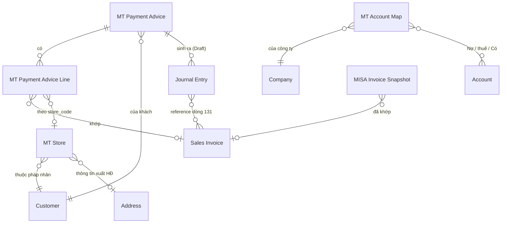

# Thiết kế MT-2 P1 — app `ketoan`, module MT

> Phạm vi: **MT2-A** (parser AEON + Fuji) · **MT2-C** (master `MT Store`) ·
> **MT2-D** (sinh Journal Entry Draft) · **MT2-E** (duyệt JE trên portal).
> Giai đoạn 1 (khai thác nghiệp vụ) bỏ qua — đã có `SOP_ke_toan_MT_RVHG.md` và
> `docs/blueprint/00_blueprint_p0.md`.
>
> Trạng thái: GĐ2 ✅ · GĐ3 ✅ · GĐ4 ✅ (bỏ, có lý do) · **GĐ5–6 CHỜ DUYỆT CUỐI**. Chưa viết code app.

---

## GIAI ĐOẠN 2 — DOCTYPE BLUEPRINT

### 2.0 Quyết định: tạo mới hay tái dùng

Nguyên tắc *Reuse > Create* của nextcode.

| Nhu cầu | Quyết định | Vì sao |
|---|---|---|
| Điểm siêu thị (store) + ánh xạ mã NCC → Customer | **DocType mới `MT Store`** | Có vòng đời riêng (mở/đóng điểm), nhiều bản ghi (Co.op ~120, LOTTE 19, CR 59 tên store), cần list/filter, là master được nhiều nơi tham chiếu |
| Số hiệu TK theo sự kiện × chuỗi | **DocType mới `MT Account Map`** | Nhiều bản ghi (sự kiện × chuỗi × công ty), kế toán tự sửa, không nhồi được vào Single Settings vì là bảng |
| Đánh dấu JE nào do MT sinh ra | **Custom Field trên `Journal Entry`** | Chỉ vài field, JE không có vòng đời riêng do ta định nghĩa — đúng tiêu chí Custom Field |
| Thêm chuỗi AEON, Fuji | **Sửa Select `chain` sẵn có** | Không phát sinh entity mới |
| Liên kết advice ↔ JE | **Custom Field trên JE, KHÔNG thêm bảng con vào advice** | Quan hệ 1-N từ phía JE; truy vấn ngược bằng index rẻ hơn, và JE bị hủy/xóa thì không để lại dòng con mồ côi |
| Ghi nhận thanh toán | **Journal Entry core** — KHÔNG Payment Entry | Ràng buộc SOP mục 0.4 |

**Không tạo**: DocType riêng cho "đợt thanh toán" (đã là `MT Payment Advice`),
DocType riêng cho phí (đã là dòng trong `MT Payment Advice Line`).

---

### 2.1 DocType mới: `MT Store`

- **Module**: MT
- **Naming**: `naming_series:` — `MT-STORE-.#####`
  *Vì sao không `format:{chain}-{store_code}`*: tên chuỗi có dấu chấm và khoảng
  trắng (`Saigon Co.op`, `Central Retail`) → docname xấu và dễ vỡ khi đổi tên
  chuỗi. Ràng buộc duy nhất `(chain, store_code)` ép ở `validate()`.
- **Is Submittable**: No · **Track Changes**: Yes
- **Title Field**: `store_name` · **Search Fields**: `store_code,store_name,vendor_code`

#### Fields

| Fieldname | Label | Type | Options | Reqd | InList | Filter | Ghi chú |
|---|---|---|---|---|---|---|---|
| `chain` | Chuỗi siêu thị | Select | (7 chuỗi, xem 2.4) | ✓ | ✓ | ✓ | |
| `store_code` | Mã điểm | Data | | ✓ | ✓ | | Giữ NGUYÊN VĂN kể cả số 0 đầu (`01019`, `8003`, `590072`) |
| `store_name` | Tên điểm | Data | | ✓ | ✓ | | |
| `customer` | Khách hàng | Link | Customer | | ✓ | ✓ | Pháp nhân xuất hóa đơn của điểm này |
| `address` | Địa chỉ / thông tin xuất HĐ | Link | Address | | | | Nguồn buyer info cho BKCK (MST chi nhánh LOTTE) |
| `tax_id` | MST của điểm | Data | | | | | Chỉ điền khi điểm có MST riêng (LOTTE). Đọc từ Address nếu trống |
| `vendor_code` | Mã NCC của mình tại chuỗi | Data | | | ✓ | ✓ | `7466` LOTTE · `100968` Emart · `2007766` Win · `0000003114` AEON · `27063` Mega · `3003172`/`3006634` CR |
| `active` | Đang hoạt động | Check | | | ✓ | ✓ | default 1 |
| `note` | Ghi chú | Small Text | | | | | |

#### Ràng buộc & tính toán

- `validate()`: `(chain, store_code)` **duy nhất**. Trùng → throw. Đây là khóa
  tự nhiên; thiếu ràng buộc này thì seed chạy hai lần là nhân đôi master.
- `store_code` chuẩn hóa: `strip()` + bỏ `\xa0`, **KHÔNG** ép số — mất số 0 đầu
  là hỏng khớp mã điểm (bài học §H.3 của contract).
- `tax_id` để trống thì đọc `Address.tax_id`/`gstin` khi cần; không sao chép sẵn
  để tránh hai nguồn sự thật lệch nhau.

#### Quan hệ

- Links to: `Customer`, `Address`
- Được đọc bởi: `mt._match_row`, `mt.detect_customer`, `mt_advice.detect_chain`
  (qua `vendor_code`), và MT2-B sau này (buyer info cho BKCK)

#### ⚠ Điểm phải chốt — `vendor_code` là của CHUỖI hay của ĐIỂM?

Đo trên file thật: `vendor_code` **giống nhau cho mọi điểm trong một chuỗi**
(LOTTE `007466` ở cả 19 store; AEON `0000003114` ở cả 6 sheet). Riêng Central
Retail có **hai** mã (`3003172`, `3006634`) nhưng đó là **hai pháp nhân EB**,
không phải hai điểm.

⇒ Đề xuất: giữ `vendor_code` trên `MT Store` (mỗi bản ghi lặp lại giá trị của
chuỗi mình) **và** truy vấn `DISTINCT` khi cần map chuỗi. Không tách bảng riêng
cho vendor_code vì sẽ đẻ thêm một master chỉ có 7 dòng.

---

### 2.2 DocType mới: `MT Account Map`

- **Module**: MT · **Naming**: `naming_series:` — `MT-ACC-.#####`
- **Is Submittable**: No · **Track Changes**: Yes

#### Fields

| Fieldname | Label | Type | Options | Reqd | Ghi chú |
|---|---|---|---|---|---|
| `event` | Sự kiện | Select | `Nhận thanh toán`⏎`Chiết khấu mình xuất`⏎`Phí chuỗi xuất` | ✓ | |
| `chain` | Chuỗi siêu thị | Select | (rỗng = áp cho MỌI chuỗi) | | Để trống là dòng mặc định |
| `company` | Công ty | Link | Company | ✓ | |
| `debit_account` | TK Nợ chính | Link | Account | ✓ | 112 / 5211 / 6411 |
| `tax_account` | TK Nợ thuế | Link | Account | | 33311 / 1331. Trống = không sinh dòng thuế |
| `credit_account` | TK Có | Link | Account | ✓ | 131 |
| `active` | Đang dùng | Check | | | default 1 |

#### Quy tắc tra cứu (quan trọng)

Tìm theo thứ tự, dừng ở dòng đầu tiên trúng:
1. `(event, chain, company)` khớp đủ
2. `(event, chain rỗng, company)` — dòng mặc định của công ty

Không tìm thấy → **throw**, KHÔNG lấy TK mặc định cứng trong code. Sinh JE vào
sai tài khoản còn tệ hơn không sinh.

#### Seed mặc định (patch, theo SOP mục 4)

| event | chain | debit | tax | credit |
|---|---|---|---|---|
| Nhận thanh toán | *(rỗng)* | `112` | — | `131` |
| Chiết khấu mình xuất | *(rỗng)* | `5211` | `33311` | `131` |
| Phí chuỗi xuất | *(rỗng)* | `6411` | `1331` | `131` |

Patch dò account theo **số hiệu đầu** trong Chart of Accounts của công ty
(`account_number LIKE '112%'`…). Không tìm được → tạo bản ghi với account để
trống + ghi log, KHÔNG đoán. Kế toán vào điền.

---

### 2.3 Custom Fields trên `Journal Entry` (qua `create_custom_fields` + patch)

| Fieldname | Label | Type | Options | Ghi chú |
|---|---|---|---|---|
| `custom_mt_source_dt` | Nguồn MT (DocType) | Data | | `MT Payment Advice` / `MT Bang Ke CK` |
| `custom_mt_source_name` | Nguồn MT (bản ghi) | Data | | `search_index=1` |
| `custom_mt_kind` | Loại bút toán MT | Select | `Thanh toán`⏎`Chiết khấu`⏎`Phí` | `in_standard_filter=1` |
| `custom_mt_fingerprint` | Vân tay chống trùng | Data | | `search_index=1`, `read_only=1` |

*Vì sao `Data` chứ không `Link` cho `custom_mt_source_name`*: JE là DocType core,
đặt `Link` trỏ vào DocType của app sẽ khóa việc xóa/đổi tên bản ghi MT và tạo
phụ thuộc ngược không cần thiết. Chỉ cần tra ngược được — `Data` + index là đủ.

**Vân tay** = sha1 của `(source_dt, source_name, kind, payment_date, tổng tiền,
danh sách SI đã sắp xếp)`. Có bản ghi JE mang cùng vân tay và `docstatus != 2`
→ **không sinh lại**. Đây là chốt chống sinh JE trùng khi bấm hai lần.

---

### 2.4 Sửa DocType sẵn có

#### `MT Payment Advice`

| Thay đổi | Chi tiết |
|---|---|
| `chain` Select | Thêm `AEON`, `Fuji` (và `Mega Market` để sẵn cho MT2-B) |
| `status` Select | Giữ nguyên 3 giá trị. **Ngữ nghĩa siết lại**: `Đã ghi nhận` chỉ được đặt khi MỌI JE liên quan đã `docstatus=1` |
| Field mới `je_state` | Select: *(rỗng)* ⏎ `Chưa sinh` ⏎ `Đã sinh nháp` ⏎ `Đã duyệt một phần` ⏎ `Đã duyệt đủ` — read_only, tính lại mỗi lần sinh/duyệt |

`chain` nằm trong DocType JSON (app-owned) → `bench migrate` tự đồng bộ.
`je_state` là field của DocType app, **không phải Custom Field** → cũng theo
migrate, không cần patch. Nhưng `custom_mt_chain` trên `Customer` **là** Custom
Field → **cần patch** để nới options.

#### `Customer.custom_mt_chain`

Nới options thêm `AEON`, `Fuji`, `Mega Market`. → patch mới.

#### Hằng `CHAIN_OPTIONS`

Hiện khai ở **3 nơi** phải khớp nhau: `mt.py`, `install.MT_CHAIN_OPTIONS`, và
Select `chain` trong DocType JSON. MT2-A sẽ **gom về một nguồn** (`install.py`)
và hai nơi kia đọc lại, kèm test khẳng định ba nơi bằng nhau — lệch một chỗ là
gán ra chuỗi không tồn tại.

---

### 2.5 ERD



---

### 2.6 ✅ BA ĐIỂM ĐÃ CHỐT (20/08/2026)

#### Q1 — JE phí: **một bút toán cả cục, ghi tham chiếu đầy đủ**

Ràng buộc "dòng 131 bắt buộc reference Sales Invoice" **chỉ áp cho JE thanh
toán**. Lý do dữ liệu: phí của Central Retail (`D1`), LOTTE (khoản `L`), Emart
(`I1`), AEON (`Costdet`) đều tính theo **kỳ** hoặc **phiếu giao**, không thuộc
hóa đơn bán nào — ép cứng thì 4/5 chuỗi không sinh được JE phí.

Chốt:

| Loại JE | Dòng 131 | Tham chiếu |
|---|---|---|
| **Thanh toán** | ~~1 dòng / Sales Invoice~~ → **1 dòng gộp** *(sửa 20/08/2026, xem dưới)* | ~~reference bắt buộc~~ → không reference |
| **Phí chuỗi xuất** | **1 dòng gộp cả cục** | Không reference SI. Ghi ĐẦY ĐỦ vào `user_remark`: chuỗi · kỳ · số hóa đơn của chuỗi · danh sách khoản trừ · tên bảng kê nguồn |
| **Chiết khấu mình xuất** (MT2-B) | 1 dòng gộp | `user_remark` ghi số BKCK + số hóa đơn CK |

Hệ quả kế toán **phải biết**: JE phí gộp làm **giảm số dư 131 của khách** nhưng
**không giảm outstanding của từng hóa đơn**. Đúng bản chất — chuỗi trừ phí vào
tổng thanh toán của kỳ, không trừ vào một hóa đơn cụ thể. Câu này sẽ hiện ngay
trên màn duyệt JE, không giấu trong tooltip.

Riêng Co.op có 17,75% theo **từng hóa đơn**: vẫn gộp một dòng 131 theo quyết
định trên, nhưng `user_remark` liệt kê chi tiết từng hóa đơn + số tiền trừ, vì
dữ liệu có sẵn — "ghi tham chiếu đầy đủ" đúng nghĩa.

#### ✏️ SỬA Q1 (20/08/2026) — **bút toán thanh toán cũng ghi 1 dòng tổng**

Người dùng chốt: *"131 thanh toán các hóa đơn chỉ cần ghi tổng thanh toán. Đã có
trang gạch hóa đơn thanh toán riêng."*

Đúng, và nó nhất quán với một quyết định đã có từ **MT-1**: ở kênh MT, con số
"đã thu / còn lại" tính từ **chính các dòng bảng kê**, không từ
`outstanding_amount` của ERPNext (xem chú thích `mtOverview` trong `api.js`).
Gắn reference Sales Invoice lên dòng 131 là dựng **cơ chế gạch nợ thứ hai** —
hai nguồn sự thật sẽ lệch nhau ngay kỳ đầu có một hóa đơn bị điều chỉnh.

Bảng cuối cùng: **cả ba loại JE đều ghi Có 131 một dòng tổng cho một pháp nhân,
không reference.**

| | Trước | Sau |
|---|---|---|
| Dòng 131 của JE thanh toán | 1 dòng / hóa đơn, có reference | **1 dòng tổng**, không reference |
| Dòng thanh toán chưa gạch được hóa đơn | **bị LOẠI** khỏi JE (để JE còn cân) → tiền đã về mà không vào sổ | **vẫn vào JE**, kèm cảnh báo |
| Việc gạch hóa đơn | JE reference + màn 'Quản lý thanh toán' (trùng nhau) | chỉ màn 'Quản lý thanh toán' |
| Tra ngược từ JE về hóa đơn | qua reference | qua `user_remark` (liệt kê tối đa 60 hóa đơn + số tiền) |

Đổi này còn **sửa một lỗ mất tiền**: ở bản cũ, dòng thanh toán chưa nối được hóa
đơn buộc phải loại khỏi bút toán để bút toán còn cân — tiền thật đã về nhưng
không được ghi sổ, chỉ có một dòng cảnh báo.

#### Q2 — 1 JE thanh toán / advice ✅

`MT Payment Advice` đã tách theo `payment_date` từ MT-1, nên `advice ×
payment_date` luôn là 1. Advice có nhiều `payment_date` ở dòng con → **throw**,
không tự tách: dữ liệu đã sai từ tầng đọc, sinh JE lên trên là chôn lỗi.

#### Q3 — Central Retail: tên store nằm trong **ngoặc** ở `shipping_address_name` ✅

Đây là nguồn TỐT HƠN file chuỗi: lấy từ **chính ERPNext**, có sẵn link Address,
và là dữ liệu mình kiểm soát.

Quy tắc seed CR:
- Quét `shipping_address_name` của Sales Invoice kênh MT thuộc Customer Central
  Retail (và/hoặc quét thẳng `tabAddress`).
- `store_name` = phần trong **cặp ngoặc cuối cùng** của tên address.
  Lấy ngoặc CUỐI vì tên address có thể chứa ngoặc khác ở giữa.
- `store_code` = tên đã chuẩn hóa (bỏ dấu, upper, khoảng trắng → `_`).
- `address` = chính Address đó → BKCK lấy được buyer info ngay.
- Không tìm thấy ngoặc → **bỏ qua và ghi log**, không lấy cả tên address làm
  store (sẽ đẻ ra store rác trùng nhau).

Với 4 chuỗi có mã thật (LOTTE, AEON, Co.op, Mega) vẫn seed từ file mẫu như cũ.

---

## GIAI ĐOẠN 3 — PERMISSION MATRIX

### 3.0 Nguyên tắc áp dụng cho MT-2

1. **DocType của app** (`MT Store`, `MT Account Map`) → DocPerm ghi thẳng trong
   DocType JSON. Convention "KHÔNG ship DocPerm qua fixtures" của repo nhắm vào
   DocType **core**; DocType do app sở hữu thì JSON chính là nguồn.
2. **DocType core** (`Journal Entry`) → cấp bằng `add_permission` trong
   `install.py`, đúng lối đã dùng cho Sales Invoice/Customer.
3. **Quyền GHI của nghiệp vụ tiền nằm ở kế toán trưởng.** Kế toán MT làm việc
   hằng ngày qua **portal** — nơi mọi thao tác ghi đều đi qua whitelisted method
   có `guard_manager()`. Cấp `write` trên Desk cho `Ke Toan MT` là **vô hiệu hóa
   guard** (đúng lỗi đã mắc và đã sửa ở MT-1 với `MT Payment Advice`).
4. **Không dùng permlevel** ở P1: không có nhóm field nhạy cảm nào cần che riêng
   trong 2 DocType mới. Thêm permlevel khi chưa cần là đẻ ra lỗi khó truy.

### 3.1 `MT Store`

| Role | Lvl | R | W | C | D | Report | Print | Export | If Owner |
|---|---|---|---|---|---|---|---|---|---|
| System Manager | 0 | ✓ | ✓ | ✓ | ✓ | ✓ | ✓ | ✓ | |
| Ke Toan Truong | 0 | ✓ | ✓ | ✓ | ✓ | ✓ | ✓ | ✓ | |
| Accounts Manager | 0 | ✓ | ✓ | ✓ | | ✓ | ✓ | ✓ | |
| Ke Toan MT | 0 | ✓ | | | | ✓ | ✓ | | |
| Accounts User | 0 | ✓ | | | | ✓ | | | |

*Vì sao `Ke Toan MT` không có `write`*: mở/đóng điểm siêu thị là việc **thưa**
(vài lần/năm) nhưng sai thì **định tuyến tiền sai** — store gắn nhầm pháp nhân
là cả kỳ công nợ chạy sang khách khác. Để trưởng chốt.

### 3.2 `MT Account Map`

| Role | Lvl | R | W | C | D | Report | Print |
|---|---|---|---|---|---|---|---|
| System Manager | 0 | ✓ | ✓ | ✓ | ✓ | ✓ | ✓ |
| Ke Toan Truong | 0 | ✓ | ✓ | ✓ | ✓ | ✓ | ✓ |
| Accounts Manager | 0 | ✓ | ✓ | ✓ | | ✓ | ✓ |
| Ke Toan MT | 0 | ✓ | | | | ✓ | |
| Accounts User | 0 | ✓ | | | | ✓ | |

`Ke Toan MT` **có `read`** — cần thấy TK nào sẽ được dùng ngay trên màn xem
trước JE. Giấu đi thì họ duyệt một bút toán mà không biết nó vào tài khoản nào.

### 3.3 `Journal Entry` (core — cấp qua `install.py`)

Ma trận hiện hành (`_SALES_CHANNEL_PERMS`) đã cho `Ke Toan MT` quyền
`DRAFT_DOC` = read/write/create/print/report trên Journal Entry — **không có
`submit`**. Đúng ý đồ: kế toán kênh lập nháp, không tự ghi sổ.

**MT-2 KHÔNG nới quyền này.** Việc duyệt JE trên portal (MT2-E) đi qua
whitelisted method có `guard_manager()`, và bản thân `doc.submit()` chạy dưới
quyền của user — nên **chỉ kế toán trưởng duyệt được**, đúng như hiện trạng
(`Ke Toan Truong` thừa hưởng `FULL_DOC` cho Journal Entry).

| Role | submit JE | Ghi chú |
|---|---|---|
| Ke Toan MT | ❌ | Lập nháp + xem; bấm duyệt sẽ bị guard chặn |
| Ke Toan Hach Toan | ✓ | `FULL_DOC` sẵn có |
| Ke Toan Truong | ✓ | |

#### ✅ Q4 đã chốt (phương án **a**)

Người kế toán phụ trách kênh MT **mang thêm role `Ke Toan Truong`**.
**KHÔNG nới `submit` Journal Entry cho `Ke Toan MT`.**

Hệ quả cho build:
- Ma trận quyền `install.py` **giữ nguyên**, MT-2 không đụng vào.
- `mt.submit_journal_entries()` vẫn `guard_manager()` ở dòng đầu — đúng.
- Tab "Duyệt bút toán" **ẩn nút duyệt** với user không phải chief
  (`ov.can_import` đã là `is_chief()`), giống cách `state.canManage` đang làm.
  Hiện nút cho người không có quyền chỉ tạo một cú bấm để nhận lỗi.
- Khi giao tài khoản cho kế toán MT: **phải gán 2 role**. Ghi vào SOP mục 0.

### 3.4 User Permission

Không đặt User Permission mới ở P1. Lọc theo công ty đã do `mt._company()` lo ở
tầng API (kiểm bằng User Permission trên `Company` nếu có khai).

---

## GIAI ĐOẠN 4 — WORKFLOW BLUEPRINT

### ❌ KHÔNG dùng Workflow doctype — có lý do

Tiêu chí của skill: chỉ dựng Workflow khi DocType có **>3 trạng thái + chuyển
trạng thái theo role**. Đối chiếu:

| Đối tượng | Trạng thái | Kết luận |
|---|---|---|
| `Journal Entry` | Draft → Submitted → Cancelled | **Đã có `docstatus` của core.** Chồng Workflow lên JE là đè lên cơ chế ghi sổ của ERPNext — rủi ro rất cao, lợi ích bằng 0 |
| `MT Payment Advice` | Nháp / Đã đối chiếu / Đã ghi nhận | Là **thuộc tính** phản ánh tiến độ, không có chuyển trạng thái theo role. Đúng định nghĩa "status field", không phải workflow |
| `MT Store`, `MT Account Map` | master data | Không có vòng đời |

⇒ **Bỏ qua giai đoạn 4.** Thay bằng ràng buộc trong controller:

- `MT Payment Advice.status = 'Đã ghi nhận'` **chỉ** khi mọi JE mang
  `custom_mt_source_name = advice.name` đều `docstatus = 1`. Đặt tay trên Desk
  mà chưa đủ điều kiện → `validate()` throw.
- `je_state` (read_only) tính lại từ chính các JE đó, không cho sửa tay.

---

---

## GIAI ĐOẠN 5 — INTEGRATION & HOOKS PLAN

### 5.1 Điểm chạm với ERPNext core

| DocType core | Chiều | Việc |
|---|---|---|
| `Journal Entry` | **GHI** (tạo Draft) | Sản phẩm chính của MT2-D. Không bao giờ `submit()` tự động |
| `Sales Invoice` | ĐỌC | `reference_name` dòng 131 của JE thanh toán; nguồn `shipping_address_name` để seed store CR |
| `Customer` | ĐỌC + custom field | `custom_mt_chain` (đã có, nới options) |
| `Address` | ĐỌC | buyer info cho `MT Store`; nguồn tên store CR |
| `Account`, `Company` | ĐỌC | `MT Account Map` |
| `MISA Invoice Snapshot` | ĐỌC | đã dùng ở MT-1, không đổi |

**KHÔNG đụng**: `Payment Entry` (ràng buộc JE-only), `GL Entry` (chỉ core ghi),
`Stock Entry` (hàng trả đi đường chứng từ trả hàng của ERPNext).

### 5.2 `hooks.py` — chỉ thêm 2 doc_events

```python
doc_events = {
    "Journal Entry": {
        "on_submit":  "ketoan.api.mt_je.sync_advice_state",
        "on_cancel":  "ketoan.api.mt_je.sync_advice_state",
    },
}
```

> **Ghi nhận khi build MT2-D (20/08/2026) — MỘT LỖI TIỀN ĐÃ BỊ CHẶN**
>
> `MT Payment Advice Line.total_amount` lưu số **GIỮ NGUYÊN DẤU** (xem
> `mt._map_rows`), không phải độ lớn. Bản đầu của `mt_je` cộng `abs()` từng dòng
> cho nhóm khoản trừ — đúng với dòng thanh toán (mỗi dòng một hóa đơn riêng)
> nhưng **sai với nhóm gộp**, vì `Sub-Total` mà chuỗi in ra là tổng **đại số**.
> Đo trên file thật, ba nhóm có cả dòng trừ lẫn dòng hoàn:
>
> | Chuỗi · loại | Tổng đại số (đúng) | Cộng độ lớn (sai) | Ghi khống |
> |---|---|---|---|
> | Saigon Co.op · Chiết khấu | 1.338.010.941 | 1.662.373.817 | **324.362.876** |
> | AEON · Phí | 10.424.817 | 11.023.025 | 598.208 |
> | LOTTE · Ghi giảm *(không sinh JE)* | 809.335 | 11.868.813 | 11.059.478 |
>
> Bút toán sai vẫn **CÂN**, con số vẫn trông hợp lý, và không tổng nào trên màn
> hình phát hiện ra — chỉ lộ khi đối chiếu sao kê ngân hàng. Nay `_group_amount`
> dùng `|Σ đại số|`, nhóm dấu lẫn lộn được **gắn cờ** ra tận màn duyệt, và
> `docs/mt/verified/je_plan_check.py` khóa cả ba con số lại.

**Vì sao cần**: `je_state` và `status='Đã ghi nhận'` của advice suy từ docstatus
của các JE. Kế toán hoàn toàn có thể submit/cancel JE **thẳng trên Desk**, không
qua portal. Thiếu hook thì advice đứng mãi ở "Đã sinh nháp" trong khi JE đã ghi
sổ — màn hình nói dối.

Hàm bọc `try/except` + `log_error` toàn bộ: **tích hợp MT hỏng không được chặn
việc ghi sổ**. Cùng nguyên tắc `misa_sync.ensure_ref_id`.

**KHÔNG thêm**: `scheduler_events` (không có việc định kỳ ở P1),
`override_doctype_class`, `jinja` (Print Format của BKCK thuộc MT2-B).

### 5.3 Whitelisted endpoints mới

| Method | Guard | Việc |
|---|---|---|
| `mt_je.preview_journal_entries(advice)` | `guard_mt` | Xem trước JE sẽ sinh: từng dòng, TK, tiền, SI reference. **KHÔNG ghi** |
| `mt_je.create_journal_entries(advice, expected_hash)` | `guard_manager` | Sinh JE Draft. Bắt buộc vân tay từ preview |
| `mt_je.list_advices(...)` | `guard_mt` | Bảng kê + `je_state` của từng cái, lọc chuỗi/kỳ/trạng thái, chia trang |
| `mt_je.list_draft_journal_entries(...)` | `guard_mt` | Danh sách JE do MT sinh (nháp hoặc đã ghi sổ), lọc chuỗi/kỳ/loại, chia trang |
| `mt_je.get_journal_entry(name)` | `guard_mt` | Chi tiết một JE để soi trước khi duyệt |
| `mt_je.submit_journal_entries(names, force_unreconciled)` | `guard_manager` | Duyệt. **try/except + savepoint từng JE**, trả kết quả per-JE |
| `mt_je.delete_draft_journal_entries(names)` | `guard_manager` | Xóa JE **nháp** sinh nhầm |

> **Bổ sung khi build MT2-E (20/08/2026)**
>
> · `get_journal_entry` — duyệt mà không soi được nội dung thì nút duyệt chỉ là
>   một cú bấm mù. Đọc cả JE đã ghi sổ để tra lại sau.
> · `delete_draft_journal_entries` — không có đường xóa là **bế tắc**: sinh nhầm
>   → vân tay chống trùng chặn lần sinh lại → kế toán buộc phải vào Desk, mà
>   `Ke Toan MT` không có quyền xóa ở đó. Chỉ đụng bản nháp; hủy chứng từ đã ghi
>   sổ vẫn là việc của Desk, có vết và có quy trình riêng.
> · `force_unreconciled` — bảng kê chưa tick 'Đã đối chiếu khớp' thì
>   `submit_journal_entries` **từ chối ghi sổ** và trả `needs_confirm` kèm danh
>   sách, cho tới khi người xác nhận có ý thức. Duyệt là ghi sổ; hủy một bút toán
>   đã ghi để lại vết trong sổ cái mà kiểm toán sẽ hỏi.
| `mt_je.get_account_map(company)` | `guard_mt` | Bảng TK đang áp dụng — để màn xem trước nói rõ bút toán vào TK nào |
| `mt_store.preview_seed()` | `guard_mt` | Xem trước danh sách store dựng được |
| `mt_store.commit_seed(expected_hash)` | `guard_manager` | Tạo `MT Store` |
| `mt_store.list_stores(...)` | `guard_mt` | Danh sách điểm, lọc chuỗi/khách/trạng thái, chia trang |
| `mt_store.save_store(...)` | `guard_manager` | Sửa một điểm (gán pháp nhân, địa chỉ, đóng điểm) |
| `mt_store.search_addresses(txt, customer)` | `guard_mt` | Gợi ý địa chỉ để gán, LỌC theo khách |

> **Điều chỉnh khi build (20/08/2026)**: nhóm điểm siêu thị nằm ở module riêng
> `ketoan/api/mt_store.py` và nhóm bút toán ở `ketoan/api/mt_je.py`, thay vì
> nhét thêm vào `mt.py` — mt.py đã ~2.500 dòng
> và lo một việc khác hẳn (đối chiếu bảng kê với hóa đơn). Đúng quy ước
> "1 file = 1 chức năng" của repo. Ba endpoint cuối là bổ sung: seed mà không
> có màn xem/sửa thì master không dùng được, và `save_store` là đường GHI duy
> nhất cho kế toán trưởng (Desk vẫn chỉ-đọc với `Ke Toan MT` đúng như §3.1).

Mọi method **guard ở DÒNG ĐẦU**, `_require_tables()` ngay sau — đúng lối MT-1.

### 5.4 Nguồn seed `MT Store` — từ DỮ LIỆU TRÊN SITE, không ship file mẫu

| Chuỗi | Nguồn seed |
|---|---|
| LOTTE · AEON · Co.op · Mega | `MT Payment Advice Line.store_code/store_name` **đã nạp trên site** — `DISTINCT` theo chuỗi |
| Central Retail | `Address` / `Sales Invoice.shipping_address_name` — lấy phần trong **cặp ngoặc cuối** |
| Win · Emart · Fuji | Không có store trong chứng từ → **không seed**, để trống |

*Vì sao không seed từ `docs/mt/samples/`*: file mẫu là ảnh chụp một kỳ, site có
dữ liệu đầy đủ hơn và luôn mới hơn. Ship dữ liệu mẫu vào patch là đóng băng một
thời điểm rồi lệch dần.

**Preview bắt buộc** trước khi ghi (lối `misa_legacy`): store dựng từ heuristic
(CR lấy trong ngoặc) nên người phải nhìn trước khi tạo master.

### 5.5 Thứ tự phụ thuộc khi build

```
MT2-A (parser AEON+Fuji)   ── độc lập, ship trước, có giá trị ngay
        │
MT2-C (MT Store)           ── cần advice đã nạp để seed
        │
MT2-D (JE Draft)           ── cần MT Account Map + advice đã đối chiếu
        │
MT2-E (duyệt trên portal)  ── cần JE đã sinh
```

---

## GIAI ĐOẠN 6 — PATCH PLAN (thay cho fixtures)

Đã chốt ở BƯỚC 0: **`create_custom_fields` + patch**, KHÔNG fixtures.
Quy tắc bất di bất dịch của repo: **thêm field mới = thêm patch mới**.

`patches.txt` đang ở `v0_0_12`. Dự kiến:

| Patch | Hạng mục | Việc |
|---|---|---|
| `v0_0_13.mt_chain_aeon_fuji` | MT2-A | Nới options `Customer.custom_mt_chain` thêm `AEON`, `Fuji`, `Mega Market`. Select `chain` của `MT Payment Advice` tự theo migrate (DocType app-owned) |
| `v0_0_14.mt_je_custom_fields` | MT2-D | 4 custom field trên `Journal Entry` (`custom_mt_source_dt`, `custom_mt_source_name`, `custom_mt_kind`, `custom_mt_fingerprint`) |
| `v0_0_15.mt_account_map_seed` | MT2-D | Seed 3 dòng `MT Account Map` mặc định cho mỗi Company. Dò account theo số hiệu đầu; không tìm được → tạo dòng với account TRỐNG + log, **không đoán** |

**Không cần patch**: `MT Store`, `MT Account Map`, field `je_state` — đều là
DocType/field do app sở hữu, `bench migrate` tự đồng bộ.

**Không có patch seed `MT Store`**: seed đi qua preview + commit trên portal
(mục 5.4), vì dựng store là heuristic phải cho người nhìn trước.

### Kiểm tra bắt buộc trước mỗi commit

1. `python3 -m py_compile` mọi file `.py` đụng tới
2. `node --check` mọi file `.js` đụng tới
3. `python3 -c "import json; json.load(...)"` mọi DocType JSON
4. **`python3 docs/mt/verified/regression_check.py`** — 5 chuỗi cũ phải vẫn
   đúng từng đồng. Đây là chốt chặn: MT2-A sửa `mt_advice.py` là đụng thẳng vào
   tầng đọc của 5 chuỗi đang chạy
5. Kiểm AST: mọi `@frappe.whitelist` có guard ở dòng đầu
6. Ba nơi khai `CHAIN_OPTIONS` phải khớp nhau

### Commit convention

Một commit / hạng mục, tiêu đề ghi rõ `MT2-A` / `MT2-C` / `MT2-D` / `MT2-E`.
Push cả nhánh `claude/zen-babbage-0vj0eg` và `main`.

---

## ✅ CỔNG DUYỆT CUỐI — TOÀN BỘ THIẾT KẾ P1

| Giai đoạn | Trạng thái |
|---|---|
| 2 — DocType blueprint | ✅ duyệt (Q1·Q2·Q3 chốt ở 2.6) |
| 3 — Permission matrix | ✅ duyệt (Q4 chốt phương án **a**) |
| 4 — Workflow | ✅ **bỏ có lý do** |
| 5 — Integration & hooks | ✅ duyệt |
| 6 — Patch plan | **chờ duyệt** |

Duyệt xong thì chuyển sang `nextcode-build`, thứ tự **A → C → D → E**.

---

## ✅ P1 ĐÃ SHIP (20/08/2026)

| Hạng mục | Commit | Bộ kiểm |
|---|---|---|
| **MT2-A** parser AEON + Fuji, gom `CHAIN_OPTIONS` một nguồn | `4cb04b2` | `regression_check` · `crosscheck_mt2` · `mutation_check` |
| **MT2-C** master `MT Store` + seed từ bảng kê đã nạp | `48105e1` | `store_seed_check` |
| **MT2-D** `MT Account Map` + sinh JE nháp (patch v0_0_14/15) | `1d65ed6` `f676467` | `je_plan_check` |
| **MT2-E** duyệt / xóa bút toán trên portal | `bd420fd` | `je_submit_check` |
| **MT2-B1** đọc file cơ sở tính chiết khấu (Central Retail · LOTTE · Mega) | `303ff6f` | `discount_basis_check` |
| **MT2-B2** bảng kê chiết khấu: lập → chốt cấp số → in → sinh JE | `d029ed0` | `discount_sheet_check` |
| **MT2-B3** hồ sơ thanh toán WinCommerce (xuất Excel + tên file PDF) | `6912873` | `win_dossier_check` |
| **MT2-F** công nợ MT đến hạn theo term (patch v0_0_16) | `899501a` | `debt_due_check` |
| **MT2-B4** đọc Rebate Settlement Emart (PDF) -> BKCK | `32e0f08` | `rebate_pdf_check` · `discount_sheet_check` |
| **MT2-G** đóng hạng mục "khớp tự động dòng Ghi giảm" bằng phép đo | `165cf30` | `clawback_check` |
| **MT2-H** soát trước deploy: 3 lỗi thật, bịt vùng mù "kiểm không bao giờ GHI" | `04a72e2` | `discount_sheet_check` · `rebate_pdf_check` |
| **MT2-I** giao diện xếp lại theo CHUỖI + vòng đời tháng | `26101e7` | `ui_board_check` |
| **MT2-J** bộ lọc chuỗi thật sự lọc — gom về MỘT quy tắc | `7b1aa83` | `chain_filter_check` |
| **MT2-K1/K2/K3** đọc 7 file công nợ Excel để nhập số dư đầu kỳ | `30e5d0b` `c77ba12` `07c5c73` | `opening_check` |
| **MT2-L1** danh sách đợt giao Winmart chưa xuất hóa đơn | `8dee7d8` | — |
| **MT2-L2** đọc phiếu nhập kho Winmart (PDF) + đối soát PO/mã hàng | `8db013e` | `win_grn_check` |
| **MT2-K4** cất số dư đầu kỳ + luật tất toán trước ngày chuyển giao | `fbb77d5` | `opening_store_check` |
| **MT2-M** parser thanh toán Mega Market — chuỗi cuối cùng | `3742487` | `mega_check` · `regression_check` · `crosscheck_mt2` |
| **MT2-N** hàng trả lại trừ vào chính hóa đơn gốc (1 lần bán = 2 chứng từ) | `672665e` `57f83c2` | `debt_due_check` · `opening_store_check` |
| **MT2-N2** ô tìm ứng viên tìm SAI CHỖ — đường nối tay chết từ đầu | `10508c9` | `opening_store_check` |
| **MT2-P** một hóa đơn MISA nối được NHIỀU chứng từ ERPNext | `02c09c0` | `opening_store_check` |
| **MT2-Q** hóa đơn cũ thiếu RefID — cấp lại được từ portal | `59222f0` | `refid_check` |
| **MT2-R** số dư đầu kỳ khớp theo HÓA ĐƠN THAY THẾ | `56f3591` | `opening_store_check` · `replaced_inv_survey` |
| **MT2-S** gán SỐ HÓA ĐƠN THAY THẾ lên chứng từ đã ghi sổ (patch v0_0_17) | `1414f9b` | `replace_check` |
| **MT2-T** đối chiếu số dư đầu kỳ Excel ↔ sổ cái ERPNext, từng siêu thị | `90bab9e` | `opening_gl_check` |
| **MT2-U** bảng không cuộn ngang — đo bằng Chromium, không đoán | `a5083b1` | `table_width_check` |
| **MT2-V** Client Script làm mất nhóm nút Create của ERPNext | `080f585` `4c18a50` `4ae5e6c` | `client_script_check` |
| **MT2-W** đọc THẲNG bảng kê thanh toán PDF của WinCommerce | `8a78341` | `win_pdf_check` · `regression_check` |
| **MT2-X** hai cuốn sổ công nợ đặt cạnh nhau (sổ ERPNext ↔ đầu HĐĐT) | `8f4dee3` | `two_books_check` |
| **MT2-Y** vá lỗi cú pháp làm TRẮNG portal + bịt vùng mù của bước kiểm | `4c5299d` | `portal_js_check` |
| **MT2-Z** hai cuốn sổ tách CHI TIẾT TỪNG CHUỖI + vá lỗi bấm-ra-số-khác | `e2c7854` | `two_books_check` |
| **MT2-Z2** năm lỗi bản soát đối kháng tìm ra ngay trong MT2-Z | `5c27310` | `two_books_check` |
| **MT2-Z3** hạn xuất hóa đơn RIÊNG của chuỗi + vá bộ giả `add_months` | `179b676` | `two_books_check` |
| **MT2-AA** màn soát hóa đơn BỎ SÓT số HĐĐT (mốc theo từng chuỗi) | `62f9c0c` | `einv_gap_check` |
| **MT2-AB** khởi tạo đợt giao Win từ SỐ DƯ ĐÃ CHỐT, không nạp lại file | `62f9c0c` | `win_seed_check` |
| **MT2-AC** hai cuốn sổ ngay trong trang chuỗi + màn trống nói đúng lý do | `a03452b` | `two_books_check` · `win_seed_check` |
| **MT2-AD** cuốn sổ THỨ BA: sổ cái TK 131 + cầu nối phân tích chỗ lệch | `a892c6b` | `gl_bridge_check` |
| **MT2-AE** "Chờ xuất hóa đơn" Win: liệt kê HĐ ERPNext thiếu số MISA | `4252bd6` | `einv_gap_check` |
| **MT2-AF** BỎ QUA hóa đơn khỏi danh sách soát HĐĐT (patch v0_0_18) | `159fc64` | `einv_gap_check` |
| **MT2-AG** danh sách soát: cột PO · điểm giao · bộ lọc | `208a735` | `einv_gap_check` · `table_width_check` |
| **MT2-AH** SỔ THEO DÕI HÓA ĐƠN — dựng lại cuốn Excel kế toán vẫn giữ | `115eb8c` | `ledger_check` |
| **MT2-AI** tick chiết khấu 4 trạng thái · phiếu trả kèm chứng từ MISA | `a2c6603` | `ledger_check` |
| **MT2-AJ** số PO gom về MỘT ô — `custom_po_`, bỏ `po_no` | `0831b66` | `po_field_check` |
| **MT2-AK** `return_invoice` — nối chứng từ trả hàng, cấm đường tiền | `4198f5c` | `return_doc_check` |
| **MT2-AL** DocType `MT Hang Hoan` — sổ việc giấy tờ của một lần hàng về | `969501c` | `hoan_check` |
| **MT2-AM** bảng mã hàng chuyển sang `vanchuyen` + cất bản vá app kia | `540f391` | `hoan_check` |
| **MT2-AN** màn "Hàng hoàn chờ xử lý" + `mt_hoan.py`, bản vá đã sang repo kia | `8a8a3b9` | `hoan_check` |
| **MT2-AO** màn làm việc MT xếp lại theo VIỆC · màn đối soát bảng kê | `d14986d`…`8685fd7` | `ui_mt_check` · `table_width_check` |
| **MT2-AP** mở cửa cho PDF ở nút *Nạp bảng kê thanh toán* | *(commit này)* | `win_pdf_check` |

Chạy toàn bộ, không cần bench:

```bash
for t in regression_check crosscheck_mt2 mutation_check \
         store_seed_check je_plan_check je_submit_check \
         discount_basis_check discount_sheet_check win_dossier_check \
         debt_due_check rebate_pdf_check clawback_check ui_board_check \
         chain_filter_check opening_check win_grn_check opening_store_check \
         mega_check refid_check replace_check opening_gl_check \
         table_width_check client_script_check win_pdf_check \
         two_books_check portal_js_check einv_gap_check win_seed_check \
         gl_bridge_check ledger_check po_field_check return_doc_check \
         hoan_check ui_mt_check; do
  python3 docs/mt/verified/$t.py
done
```

### Một lần bán, HAI chứng từ ERPNext — hàng trả lại

Quy trình thật của kênh MT:

```
đơn hàng → hóa đơn ERPNext → hóa đơn MISA → ký → giao hàng
         → hàng móp/lỗi → ĐIỀU CHỈNH hóa đơn MISA → TRẢ LẠI trên ERPNext
```

Sau khi điều chỉnh, **một lần bán tương ứng HAI chứng từ ERPNext**: hóa đơn gốc
và phiếu trả hàng (`is_return = 1`, `return_against` trỏ về gốc). Ba chỗ hỏng
theo ba kiểu khác nhau:

#### 1. Nợ không trừ hàng trả lại — SAI TIỀN, có sẵn từ trước

`return_against` **chưa từng được dùng** ở bất kỳ đâu trong kênh MT. Hóa đơn
100tr bị trả 20tr vẫn đòi **đủ 100tr mãi mãi**, còn 20tr phiếu trả hàng trôi vào
một ô tổng riêng không dính vào hóa đơn nào. Chuỗi trả 80tr là đúng, màn hình
vẫn đòi thêm 20tr không tồn tại.

Sửa: bảng tạm `rt` cộng phiếu trả hàng theo `return_against`, và **mọi** phép so
nợ đổi mẫu số từ `ABS(grand_total)` sang

```
_NET_DUE = ABS(si.grand_total) − IFNULL(rt.returned, 0)
```

`_paid_subquery` đổi tên thành **`_debt_joins`** và trả về **cả hai** join. Gộp
là có chủ đích: quên `p` thì nổ SQL ngay, còn **quên `rt` thì sai tiền im lặng**.

Chỉ đếm phiếu trả hàng **đã ghi sổ** và **có khai `return_against`**. Phiếu đứng
rời không tự trừ vào đâu — đoán xem nó thuộc hóa đơn nào là ghi giảm nhầm.

Cột `doanh số` (`invoiced`, `returns_amt`, `credit_notes`, `amount`) **giữ
nguyên** `grand_total`: chúng nói về giá trị đã xuất, không nói về nợ.

#### 2. Số dư đầu kỳ không nối được hóa đơn đã điều chỉnh

`misa_sync._mark_superseded` đặt hóa đơn GỐC thành `Đã thay thế`, và
`_invoice_objection` coi đó là phủ quyết.

| Ngữ cảnh | Hóa đơn `Đã thay thế` | Vì sao |
|---|---|---|
| Bảng kê thanh toán | **loại hẳn** | không ai trả tiền cho hóa đơn hết hiệu lực |
| Số dư đầu kỳ | **vẫn là ứng viên** | dòng file nói "CÒN NỢ" — nói về khoản phải thu, không nói về hiệu lực tờ hóa đơn |

Loại hẳn ở số dư đầu kỳ thì dòng đó không giữ được hóa đơn nào lại, và khi chốt,
đúng hóa đơn đang còn nợ ấy rơi vào vế "không có trong danh sách" → **nợ thật
biến mất**.

Nên: hóa đơn đã điều chỉnh **bị đẩy xuống sau**, chỉ lấy khi không còn ứng viên
nào khác, và mang hậu tố `_da_dieu_chinh` để người soi biết. **Khác chuỗi thì
vẫn loại hẳn** — đó là phủ quyết về chủ thể, sai ở mọi ngữ cảnh. Hai lý do tách
thành hai hằng số `OBJ_OTHER_CHAIN` / `OBJ_DEAD_INVOICE`.

#### 3. So tiền trượt vì hai bên nói về hai thời điểm

File công nợ chuỗi có thể ghi số **sau** điều chỉnh, ERPNext giữ số **gốc**. So
một mốc là trượt đúng nhóm hóa đơn dễ sai tiền nhất. Nên thử **cả hai**:
`grand_total` và `grand_total − returned`. `_si_index` mang thêm cột `returned`.

### Nối tay khi một hóa đơn MISA ứng với HAI chứng từ ERPNext

Câu hỏi từ hiện trường: *"Hóa đơn MISA trong file Excel tương ứng 2 hóa đơn
ERPNext (1 hóa đơn đi, 1 hóa đơn trả lại do bẹp méo). Link tay chỉ cho 1–1."*

**1–1 là ĐÚNG, không phải hạn chế.** Chỉ nối **hóa đơn gốc**. Phần trả lại đã tự
trừ vào nó qua `return_against` (MT2-N), nên cột *còn phải thu* đã là số sau khi
trừ — đúng bằng số trong file Excel. Nối thêm phiếu trả hàng nữa là **trừ hai
lần**.

#### Nhưng có một lỗi thật, và nó nặng hơn

Ô tìm ứng viên lấy số hóa đơn của dòng (`00005449`) làm từ khóa rồi so với

```sql
si.name LIKE '%00005449%'
```

`si.name` là **mã chứng từ ERPNext** (`ACC-SINV-2026-00123`) — nó **không bao giờ
chứa số hóa đơn**. Nên màn hình luôn ra *"Không có hóa đơn nào khớp"*, với **mọi**
dòng treo. Cả đường nối tay chết từ đầu, mà nhìn vào thì tưởng "đúng là không có
hóa đơn nào" — hỏng theo kiểu **trông giống câu trả lời**.

Số hóa đơn nằm ở `custom_misa_inv_no`. Giờ tìm ở đó, cộng cả ký hiệu, mã chứng
từ và tên khách.

#### Không bao giờ trả màn hình rỗng khi chuỗi có hóa đơn

Người vào đây là vì máy đã chịu thua. Lọc cứng rồi trả rỗng là bắt họ đoán tiếp
mà không có gì trong tay. Nên liệt kê ứng viên xếp theo mức gần, **và nói rõ vì
sao** từng cái được xếp lên trên:

1. trùng **số** hóa đơn
2. trùng **số tiền** — thử cả trước lẫn sau khi trừ hàng trả lại
3. gần **ngày** nhất

Mỗi ứng viên hiện `Tổng`, `− trả lại`, và `Còn phải thu`. Ca thật trên màn hình:
hóa đơn gốc 5.893.696 − trả lại 1.000.000 = **4.893.696** — đúng số dòng 1432
của file Central Retail, và cả ba lý do cùng bật.

### Một hóa đơn MISA ↔ NHIỀU chứng từ ERPNext

Ca thật, hóa đơn MISA **5449** của Central Retail:

```
file công nợ ghi                4.893.696
ERPNext:  hóa đơn đi           +5.893.696
          hóa đơn trả về       −1.000.000   siêu thị không nhận vì hàng bẹp méo
                               ──────────
                                4.893.696   ✓
```

Hóa đơn trả về được lập trên ERPNext **để không ảnh hưởng kho**. Nó là chứng từ
thứ hai của cùng một lần bán.

#### Vì sao phải là bảng liên kết, không phải một field

Một field `sales_invoice` chỉ giữ được một đầu. Giữ đầu nào cũng mất vế kia — và
mất luôn **phép cộng chứng minh con số**, thứ mà kế toán cần để tin. "Đã nối" chỉ
là một cái tick; nó không nói được đã nối **đủ** hay chưa.

Nên: child table **`MT Opening Match`** — `line_no` · `sales_invoice` · `role` ·
`si_amount` (có dấu) · `si_is_return` · `return_against`.

`MT Opening Invoice.sales_invoice` **vẫn còn nhưng thành BẢN SAO**, luôn tính lại
từ bảng liên kết trong `validate` nên không bao giờ lệch. Luật tất toán đọc
**bảng liên kết**, không đọc bản sao — đọc bản sao là bỏ sót mọi chứng từ thứ hai
trở đi.

#### Dấu suy từ chứng từ, không do người gõ

`si_amount` = `−|grand_total|` khi `is_return`, ngược lại `+|grand_total|`. Cho
người gõ dấu là mở đường cho một lần gõ nhầm làm lệch cả dòng. ERPNext có để
credit note mang số âm, nhưng quy ước đó không phải chỗ nào cũng giữ — nên đọc
`is_return`, không đọc dấu.

#### Danh sách ứng viên phải hiện CẢ hóa đơn trả về

Bản trước lọc `si.is_return = 0`. Giữ nguyên thì chính vế thứ hai **không bao giờ
chọn được**. Giờ hiện cả hai, hóa đơn trả về hiện với dấu **trừ** để nhìn là biết
nó sẽ trừ vào phép cộng. Sau khi đã nối được vài chứng từ, thêm một lý do gợi ý:
**"bù đúng phần còn thiếu"**.

#### Lệch tổng: CẢNH BÁO, không chặn

Liên kết chỉ có **một** tác dụng — giữ hóa đơn ở lại rổ nợ. **Số tiền nợ lấy từ
chính ERPNext** (`_NET_DUE`), không lấy từ file. Nên một dòng nối thiếu hóa đơn
trả về **không sai đồng nào**; nó chỉ làm hồ sơ đối chiếu kém đầy đủ.

Chặn một thứ không đổi số nào là chặn nhầm chỗ, và sẽ đẩy kế toán đi tìm cách
lách. Nên `finalize_preview` **đếm và bày ra** (`amount_off`) để người quyết.

Ngược lại, hai chuyện vẫn **chặn cứng** vì chúng đổi số thật:
- dòng nhóm `co_hoa_don` **chưa nối gì** và chưa ai bảo bỏ qua;
- **một chứng từ nối cho hai dòng** — giữ nó lại hai lần.

### Hóa đơn THAY THẾ — cả dòng nói về tờ thay thế

4/7 file công nợ có cột `HĐ thay thế` (AEON · Central Retail · LOTTE ·
WinCommerce). Và **chính tiêu đề cột số hóa đơn** đã nói ra ngữ nghĩa: Central
Retail đặt tên nó là `HĐ xóa bỏ`, WinCommerce là `HĐ SD/xóa bỏ`.

```
dòng 1432 · Central Retail
  cột "HĐ xóa bỏ"   00005449   <- tờ đã CHẾT
  cột "HĐ thay thế" 6537       <- tờ CÒN HIỆU LỰC
  ngày 31/07/2026 · 4.893.696đ  <- của tờ 6537
```

**59 dòng CÒN NỢ mang số thay thế, 464.169.744đ** (Central Retail 49 · LOTTE 6 ·
WinCommerce 4), chưa thu đồng nào.

#### Điều đo được, và điều CHƯA đo được

**Đã đo — ngày trên dòng là ngày của TỜ THAY THẾ.** Dựng bản đồ số→ngày từ các
dòng không có thay thế rồi nội suy: Central Retail **224/228** dòng khớp tờ thay
thế, **0** dòng khớp tờ gốc; trung vị trễ 11 ngày, tối đa 64. Bằng chứng khỏi
cần thống kê: 4 hóa đơn gốc `78/82/95/96` xuất rải rác trong tháng đều ghi cùng
ngày 15/01/2026, còn 4 số thay thế `561/562/564/565` thì liên tiếp — đó là ngày
của một **lô thay thế**.

**Chưa đo — tiền thuộc tờ nào** thì cần dữ liệu trên site. Suy luận mạnh
(546/546 dòng đã tất toán có `paid == gross`) nhưng vẫn là suy luận, nên code
thử tiền theo **cả hai** mốc thay vì cược vào một mốc.

#### Khóa khớp là số THAY THẾ, và KHÔNG lùi về số đã xóa bỏ

Lùi về số gốc nghe hợp lý nhưng là **no-op đội lốt phép kiểm**: app không xuất
được hóa đơn thay thế (`push_invoice` không gửi `OrgRefID`), nên hôm nay nhánh
lùi sẽ bắn 59/59 lần và giữ lại đúng tờ mà chính file khai là vô hiệu, với số
tiền của tờ khác. Không tra ra thì trả **`None`** — và phải là `None`, vì
`unresolved()` xét *có liên kết hay không*, **không** xét độ tin cậy: trả một SI
kèm tên method đáng sợ thì `_check_ready_to_finalize` **vẫn cho chốt**.

Nhánh thay thế còn **cấm lối tắt "còn đúng một ứng viên thì nhận"**. Số thay thế
ngắn, không mang ký hiệu, mà số hóa đơn đánh lại từ 1 theo từng mẫu số. Ca thật:
WinCommerce `4316→4461` còn nợ 5.348.160đ, trong khi một dòng khác có hóa đơn
`00004461` của 2025 **đã trả đủ**. Nhận bừa = ghi nợ ma lên hóa đơn đã tất toán.
Phải có **ngày hoặc tiền** đồng ý mới nhận.

#### Màn nối tay: hai lỗi khiến nó vô dụng

**1. Danh sách ứng viên không chứa tờ cần chọn.** SQL cắt `LIMIT` *trước* khi
xếp hạng, `ORDER BY` theo độ gần ngày — mà ngày trên dòng là của tờ thay thế,
còn tờ ERPNext đang giữ mang ngày tờ gốc. Đo được: **49/49 dòng Central Retail
(337.497.624đ)** có tờ đó rơi ngoài 20 dòng đầu; dòng 1398 có **432 hóa đơn cùng
chuỗi gần ngày hơn**. Sửa: ghim đúng hai số của dòng lên đầu, bất kể ngày.

**2. Giao diện đẩy người dùng về phía nút xóa tiền.** Bỏ nhánh lùi làm 58 dòng
treo; trong modal chỉ có hai lối ra. Bản đầu xếp tờ mang số đã xóa bỏ **xuống
cuối** và dán nhãn **đỏ** — trong khi nối nó chính là **cách duy nhất giữ khoản
nợ lại**, còn "Bỏ qua" thì xóa tới 433.985.904đ. Đã đảo lại: khi ERPNext chưa có
tờ thay thế, tờ đã xóa bỏ lên đầu, kèm chỉ dẫn có số tiền và câu *"đừng bấm Bỏ
qua"*.

#### Cách cập nhật ERPNext — KHÔNG dùng cancel + amend

| | Vì sao bác |
|---|---|
| **Amend phá chính phép khớp** | `ensure_ref_id` xóa cả `custom_misa_inv_no` lẫn `vn_einvoice_number` ở `before_submit`. Tờ amend rơi khỏi `_si_index` (đòi số hóa đơn khác rỗng) **và** khỏi `misa_legacy` (đòi `vn_einvoice_number`). Tờ gốc thành `docstatus=2`, cũng rơi ra. |
| **Amend sau khi CHỐT = xóa nợ im lặng** | Amend giữ `posting_date`, đổi **tên** chứng từ. Liên kết trỏ tên cũ; tờ mới `docstatus=1`, ngày ≤ cutover, **không có trong bảng liên kết** → luật tất toán tuyên "đã trả". Không hook nào chạy lại. Phơi nhiễm **không giới hạn ở 59 dòng**. |
| **Hủy hóa đơn gốc có thể gỡ khoản đã thu** | JE mang `reference_name` = SI. Tùy cấu hình, hủy sẽ `LinkExistsError` hoặc âm thầm gỡ reference làm hóa đơn đã thu quay lại rổ nợ. |

Nên: **giữ nguyên Sales Invoice gốc**, và ghi số thay thế lên chính nó. Đó là
MT2-S dưới đây.

### MT2-S — ghi số thay thế lên chứng từ ĐÃ GHI SỔ

`ketoan/api/misa_replace.py` · màn hình *Hóa đơn VAT → Đổi số HĐ thay thế*.

Đo trước khi viết, và phép đo đổi hẳn thiết kế:

| Câu hỏi | Đo được |
|---|---|
| `custom_misa_inv_no` có `allow_on_submit`? | **CÓ**, sẵn trong `install.py` — không cần patch cho field đó |
| Đồng bộ có ghi đè lại số vừa gán? | **CÓ.** Vòng quét 2 của `poll_pending` hỏi MISA theo `custom_misa_ref_id`; ref_id đó vẫn trỏ tờ ĐÃ CHẾT nên MISA trả số cũ và `_write` ghi đè — lặng lẽ, mỗi lượt |

Cái bẫy thứ hai mới là thứ quyết định hình dạng module. Có **hai chế độ**:

**A — tra được tờ thay thế trong `MISA Invoice Snapshot`.** Lấy được RefID thật
của nó → **chuyển `custom_misa_ref_id` sang tờ mới**. Từ đó đồng bộ hỏi đúng tờ
đang sống: số, ngày, mã CQT, kể cả việc tờ mới có bị hủy tiếp, đều tự về. Không
khóa gì cả.

**B — chưa kéo bảng kê / không tra ra.** Chỉ gán được số. Bắt buộc bật
`custom_misa_no_locked` (**patch v0_0_17**) để vòng quét 2 bỏ qua chứng từ này.
Cái giá: chứng từ đó **không còn được tự phát hiện hủy/thay thế**. Nên B là lối
cuối, màn hình luôn chỉ đường về A ("bấm Đồng bộ MISA trước"), và danh sách
chứng từ đang khóa hiện ngay trong chính modal để còn có người gỡ dần.

Bốn chốt chặn, mỗi cái ứng với một kiểu mất tiền đã hình dung được:

1. **Xem trước bắt buộc** — `apply` đòi `expected_hash` dựng từ `preview`. Đồng
   bộ chạy xen vào giữa là dừng, không ghi gì.
2. **Không hai chứng từ cùng một số** — trùng số + trùng ký hiệu thì **chặn**
   (một lần trả tiền sẽ tất toán cả hai). Trùng số khác ký hiệu chỉ **cảnh báo**:
   MISA đánh số lại từ đầu theo từng ký hiệu nên đó là hợp lệ.
3. **Số cũ không bao giờ mất** — chuyển sang `custom_misa_org_inv`, ref_id cũ
   sang `custom_misa_org_ref_id`, kèm một dòng nhật ký có người + giờ + lý do.
   Chạy lại lần hai KHÔNG được đẩy chính số mới vào ô đó (lúc ấy `old_no` chính
   là số mới) — đây là một lỗi thật, `replace_check` bắt được trước khi commit.
4. **Chuyển liên kết bảng kê, gỡ trước nối sau** — `relink_snapshot` từ chối nối
   khi chứng từ đã có bản MISA khác, nên nối trước là hỏng cả hai việc: tờ chết
   vẫn nối, tờ thay thế vẫn nằm rổ "Chỉ có trên MISA".

#### Kèm theo: hết "Lệch tiền" giả cho hóa đơn thay thế

Tờ thay thế khai lại **toàn bộ** hóa đơn đã sửa (khác hóa đơn điều chỉnh — chỉ
mang phần chênh), còn phần hàng bị từ chối bên ERPNext đi bằng **hóa đơn trả
về**. So vế chưa trừ trả về thì mọi hóa đơn thay thế đứng `Lệch tiền` vĩnh viễn
và đẻ ToDo mỗi lượt đồng bộ — rổ cảnh báo đầy báo động giả rồi không ai đọc nữa.

`misa_sync.erp_totals(si, relation)` là **một** hàm dùng chung cho cả
`poll_pending` lẫn `misa_reconcile._status`, nên hai màn hình không bao giờ nói
hai con số khác nhau về cùng một hóa đơn. Nó **chỉ** trừ khi `relation ==
"Hóa đơn thay thế"`: hóa đơn thường có trả về một phần thì bản MISA vẫn giữ tổng
cũ, trừ vào là tạo ra lệch giả theo chiều ngược lại.

```
hàng đi 5.893.696  →  siêu thị nhận thiếu vì bẹp méo
  MISA:    tờ thay thế 4.893.696
  ERPNext: hóa đơn 5.893.696 − trả về 1.000.000 = 4.893.696   ✓ khớp
```

### MT2-AP — tầng đọc PDF nằm đó suốt, không có nút nào bấm tới

MT2-W dựng `mt_advice_pdf`: đọc THẲNG bảng kê thanh toán PDF của WinCommerce,
đối chiếu với bản Excel chuyển đổi ra **cùng 36 dòng, cùng 245.795.904đ**, và
`read_sheets_any` thành "cửa vào duy nhất" nhận cả Excel lẫn PDF theo chữ ký
byte.

Ô chọn file của nút **Nạp bảng kê thanh toán** thì vẫn là `.xlsx,.xls` — nguyên
từ MT2-D, không ai mở ra sửa. Hộp thoại của trình duyệt vì vậy **lọc mất đúng
cái file duy nhất WinCommerce gửi**: kế toán bấm nút, thấy file PDF của mình bị
làm mờ, và không có gì trên màn hình nói vì sao. Cả một tầng đọc đã đo đạc, đã
đối chiếu, đã có bộ kiểm — không có đường nào bấm tới.

Sáu mục của `win_pdf_check` chỉ đo TẦNG DƯỚI, nên tất cả đều xanh suốt thời gian
đó. Nay có mục 7: tầng đọc nhận PDF thì cửa vào phải mở.

⚠ Mục ấy suýt nữa cũng nói dối. Bản đầu quét cả thân `pickFile` tìm chữ `.pdf` —
mà chú thích ngay trên dòng `accept` có chữ đó, nên bẻ ô chọn file về `.xlsx,.xls`
nó vẫn xanh. Phải đọc **chính giá trị** `accept` bằng regex thì hai đột biến mới
đỏ. Đúng kiểu lỗi mục này sinh ra để bắt.

### MT2-AO — badge nói 13, màn hình mở ra 194 dòng

Thẻ chuỗi ghi "13 việc". Bấm vào chuỗi thì con số đó **biến mất**, bước Đối soát
mở ra 194 hóa đơn với bộ lọc mặc định *Tất cả*, và 13 việc thật nằm lẫn trong đó
không có gì đánh dấu. Người dùng đọc badge rồi nhìn danh sách và không biết bấm
vào đâu — badge nói về một tập, danh sách nói về một tập khác.

Ba chỗ sửa, và chúng phải nói CÙNG một con số:

- **Thanh việc dính trên đầu** — tổng + ba chip đếm theo nhóm, bấm chip là nhảy
  thẳng vào nhóm đó.
- **Panel "Cần bạn xử lý"** ở cột trái — liệt kê đúng những dòng đó, mỗi dòng
  một nút (`Đối chiếu` / `Nối` / `Xem`).
- **Rổ mặc định đổi sang `Chưa thu đủ`**, và mỗi chip rổ mang số đếm của nó.

#### Badge và panel lệch nhau ngay từ đầu — vì `get_board` đếm hai lần

`get_board` cộng `lines_unmatched + lines_review`. Một dòng vừa **chưa nối hóa
đơn** vừa mang cờ **Cần review** rơi vào CẢ HAI ô, nên badge nói 13 trong khi
panel — vốn xếp mỗi dòng vào đúng một nhóm — liệt kê 12.

Đúng hơn là panel: đó là MỘT dòng và MỘT việc. Nên `get_board` thôi đếm chồng,
và "chưa nối" thắng — chưa biết dòng tiền trả cho hóa đơn nào thì chẳng có gì
để mà xác nhận.

#### Tuổi nợ trên danh sách hóa đơn, mà KHÔNG dựng luật hạn thứ hai

Cột tuổi nợ cần ngày đến hạn. Luật đó đã có ở `mt_debt._resolve_due` — nhưng nó
là Python chạy trên từng dòng đã lấy về, còn danh sách phải **xếp theo tuổi nợ
và cộng phần quá hạn trên CẢ bộ lọc**, tức phải làm trong SQL.

Nên `mt_debt.due_expr()` là **bản song sinh SQL**, đặt cạnh bản Python trong
chính module sở hữu luật, và `debt_due_check` chạy cả hai trên cùng một ma trận
trường hợp. Hai bản nói khác nhau thì cùng một hóa đơn bị gọi là quá hạn 40 ngày
ở màn này và 0 ngày ở màn kia — mất lòng tin vào cả hai.

`NULL` (chưa khai hạn) đi thẳng ra màn hình thành chữ **"chưa khai hạn"**, không
thành 0: 0 trong một cột ngày đọc là *đến hạn hôm nay*, một kết luận về việc
chưa ai khai. Dòng cộng vì vậy đếm riêng số tờ chưa khai hạn — chúng không nằm
trong "quá hạn" mà cũng không nằm trong "chưa đến hạn".

#### Dòng cộng nói về CẢ BỘ LỌC

Một `tfoot` cộng 20 dòng đang hiện là con số đúng về một tập không ai hỏi — mà
nó trông vẫn rất đáng tin, và kế toán sẽ đem đi đối chiếu với chuỗi. Nên mệnh đề
lọc tách ra `_invoice_where` và dùng chung cho **ba** truy vấn: đếm · lấy trang ·
cộng tổng. Ba nơi tự ghép mệnh đề riêng thì sớm muộn dòng tổng cộng trên một tập
khác với tập đang hiện.

#### Trạng thái: MỘT nhãn, và thứ tự ưu tiên là nghiệp vụ

Một hóa đơn có thể vừa quá hạn, vừa mang số HĐĐT đã chết, vừa bị trả thiếu. In
cả ba là không nói được **phải làm gì trước**.

```
1. Phát hành lại   số HĐĐT đã hủy/thay thế — siêu thị KHÔNG trả theo số đã chết,
                   nên đi đòi trước khi phát hành lại là đòi vào chỗ trống
2. Cần xác nhận    chuỗi đã trả nhưng thiếu một khoản, hoặc dòng còn "Cần review"
3. Quá hạn         tới hạn mà chưa thấy tiền
4. Đã khớp         thu đủ theo bảng kê
5. Chờ bảng kê     chưa tới hạn, chưa có bảng kê — BÌNH THƯỜNG
```

"Chờ bảng kê" cố ý đứng CUỐI: phần lớn hóa đơn nằm ở đó, và nếu nó tranh chỗ với
bốn nhãn trên thì màn hình toàn một màu.

#### Màn đối soát ba vế — và vì sao nó là MỘT grid, không phải ba cột

Ba cột độc lập đặt cạnh nhau thì một ô phải cao gấp ba ô trái là ba vế **lệch
hàng ngay**, và người đọc ghép dòng bảng kê của bản ghi này với hóa đơn của bản
ghi khác — sai tiền vì một lỗi dàn trang. Nên mỗi bản ghi là **một hàng grid gồm
đúng ba ô con**; grid cấp cha giữ chúng cùng hàng dù ô nào cao bao nhiêu.

Module `mt_reconcile` **ủy quyền**, không viết lại: nối dòng đi qua
`mt.relink_line` (đã chặn dòng `Ghi giảm` — bẫy tiền Central Retail, chặn hóa
đơn khác công ty, chặn khách ngoài kênh MT, chặn phiếu trả hàng), sinh bút toán
đi qua `mt_je` và giữ nguyên hai bước vân tay. Bốn chốt đầu không nhìn thấy được
từ màn hình, nên một bản "viết lại cho gọn" sẽ chạy tốt tới ngày tiền biến khỏi
cả hai kênh.

**Gợi ý khớp có ba mức, và chỉ mức 1 được nhận hàng loạt** — mà mức 1 còn phải
là ứng viên DUY NHẤT: hai hóa đơn cùng số tiền cùng điểm giao thì máy không có
cơ sở nào chọn giữa chúng.

#### "Giải trình phần lệch" là một cái NHÃN, không phải một lần thu tiền

Chuỗi trả 3.276.000 cho hóa đơn 3.294.000; kế toán biết 18.000 là phí trưng bày
và ghi lại. ⚠ **Nó KHÔNG làm 18.000 biến mất khỏi công nợ** — khoản đó còn
nguyên cho tới khi có bút toán ở bước B5. Cho cái nhãn tự trừ công nợ là mở lại
đúng cái lỗ MT2-G đã bịt.

Vì vậy `variance_amount` **máy suy** đúng bằng phần còn thiếu, không cho gõ tay,
và `ui_mt_check` quét mọi hàm trong `api/` để chắc không hàm nào vừa cộng tiền
vừa đọc ba ô `variance_*`.

#### Hai nút hàng loạt: một cái làm được, một cái CỐ Ý không

Brief xin `Gán vào bảng kê` và `Đánh dấu đã thu`.

**Gán vào bảng kê** dựng được, và nó là chiều NGƯỢC của màn đối soát: cầm vài
hóa đơn còn nợ rồi tìm dòng tiền của chúng trên các bảng kê đã nạp. Chiều này
kế toán dùng nhiều hơn — nhìn danh sách còn nợ, thấy vài tờ đáng lẽ đã được trả.
Hóa đơn không có dòng nào khớp thì không nối gì cả; nó vẫn còn nợ, vì nó thật sự
còn nợ, và câu đó in ngay trên đầu modal.

**Đánh dấu đã thu KHÔNG dựng**, và nút nói ra vì sao thay vì im lặng không phản
ứng. Kênh MT không tạo Payment Entry — mọi khoản trừ công nợ đi bằng **bút toán
do người duyệt** (SOP §1, và cả tầng `mt_je` dựng quanh đúng luật đó). Một cái
tick trừ được công nợ là trừ tiền mà không có chứng từ nào đứng sau, và nó sẽ
trừ đúng những tờ khó đòi nhất — những tờ người ta muốn cho khuất mắt. Đây là
chỗ duy nhất trong màn này cố ý không có đường tắt.

#### Phép ĐO bắt một lỗi mà phép kiểm cũ không thấy

`table_width_check` dựng mỗi bảng ĐỨNG RIÊNG, chiếm trọn `.kt-main`. Nhưng bảng
hóa đơn giờ nằm ở cột phải của bố cục hai cột, sau một panel 380px. Đo thật bằng
Chromium:

```
1440px  ô bảng 958px · cần 958px   vừa
1366px  ô bảng 908px · cần 918px   CUỘN NGANG
1280px  ô bảng 822px · cần 878px   CUỘN NGANG
```

Hai trong ba cỡ **bắt buộc** đều hỏng, trong khi mục đo đứng riêng vẫn xanh.
Panel thu về 300px dưới 1440px, và `table_width_check` có thêm mục **"bảng nằm
trong bố cục hai cột"** — dựng lại đúng `.ktmt-split` rồi đo, để lần sau ai đổi
bề rộng panel là biết ngay.

#### Vòng soát: năm chỗ hai bản ghi cùng nói về MỘT sự thật

Vòng soát đối kháng trên MT2-AO tìm ra một họ lỗi có chung hình dạng — hai chỗ
cùng ghi lại một sự thật, rồi một chỗ đi trước chỗ kia. Không cái nào nổ ra lỗi.
Chúng chỉ hiện số cũ, và **số cũ trông y hệt số mới**.

| chỗ | hai bản ghi | hậu quả |
|---|---|---|
| `bulk_link` | `_auto_ok` chỉ xét *dòng → hóa đơn*, không xét chiều ngược | hai dòng bảng kê nhận cùng một hóa đơn: **ghi có hai lần trên một khoản nợ** |
| `_candidates` | rổ ứng viên không hỏi hóa đơn đã thu đủ chưa | hóa đơn nhận đủ tiền tháng trước vẫn hiện là ứng viên "chắc chắn" tháng này |
| `ensureWorklist` | `paint` gọi cho thanh, `loadTab` gọi cho panel | hai request, hai ảnh chụp, hai con số trên **cùng một màn hình** |
| ô tích | `invoiceTable` đọc rổ cũ, `bindInvoiceTable` thay rổ sau đó | ô hiện ĐÃ TÍCH trong khi bộ đếm ghi "0 hóa đơn" và nút mờ đi |
| modal đối soát | modal nạp lại, màn phía sau thì không | đóng modal ra vẫn thấy "12 dòng chưa nối" cho bảng kê vừa nối xong |

`bulk_link` là cái đắt nhất: `_auto_ok` **chỉ dám nói** "dòng này có đúng một
hóa đơn ứng". Nó không nói gì về chiều ngược lại, và nhận hàng loạt đọc lời hứa
đó rộng hơn nó thật sự nói. Nay có `taken` cho trong-một-lượt, và một truy vấn
hỏi TRƯỚC khi nối xem hóa đơn đã có dòng tiền nào trỏ tới chưa — `relink_line`
vẫn trả `other_lines_on_invoice` đúng để cảnh báo chuyện đó, và bản đầu vứt nó
đi. Cả hai đường ra `clashed` để người chọn tay, chứ không im.

Trả GÓP không rơi vào đây: một kỳ trả nhỏ hơn hẳn hóa đơn nên `_rank` không xếp
nó mức `chac_chan` để mà nhận. Một gợi ý mức 1 rơi vào hóa đơn đã có dòng khác
nghĩa là **trả trọn thêm một lần nữa**.

Bốn chỗ còn lại chữa bằng cách **cho một chỗ làm chủ**: rổ chọn chốt lúc VẼ
(`pickedFor`), hàng đợi nhớ cả chuyến đang bay (`wlPending` + `wlGen`, kết quả
về muộn hơn một lần xóa thì vứt), và `openModal` có `onClose` chạy đúng một lần
cho cả ba lối đóng (nút X · bấm nền · Esc) — ba lối mà chỉ một lối gọi lại thì
màn hình giữ số cũ đúng trong hai trường hợp kia.

#### Hai con số backend tính đúng rồi rơi ở giữa đường

`_invoice_page` đếm riêng phiếu trả hàng và trả `returns` / `returns_amt`, kèm
chú thích nói rõ vì sao: với một phiếu trả `_REMAIN` vẫn dương, nên cộng thẳng
là dòng tổng ghi "còn nợ 3tr" cho một lần bán **đã bị hủy**. Nó cũng trả
`paid_gross` để màn hình nói được "đã trả X, bị đòi lại Y".

Màn hình không đọc cả hai. Hậu quả: dòng tổng ghi "Cộng 194 hóa đơn" trong khi
ba cột tiền chỉ cộng 190 — đúng, nhưng không có gì trên màn hình nói ra bốn tờ
kia đi đâu. Và một hóa đơn Co.op bị đòi lại trọn 5tr hiện **"Đã nhận —"**, y hệt
một hóa đơn chưa ai trả đồng nào; hai tình huống hoàn toàn khác nhau, và chỉ một
trong hai cần đi hỏi chuỗi.

Một con số tính đúng rồi rơi ở giữa đường còn tệ hơn không tính: mã nguồn đọc
như thể màn hình đã nói ra nó, nên không ai đi tìm.

#### Ngày mặc định lấy theo giờ London

`new Date().toISOString().slice(0, 10)` đọc như "hôm nay". Nó là hôm nay **ở
UTC**. Việt Nam là UTC+7, nên từ 00:00 tới 07:00 mỗi ngày nó trả về HÔM QUA —
lặng lẽ, và chỉ trong bảy tiếng đó, nên kiểm tay lúc chín giờ sáng không bao giờ
thấy.

Preset ngày dính nặng hơn: `new Date(y, m, 1)` là **nửa đêm giờ địa phương**,
quy sang UTC ra 17:00 ngày hôm trước. "Tháng này" vì vậy bắt đầu từ ngày cuối
tháng trước, và `activePreset` — vốn so lại đúng công thức ấy với hai ô ngày —
không bao giờ khớp để tô nút.

Cùng một dòng ấy được chép ở **tám** chỗ trong portal. Sửa mỗi `mt.js` thì bảy
bản còn lại vẫn sai và lần sau ai đó chép tiếp từ bản sai, nên `isoDate()` về
`lib/format.js` và cả tám chỗ gọi nó. `ui_mt_check` mục 5c quét toàn bộ portal:
còn một chữ `toISOString` ngoài chú thích là đỏ.

#### Hai con số cách nhau 50px không được cùng mang một cái tên

Đầu màn chuỗi ghi "13 việc đang chờ" (`get_board`, cộng **mọi bước**). Ngay dưới
đó, thanh việc ghi "8 việc đang chờ bạn" (`get_chain_worklist`, **một bước**).
Cả hai đều đúng; đặt cạnh nhau với cùng một cái tên thì ít nhất một cái là nói
dối, và người đọc không có cách nào biết cái nào.

Nay đầu màn ghi **"việc ở mọi bước"** — cộng đúng bằng tổng các badge trên dãy
tab, kiểm được bằng mắt — và thanh ghi **"việc ở bước Đối soát thanh toán"**.

#### Điều KHÔNG được đổi, và đã có phép kiểm canh

Khối **"Hai cách theo dõi công nợ"** + dòng **"Sổ cái TK 131 — số dư thật trên
sổ"** + nút **"Vì sao lệch"**: giữ nguyên từng chữ, nguyên bố cục hai vế, nguyên
vị trí. Đó là khối đắt nhất của cả màn — hai vế luôn cộng lại bằng số còn nợ, và
dòng sổ cái nói ra chỗ lệch giữa rổ hóa đơn và số dư thật. Sửa một chữ ở đó là
sửa một kết luận kế toán, không phải sửa giao diện. `ui_mt_check` mục 2 đọc từng
câu.

### MT2-AN — hàng đợi hàng hoàn, và việc mà không màn hình nào đếm được

MT2-AL dựng bảng `MT Hang Hoan` rồi dừng: chưa nối vào portal. Phần này nối nó,
và làm rõ tại sao nó không trùng với sổ theo dõi hóa đơn.

**Sổ theo dõi lấy TỜ HÓA ĐƠN làm đơn vị**, và cột `N chưa có HĐ` của nó đếm
phiếu trả hàng **đã lập** mà chưa có chứng từ thuế. Đúng, nhưng nó không bao giờ
đếm được cái nặng hơn: **lần hàng quay về mà chưa ai lập phiếu trả**. Chưa có
phiếu thì không có gì để đếm. Hóa đơn gốc vẫn đòi đủ tiền, siêu thị vẫn trừ phần
hàng trả khi trả tiền, và chênh lệch chỉ lộ ra ở khâu đối soát vài tháng sau.

Nên màn này lấy **LẦN HÀNG QUAY VỀ** làm đơn vị. Một hóa đơn có thể vừa móp lúc
giao (tháng 6) vừa bị trả hàng date (tháng 8) — hai lần, hai phiếu trả, hai
việc. Bốn ô:

```
chua_vao_so     phiếu sự cố bên vanchuyen CHƯA có dòng nào trong sổ
chua_phieu_tra  đã vào sổ, chưa lập phiếu trả trên ERPNext
chua_chung_tu   đã có phiếu trả, chưa có hóa đơn thay thế/điều chỉnh
xong            đủ chứng từ, hoặc đã kết luận "không cần"
```

Ô đầu đứng trước vì nó là ô **duy nhất mà việc còn nằm ngoài tầm nhìn của kế
toán** — nó ở bên app vận chuyển.

#### Máy liệt kê, NGƯỜI bấm nhận

Cách gọn nhất là `doc_events` trên `Su Co Van Chuyen`: có sự cố thì đẻ luôn một
dòng. Không làm, vì hai lẽ. Thứ nhất, hook trỏ vào DocType app khác làm `ketoan`
**không cài được** trên site chưa có `vanchuyen` — đúng lý do `su_co` là Data
chứ không phải Link. Thứ hai, **không phải sự cố nào cũng sinh việc kế toán**:
giao chậm rồi giao đủ, sai địa chỉ rồi giao lại — hóa đơn gốc vẫn đúng. Tự tạo
hàng loạt là dựng một hàng đợi đầy việc không có thật, và hàng đợi như thế thì
hai tuần nữa không ai mở; lúc đó nó nuốt luôn việc thật.

Và **"bỏ qua" không cần cờ riêng** như `mt_einv.set_skip`: nhận vào sổ rồi chốt
`chung_tu_can = "Không cần chứng từ"` là dòng ra khỏi hàng đợi ngay, mà vẫn còn
dấu vết *ai kết luận gì, lúc nào*. Một cái cờ `bo_qua` làm được đúng việc ẩn
dòng nhưng mất phần trả lời cho người soát sau.

#### Hàng đợi có dòng KHÔNG BAO GIỜ ra được — lỗi của chính MT2-AL

`_derive_paper_status` hỏi `credit_note` **trước**:

```python
if not self.credit_note:          # <- chặn ở đây
    return GIAY_CHUA_TRA
if self.chung_tu_can == KHONG_CAN:
    return GIAY_XONG
```

Nhưng "giao lại nguyên lô" thì hóa đơn gốc vẫn đúng: **không cần chứng từ, và
cũng không cần phiếu trả**. Nhánh đó kẹt vĩnh viễn ở "Chưa lập phiếu trả" —
đúng cái nó không bao giờ phải lập. Đổi thứ tự: hỏi `chung_tu_can` trước.

Kèm hai chốt nữa trên chính controller đó:

- **Phiếu trả phải ĐÃ GHI SỔ.** `mt._returns_join` chỉ cộng `docstatus = 1`, nên
  nối một phiếu nháp là sổ này báo "đã lập phiếu trả" trong khi công nợ vẫn đòi
  đủ tiền tờ gốc. Hai màn hình nói hai đằng, và cái sai là cái bảo việc đã xong.
  (`docstatus` vốn đã được `get_value` lấy về nhưng chưa dùng.)
- **Một phiếu sự cố → MỘT dòng sổ.** Hai người cùng mở màn hình cùng bấm "Nhận"
  là hai dòng cho một lần hàng về, và từ đó mọi con số đếm việc gấp đôi cho đúng
  những sự cố đông người xem nhất. Chỉ chặn khi `su_co` có giá trị: dòng lập tay
  (hàng date siêu thị trả, không qua chuyến xe nào) để trống ô đó.

Và bốn lỗ nữa cùng vòng soát đó:

- **`_le_cua_chuoi` đọc `tabSales Invoice` không buộc công ty.** Khách hàng dùng
  CHUNG giữa các pháp nhân, nên "khách của chuỗi này" không phải một ranh giới
  công ty; mà `frappe.db.sql` thô thì không đi qua User Permission mà `_company()`
  vừa kiểm. Người chỉ được đọc HGC nhận về con số đếm cả phiếu trả của HGF.
- **Hai dòng sổ cùng nhận MỘT phiếu trả.** Khóa duy nhất là ô `disabled` vẽ lúc
  mở trang; hai người mở trước khi ai kịp lưu thì cả hai đều thấy nó còn trống,
  còn Desk thì chỉ có một ô Link trần.
- **Ô chọn phiếu trả tự xóa liên kết đang có.** Phiếu bị hủy để amend rơi khỏi
  bộ lọc `docstatus = 1`, nên không `<option>` nào `selected` → trình duyệt chọn
  dòng đầu ("— chưa lập —") → lần bấm Lưu tiếp theo XÓA TRẮNG phiếu trả và số
  chứng từ, của người chỉ định vào sửa ghi chú.
- **Trang rơi ra ngoài phạm vi.** Nhận dòng cuối của trang 2 thì trang 2 hết
  dòng, và màn hình in "mọi phiếu sự cố đều đã vào sổ" ngay dưới cái thẻ đang
  ghi 50.

#### Đọc SỐNG từ `vanchuyen`; bản chép chỉ là lưới an toàn

`MT Hang Hoan` chép `loai_su_co` · `huong_xu_ly` · `ngay_xay_ra` sang cột
read-only của mình lúc nhận. Nhưng `huong_xu_ly` là **khóa chính quyết định
chứng từ phải làm** ("Hủy đơn" chỉ tồn tại ở cột đó), và điều phối sửa nó sau
khi làm việc với siêu thị là chuyện thường. Đọc bản chép là kế toán làm việc
trên một tiền đề đã cũ mà không có gì báo.

Nên danh sách đọc sống, và **nói ra chỗ đã đổi** (`da_doi`: cũ → mới) thay vì
lặng lẽ tráo giá trị dưới tay người đang đọc. `sync_hoan` là chỗ ghi bản chép
mới — NGƯỜI bấm, không phải máy ghi lúc đọc: tự ghi mỗi lần đọc là biến một màn
hình xem thành màn hình ghi, và mọi lượt mở đều đụng vào chứng từ.

Chỉ ba cột được báo "đã đổi". Báo mọi cột thì mỗi lần điều phối gõ thêm một chữ
vào ghi chú là cả danh sách nhấp nháy, mà cảnh báo nhấp nháy vì chuyện vặt là
cảnh báo bị tắt.

#### Trạng thái giấy tờ SUY LÚC ĐỌC, không đọc cột đã lưu

Đây là chỗ bản đầu sai nặng nhất, và bản soát đối kháng tìm ra.

`MT Hang Hoan.trang_thai_giay` chỉ được tính trong `validate()`, tức **chỉ khi
có người bấm lưu**. Nhưng hai sự kiện quyết định nó thì đến SAU đó và **không
đi qua bảng này**:

```
kế toán nối phiếu trả          ->  lưu, tính trạng thái  ->  "Chưa có chứng từ"
(ngày hôm sau) MISA trả số về  ->  ghi lên Sales Invoice ->  KHÔNG ai lưu lại
(tuần sau) nạp bảng kê         ->  ghi return_invoice    ->  KHÔNG ai lưu lại
```

Việc đã xong từ lâu mà dòng vẫn nằm trong "Chưa có chứng từ thuế" vĩnh viễn,
thẻ chuỗi vẫn đếm nó, và **không thao tác nào của kế toán làm nó thoát ra** —
đúng cái bệnh mà phần "hàng đợi không bao giờ về 0" ở trên nói.

Nên `_trang_thai_expr()` dựng lại luật đó thành **một mệnh đề SQL**, và cả ba
chỗ — danh sách, ô đếm, thẻ chuỗi — lọc bằng nó. Cột đã lưu còn lại làm **ảnh
chụp cho Desk và bản in**; khi ảnh chụp lệch với sự thật thì màn hình nói ra,
và lần bấm Lưu kế tiếp cho nó đuổi kịp.

Không chọn đường "ghi lại lúc đọc": biến một màn hình XEM thành màn hình GHI
thì mọi lượt mở đều đụng vào chứng từ.

Cùng lý do, `misa_no` thôi dùng `self.misa_no or _doc_no_of(...)`. Đổi phiếu
trả là thao tác **bình thường** ở đây — màn hình bày cả danh sách để chọn — nên
giữ số cũ là dòng mang số chứng từ của một lần trả hàng khác mà vẫn báo "Đã đủ".

#### `return_invoice` vẫn không được chạm đường tiền

Module đọc `MT Payment Advice Line.return_invoice` để biết "siêu thị đã tự xuất
hóa đơn trả" — ở **đúng một hàm**, `_chung_tu_sieu_thi`, và hàm đó không có
`SUM(`, không `total_amount`. `return_doc_check` quét mọi hàm trong `api/` theo
luật đó; `hoan_check` kiểm thêm đích danh module này.

#### Thẻ chuỗi đếm bằng CHÍNH tầng của màn hình

`mt_hub.get_board` gọi `mt_hoan.board_counts`, không viết lại SQL: cách chắc
chắn nhất để hai con số về cùng một tập lệch nhau là để hai module cùng đếm. Và
`board_counts` gom chuỗi qua `_customer_chain_map`, **không** qua cột `chain` đã
chép trên dòng sổ — đổi chuỗi của một khách thì bản chép cũ đứng nguyên, và thẻ
chuỗi sẽ đếm một đằng còn danh sách bấm vào lọc một nẻo.

Kèm theo: bước 2 của vòng đời tháng (`tra_hang`) trước đây khai `portal: False`
với ghi chú "không thuộc portal". Sau khi màn này dựng xong, ghi chú đó nói sai
về chính thứ nó điều khiển — đổi thành `portal: True`, và nói rõ chứng từ **vẫn**
lập trên ERPNext/MISA, portal chỉ theo dõi việc còn thiếu.

#### Bảy chỗ bộ kiểm NÓI DỐI, và cách thử ra

Bản soát đối kháng không chỉ đọc `hoan_check` — nó **phá mã rồi chạy lại**, và
bảy khẳng định vẫn in ✅ trên mã đã hỏng:

| khẳng định | vì sao nó không kiểm gì |
|---|---|
| `EXISTS(return_against)` | chỉ soi 200 ký tự quanh lần nhắc ĐẦU TIÊN, mà lần đầu nằm ở một hàm hợp lệ nên cửa sổ ghim luôn ở đó |
| `"Su Co" not in body` | tên bảng khai một lần ở hằng `SU_CO`, nên `set_value(SU_CO, ...)` không chứa chuỗi nào nhìn thấy được; và vòng lặp "nếu có set_value thì kiểm" **không khẳng định gì** khi không hàm nào khớp |
| ba luật của controller | gọi thẳng method, nên không thấy được `validate()` có gọi chúng hay không |
| bộ giả `get_value` | nuốt mọi tham số, nên vế "tự loại mình" của bộ lọc trùng không kiểm được — bỏ vế đó là mọi lần lưu lại đều tự đụng chính nó và cả hàng đợi đông cứng |
| regex so sánh | `\b` đặt SAU nhóm `(?:=\|!=\|IN\|NOT)` nên không bao giờ khớp `=` hay `!=` |
| `A or B` | `B` luôn đúng khi dòng kiểm phía trên đã đạt |
| "guard ở dòng đầu" | chỉ dò chuỗi, nên guard nằm trong một nhánh `if` vẫn đạt — mà nhánh đó đúng là cửa màn hình dùng |

Bản sửa đổi cách hỏi chứ không chỉ vá luật: vị trí `sc.trang_thai` so với mệnh
đề `FROM` của **chính câu chứa nó** (không cắt ở `FROM` đầu tiên — một hàm
thường có hai câu), câu lệnh đầu tiên của hàm hỏi bằng **AST**, bộ giả
`get_value` **ghi lại bộ lọc**, và `unassigned_todo` hỏi bằng AST xem nó có
thật sự CỘNG hai ô đếm hay đã bị gán một hằng số.

Mười lăm phép phá cố ý — bảy cho bộ kiểm, tám cho mã — chạy lại sau khi sửa,
cả mười lăm đều bị bắt.

Và bộ giả SQL của mục 12 cũng sai theo cùng kiểu: nó nhận diện câu truy vấn
theo mệnh đề `FROM`, trong khi `_trang_thai_expr` nhúng một `EXISTS` trên bảng
kê vào giữa danh sách SELECT của câu đọc sổ — nên "FROM đầu tiên" của câu đó là
bảng kê. Bộ giả trả nhầm dữ liệu cho nhau, rồi bộ kiểm báo hỏng vì lỗi của
chính nó. Đổi sang nhận theo đầu danh sách SELECT.

#### Bộ giả `frappe` trả lời SAI, và nó làm hỏng một bộ kiểm khác

`regression_check._stub_frappe` để `get_cached_doc = lambda: None`, trong khi
`Ketoan Portal Settings` là Single doc mà gần như mọi truy vấn MT đọc qua
`_mt_clause → channel_group_clause → get_settings()`. Ngay khi `get_board` bắt
đầu gọi `board_counts`, `two_books_check` nổ `AttributeError: 'NoneType' object
has no attribute 'npp_customer_group'` — ở giữa một hàm chẳng liên quan gì tới
Settings, và người đọc sẽ đi tìm lỗi trong code sản xuất. Cùng loại với lỗi
`add_months` đã ghi ở đây: **bộ giả sai nguy hiểm hơn không có bộ giả.** Đổi
thành một `_dict` mặc định; bộ kiểm cần giá trị khác vẫn ghi đè như trước.

#### Bản vá `vanchuyen` đã sang repo kia

Phiên MT2-AM không có quyền push nên cất bản vá ở `docs/mt/vanchuyen/`. Phiên
này có quyền: bản vá đã `git am` vào `mrhuychien/vanchuyen`, nhánh
`claude/mt2-vanchuyen-hanghoan-gtbyb1` (commit `11d4e57`). Site vẫn phải
`bench --site <site> migrate` cho **cả hai** app — có DocType mới ở cả hai bên.

### MT2-AK — chứng từ trả hàng của siêu thị, và một cái lỗ suýt mở lại

MT2-AI cảnh báo `N chưa có HĐ` khi phiếu trả chưa có chứng từ MISA. Nhưng có
một nhánh làm cảnh báo đó **không bao giờ tắt được**: khi hàng date được trả và
**chính siêu thị** xuất hóa đơn, mình không có hóa đơn MISA nào cho phiếu trả
đó — hỏi mãi cũng không bao giờ có. Báo động giả kêu mãi thì sau hai tuần không
ai nhìn nữa, và lúc đó nó nuốt luôn những cảnh báo thật.

Chứng từ ấy **đã nằm sẵn** trong bảng kê thanh toán, ở dòng `Ghi giảm`. Nên chỉ
cần trỏ dòng đó về phiếu trả — không ô nhập tay nào.

**Nhưng đó đúng là con đường mở lại lỗ trừ-hai-lần của MT2-G.** Hàng trả đã
được trừ công nợ một lần bằng chính phiếu trả (`_returns_join`, MT2-N); cho
dòng ghi giảm nối vào đường tiền là trừ lần thứ hai. `mt_advice` chặn ở ba chỗ
vì đúng lý do đó.

Cách gỡ: **ô THỨ HAI, tách hẳn khỏi ô tiền.**

```
sales_invoice    đường TIỀN     — dòng ghi giảm vẫn CẤM, luật cũ nguyên vẹn
return_invoice   đường CHỨNG TỪ — chỉ dòng ghi giảm, và phải là is_return = 1
```

`_attach_returns` giờ hỏi **cả hai phía**: chứng từ của mình *hoặc* của siêu
thị. Thiếu cả hai mới kêu.

**Phép kiểm ở đây không kiểm tính năng — nó canh cái lỗ.** Và `"return_invoice"
in src` là vô dụng, vì ô này *được phép* xuất hiện. Câu hỏi là nó xuất hiện ở
**hàm nào**. Nên `return_doc_check` soi thân từng hàm: danh sách hàm tiền đã
biết, cộng một lượt quét rộng bắt mọi hàm vừa có `SUM(`/`total_amount`/`paid`
vừa nhắc `return_invoice`. Hàm tiền mới ai đó viết sau này cũng dính.

Đã thử phá bốn kiểu, cả bốn đều trúng — trong đó có kiểu nguy hiểm nhất: thêm
`SUM(l.total_amount)` vào chính hàm đọc chứng từ.

### MT2-AJ — số PO nằm ở hai ô, và app đọc nhầm ô

Trên Sales Invoice có hai ô mang số PO. Nghe thì ô chuẩn của ERPNext phải là ô
đúng — nhưng đọc Client Script thì ngược lại:

```
dòng 313:  custom_po_: so_po        <- người nhập điền ô này
dòng 474:  po_no: so_po             <- chép sang
dòng 488:  po_no: "THU HỘ COD"      <- GHI ĐÈ, với đơn có thu hộ COD
```

Với đơn COD, `po_no` **không còn là số PO**: nó là chữ "THU HỘ COD". Màn hình
nào đọc `po_no` sẽ in chữ đó vào cột PO và **không có gì báo là sai** — ô vẫn
có giá trị, chỉ là giá trị của việc khác. Kiểu hỏng im lặng nhất.

App đang đọc **cả hai**: `misa_push` · `mt_win` · `mt_win_grn` đọc `custom_po_`,
còn `mt_einv` · `mt_ledger` đọc `po_no`. Hai nửa nói hai thứ về cùng một đơn,
và chưa ai thấy vì hai nửa chưa gặp nhau.

Gom về `mt.SI_PO_FIELD` + `mt.po_column()`. **`po_column()` không có đường lùi
về `po_no`** — site thiếu ô thì trả `NULL`, vì in một giá trị sai tệ hơn để
trống. Chuỗi `"custom_po_"` giờ chỉ được phép xuất hiện đúng một lần trong
`api/`, và `po_field_check` đếm.

Chỗ dễ làm phép kiểm báo động giả: `MT Win Pending` có ô `po_no` **của chính
nó**, hợp lệ. Phép kiểm phải phân biệt được — một phép kiểm hay báo động giả
thì sớm muộn cũng bị gỡ.

Việc này thành ra cấp thiết vì app `vanchuyen` đọc `custom_po_`: PO là khóa
nghiệp vụ nối hai app, nên hai app phải nói về cùng một ô.

### MT2-AI — tick chiết khấu, và phiếu trả hàng phải đi kèm chứng từ MISA

**Tick chiết khấu có BỐN trạng thái, không phải hai.** Câu hỏi của kế toán là
"tờ này xử chiết khấu chưa", nên câu trả lời tự nhiên là ✓ / trống. Nhưng dựng
hai trạng thái là nói dối ở một chỗ: tờ **chưa đợt nào trả** thì không có gì để
mà trừ — chấm nó là "không có chiết khấu" là kết luận về một việc chưa xảy ra.

```
co        ✓ (xanh)   có khoản trừ, và khoản đó gắn ĐÍCH DANH tờ này
theo_dot  ⊟ (vàng)   đợt trả tờ này CÓ khoản trừ, nhưng của cả đợt
khong     ☐ (xám)    đợt trả tờ này KHÔNG có khoản trừ nào  → đã biết, và là không
chua      —          chưa đợt nào trả tờ này               → CHƯA BIẾT
```

`khong` và `chua` trông giống nhau trên màn hình nhưng ngược nhau về nghĩa, và
đó đúng là chỗ kế toán sẽ nhìn để quyết định có phải đi đòi hay không.

Tick **không mang số tiền**. Lý do y hệt MT2-AH: chiết khấu thuộc về đợt. Cái
mới ở đây là `co` — khi bảng kê có dòng ghi *đích danh* số hóa đơn, thì khoản
đó thật sự thuộc tờ đó, không phải chia. Bộ kiểm vẫn chặn mọi phép chia.

**Hai kịch bản trả hàng là HAI việc khác nhau, và app không được đoán.**

```
a) hàng date / thời vụ siêu thị trả lại
   → giao dịch MỚI. Siêu thị xuất HĐ trả cho mình, HOẶC mình xuất HĐ
     ĐIỀU CHỈNH GIẢM. Hàng đã giao đúng, hóa đơn gốc KHÔNG sai.

b) hàng móp/lỗi trên đường vận chuyển
   → siêu thị chỉ nhận theo thực nhận. Hóa đơn gốc SAI ngay từ đầu
     → MISA xuất hóa đơn THAY THẾ.
```

Trên ERPNext cả hai đều là một phiếu trả hàng — **cùng một hình dạng dữ liệu,
khác nhau ở nguyên nhân**. Không có trường nào trong ERPNext phân biệt được, và
suy từ ngày tháng hay từ tỉ lệ trả là đoán. Nên sổ **không phân loại**: nó chỉ
hỏi *phiếu trả này đã có chứng từ MISA đi kèm chưa*, và khi chưa có thì kêu lên
`N chưa có HĐ` ngay trên dòng. Người chọn loại chứng từ; app đếm tờ còn thiếu.

Cột quan hệ MISA (`Hóa đơn thay thế` / `Hóa đơn điều chỉnh` / …) đã có sẵn từ
MT2-AD, nên phần này chỉ **đọc** — không thêm field, không thêm patch.

### MT2-AH — sổ theo dõi hóa đơn: dựng lại cuốn Excel

Kế toán MT ngồi giữa **ba** cuốn sổ: ERPNext theo dõi **hàng**, MISA theo dõi
**hóa đơn**, và một file Excel — cuốn *thật sự làm việc*, mở suốt ngày.

Việc chính không phải ba việc rời. Nó là **một** việc: căn hóa đơn MISA cho
khớp hàng đã đi, rồi theo tờ đó tới lúc thu được tiền. Cuốn Excel là nơi việc
đó diễn ra, và nó có đúng một hình dạng — **một dòng mỗi hóa đơn**, các cột đi
từ trái sang phải theo đời của tờ hóa đơn:

```
số HĐ MISA · ngày · hàng (chứng từ ERPNext, PO, điểm giao)
   → tiền HĐ → trả hàng → phải thu → đã nhận → còn lại
   → thuộc đợt thanh toán nào, đợt đó bị trừ những gì
```

Ba câu hỏi cuốn sổ đó trả lời mà chưa màn nào của app trả lời trọn vẹn: tờ nào
**đã** thanh toán / tờ nào **chưa** · khoản tiền về bị **cấn trừ** những gì ·
tờ nào có **hóa đơn xuất trả**.

**Chiết khấu thuộc về ĐỢT, không thuộc về hóa đơn** — chỗ dễ dựng sai nhất.
Bảng kê trừ chiết khấu/phí trên **tổng đợt**; không chứng từ nào nói tờ này
chịu bao nhiêu. Nên khoản trừ bày ở tầng đợt (mở "Chi tiết" một dòng là thấy),
kèm câu nói rõ. Chia đều cho từng tờ để mỗi dòng có một ô "chiết khấu" cho đẹp
là **bịa**, và con số bịa đó sẽ được đem đi đối chiếu với chuỗi. Bộ kiểm chặn
mọi phép chia trong `get_trace`.

**"Chưa xuất HĐĐT" đứng trước mọi trạng thái tiền.** Siêu thị không trả cho tờ
chưa phát hành — nói "chưa thu" ở đó là đổ lỗi nhầm chỗ. Site chưa có ô số HĐĐT
thì không dùng trạng thái này: không biết ≠ chưa xuất.

**Sổ trong kỳ, không phải số dư.** Lọc theo ngày hóa đơn và cố ý bày cả tờ đã
thu đủ (vì câu hỏi số 1 là "tờ nào đã thanh toán"). Cột *Còn lại* cộng lại là
công nợ của các tờ **trong kỳ đang xem** — số dư nằm ở màn Công nợ đến hạn. In
thẳng trên màn, vì hai con số gần giống nhau mà khác nghĩa là chỗ dễ chép nhầm
vào báo cáo nhất.

Tập hóa đơn dùng **đúng** các mệnh đề của `mt_debt._fetch` trừ điều kiện "còn
nợ" — lọc sang *Chưa thu* + *Thu một phần* là ra đúng tập của màn công nợ.

### MT2-AG — cột PO, điểm giao, và bộ lọc

**Chốt chặn quan trọng nhất: bộ lọc KHÔNG được đổi MỐC.**

Mốc dựng từ hóa đơn *đã* có số. Lọc **trước** khi dựng mốc thì một bộ lọc ngày
tháng đổi luôn tờ nào bị chấm là "bỏ sót" — lọc từ 01/03 là mọi tờ đã xuất
trước đó biến mất, mốc tụt về sau, và một loạt hóa đơn bình thường bỗng thành
bỏ sót. Bộ lọc là chuyện của **màn hình**; mốc là chuyện của **dữ liệu**.
`_apply_filters` chạy **sau** `_split`, và bộ kiểm chạy thật để chứng minh: lọc
theo ngày giữ nguyên 1 bỏ sót / 1 chưa tới lượt, chỉ danh sách bị cắt.

Đang lọc thì **nói ra**, kèm số dòng bị giấu (`filtered`, `total_unfiltered`).

**Cột mới.** Số PO (`si.po_no`) · điểm giao — nối `MT Store.address =
si.shipping_address_name` để hiện đúng tên điểm kế toán dùng, rơi về docname
địa chỉ khi chưa nối được, và nói rõ *"chưa khai địa chỉ giao"* khi trống (bỏ
trống đọc thành "hóa đơn không có địa chỉ"). Không in `si.shipping_address` vì
ô đó là HTML đã dựng sẵn, không phải một cái tên.

**Ô lọc chỉ bày lựa chọn CÓ THẬT** trong tập đang soát (`filter_options`) — bày
một lựa chọn không có dòng nào là mời người dùng bấm rồi tưởng màn hình hỏng.
Hai màn dùng **ô lọc riêng**; đổi chuỗi thì xóa bộ lọc và nạp lại tùy chọn.

**Ba lỗ trong bộ kiểm, lộ ra nhờ phép thử phá hoại** — cả ba đều là *dò trên cả
file thay vì soi đúng chỗ*:

- `"r.po_no" in js` luôn ĐẠT vì `r.po_no` còn ở bảng đợt giao Win và bảng đối
  soát phiếu nhập kho. Nay soi trong thân `einvRow`.
- `"state.wpEinvFilter" in js` luôn ĐẠT vì tên đó còn trong state literal. Nay
  soi trong thân từng loader.
- `js_calls` không nhận **tagged template** — ``html`…` `` không phải `html(`,
  nên nó báo "không gọi" cho gần hết tầng giao diện. Đã sửa ở hàm dùng chung.

**Và một lỗ ở bộ đo bề rộng.** Tiêu đề bảng nay là hằng số chèn vào
`<thead>${einvHead}</thead>`; `table_width_check` chỉ dò `<thead>…</thead>` nên
nó đếm ra 0 cột và **bảng biến mất khỏi phép đo mà không báo gì**. Nay bộ đo
tra được hằng số đó — bảng 6 cột mới đã vào phép đo và không cuộn ngang.

### MT2-AF — bỏ qua hóa đơn khỏi danh sách soát HĐĐT

Danh sách lấy **mọi** hóa đơn trống ô số HĐĐT, nên trong đó luôn có một ít tờ
không bao giờ xử được — hóa đơn nội bộ, hóa đơn đã hủy ngoài hệ, kỳ cũ đã chốt
bằng cách khác. Chúng nằm mãi ở đó, và **một danh sách việc-phải-làm không bao
giờ về 0 là danh sách người ta thôi nhìn.**

Bốn ô mới trên Sales Invoice (patch **v0_0_18**), `allow_on_submit=1`, ghi bằng
`db_set(..., update_modified=False)` — không `save()` trên chứng từ đã ghi sổ.

**Ranh giới, và bộ kiểm khóa nó lại:**

> Bỏ qua **chỉ ẩn dòng khỏi danh sách này**. Không đụng công nợ, doanh thu hay
> sổ cái 131 — `mt_debt`, `mt_gl_bridge`, `mt_hub`, `mt` đều **không** đọc cờ
> đó. Nếu có ngày một trong số chúng đọc, cờ này thành **đường tắt để giấu công
> nợ**, và đó là chuyện khác hẳn phải bàn lại từ đầu.

Câu đó in thẳng trên hộp thoại, không giấu trong tooltip: người bấm phải biết
mình đang làm gì và **không** làm gì.

Bốn chốt đi kèm: **lý do bắt buộc** (bỏ qua không lý do thì sáu tháng sau không
ai dựng lại được quyết định, cũng không ai dám mở lại) · **mở lại thì không đòi
lý do** (đòi là dựng rào để người ta thôi mở) · số tờ đã bỏ qua **luôn được đếm
và hiện ra** (ẩn mà không nói ẩn bao nhiêu thì "0 việc" không phân biệt được với
"ai đó bỏ qua sạch") · có chỗ **xem lại và mở ra**, không phải thùng rác một
chiều. Ghi cần quyền **trưởng**; xem thì kế toán MT.

Tờ đã bỏ qua rơi khỏi **cả hai** nhóm, kể cả nhóm "đã xuất" — để nó lại thì một
tờ người ta cố ý loại vẫn quyết định tờ nào bị chấm là bỏ sót.

**Ba lỗ trong bộ kiểm, lộ ra nhờ phép thử phá hoại** — cả ba đều là *dò chữ thay
vì gọi thật*:

- `"MIN_NOTE" in seg` vẫn ĐẠT khi mệnh đề kiểm đã bị gỡ, vì tên hằng còn nằm
  trong câu thông báo bên dưới. Nay **gọi thật** `set_skip` với lý do trống ·
  toàn khoảng trắng · quá ngắn.
- `count("_skip_clause()") >= 2` vẫn ĐẠT khi gỡ một chỗ dùng, vì dòng
  `def _skip_clause():` cũng khớp. Nay soi trong thân **đúng hai hàm quét**.
- `count('"custom_mt_einv_skip"') == 1` báo hỏng oan: `depends_on` /
  `insert_after` trỏ về nó là đúng và cần. Nay chỉ đếm chỗ **khai**.

`regression_check` được bổ sung `frappe._dict` — thiếu nó thì mọi phép kiểm
**gọi thật** một hàm dùng `as_dict` đều nổ vì lý do không liên quan.

### MT2-AE — "Chờ xuất hóa đơn" có HAI nghĩa, và em dựng nhầm cái

Kế toán hỏi: *"chỉ cần liệt kê hóa đơn trên ERPNext chưa điền số MISA là được
mà? sao giờ vẫn chưa hiển thị?"* — đúng, và đó là nghĩa em bỏ qua.

| | nguồn | có dữ liệu ngay? |
|---|---|---|
| **A.** Hóa đơn đã ghi sổ, **chưa có số HĐĐT** | ERPNext | **có** |
| **B.** Đợt giao **chưa có hóa đơn** (PO/phiếu nhập kho) | `MT Win Pending`, nhập tay | trống tới khi nhập |

Hai tập **không giao nhau**: A đã có Sales Invoice, B thì chưa. Cả hai đều thật.
Nhưng bản đầu chỉ dựng **B** — thứ phải nhập tay — nên màn hình trống trong khi
câu trả lời đã nằm sẵn trong ERPNext. A nay đứng **trước**, vì nó có dữ liệu
ngay và là việc hằng ngày.

Máy tính A đã có sẵn từ MT2-AA; chỉ thiếu chỗ đứng. Thêm `scope` cho
`mt_einv.get_gaps` để liệt kê được cả `chua_toi_luot` (chính là "chờ xuất hóa
đơn"), giữ nguyên phép chia quanh MỐC — vì nó có ích ngay tại đây: tờ **cũ hơn
mốc** là bất thường, tờ mới hơn là hàng đang chờ tới lượt. Đổi `scope` không
bao giờ làm biến mất con số tổng: cả ba tập vẫn được đếm đủ.

**Ba lỗ trong bộ kiểm, lộ ra nhờ phép thử phá hoại**, và cái thứ ba là lần thứ
**ba** cùng một kiểu:

- `scope` lạ chặn bằng `KeyError` tình cờ thay vì thông báo đọc được — phép kiểm
  cũ bắt "có exception" nên vẫn xanh. Nay đòi đúng câu tiếng Việt.
- `"loadWinEinv" in js` vẫn ĐẠT khi chỗ gọi đã bị gỡ, vì dòng `function
  loadWinEinv(` cũng chứa chuỗi đó — phép kiểm thấy **định nghĩa** rồi tưởng là
  **chỗ dùng**. Đã dính đúng kiểu này ở `twoBooksChain` và `loadChainGl`.
- Nên đưa thành `regression_check.js_calls(js, caller, callee)` — soi trong
  **thân hàm gọi**. Cả ba bộ kiểm chuyển sang dùng chung.

### MT2-AD — cuốn sổ thứ ba: sổ cái TK 131

Kế toán nêu: đặt **số dư 131 trên sổ cái** cạnh sổ theo dõi để thấy lệch bao
nhiêu, và **phân tích nguyên nhân lệch**.

Hai cột cũ đến từ **bảng kê chuỗi**; cột này đến từ **bút toán**. Kênh MT cố ý
không tạo Payment Entry, nên sổ cái luôn tụt lại sau đúng bằng phần tiền đã
khớp mà chưa ai ghi sổ. **Lệch là bình thường** — câu hỏi đúng không phải "có
lệch không" mà là "lệch nằm ở đâu".

**Không so hai số — dựng cầu nối.** In "lệch 386 triệu" là không dùng được: kế
toán không biết nó nằm ở đâu nên hoặc bỏ qua, hoặc sửa bừa một bên cho khớp.
Bốn khoản mục cộng lại **đúng** chỗ lệch:

```
Sổ cái 131 (C) − Rổ hóa đơn (B)
  = (1) sổ cái lệch so với chính hóa đơn   C_hd − Σ(gộp − trả lại)
  + (2) hóa đơn không còn trong rổ         Σ_tất cả − Σ_còn nợ
  + (3) tiền bảng kê đã trừ khỏi rổ        Σ đã trả (trên HĐ còn nợ)
  + (4) bút toán ghi thẳng vào 131         C_khác
```

Đẳng thức đúng **về đại số**, không nhờ làm tròn. Dư một đồng là **lỗi code**,
và màn hình nói thẳng ra thế kèm câu "đừng dùng con số này". Bộ kiểm quét
**16.807 tổ hợp** (âm · 0 · tỷ đồng · lẻ xu) — dư lớn nhất 0.

**Nguyên nhân tách khỏi phân rã.** Danh sách nguyên nhân là *nghi can có số*,
chồng lấn nhau, **không** cộng lại thành chỗ lệch — trộn vào cầu nối là mời
người đọc cộng nhầm. Hai nguyên nhân đo được: tiền bảng kê đã khớp mà `je_state`
chưa "Đã duyệt đủ", và phiếu trả hàng chưa khai hóa đơn gốc. Mỗi cái có nút
**Đi xử lý** — nêu nguyên nhân mà không mở ra được chỗ xử lý thì chỉ là lời than.

**Vì sao không quy về từng hóa đơn.** Cách tự nhiên nhất là so từng tờ. Không
làm được, và lý do nằm ngay trong code: `mt_je` **cố ý không gắn**
`reference_name` lên dòng Có 131 — bút toán MT ghi tổng. Nên `against_voucher`
rỗng, và ép quy về từng hóa đơn thì phải đoán (FIFO hay khớp theo số tiền);
đoán sai ở đây là chỉ tay vào một hóa đơn đã thu đủ mà bảo "còn nợ". Cầu nối ở
mức tổng nói ít hơn nhưng không bao giờ nói sai. Bộ kiểm khóa cả tiền đề đó
trong `mt_je` — nếu sau này bút toán có gắn reference thì cầu nối nên dựng lại.

Ô sổ cái nạp **sau và không chặn**: nó quét bảng GL Entry, nặng hơn hẳn hai ô
trên vốn đã có sẵn trong `get_board`.

### MT2-AC — hai cuốn sổ ngay trong trang chuỗi

Kế toán nêu: vào trang chi tiết của chuỗi thì phải thấy **công nợ ERPNext và
công nợ theo dõi theo hóa đơn cạnh nhau**, để theo dõi và xử lý ngay tại đó.
Trước đó bàn làm việc của chuỗi chỉ có một mẩu chữ nhỏ trong dòng phụ — bắt
người dùng quay về bảng tổng để đọc con số của chính chuỗi mình đang làm, tức
bắt họ nhớ một con số qua hai màn hình.

`twoBooksChain(c)` bày đúng phép chia đó, phạm vi một chuỗi, kèm:
câu **"hai vế cộng lại đúng bằng X còn nợ"** in ngay trên đầu (không nói tổng
thì hai con số cạnh nhau thành hai nguồn sự thật) · cảnh báo số HĐĐT đã
hủy/bị thay thế nằm **trong** vế "đã xuất" · hạn riêng của chuỗi · và bấm vào
mở đúng danh sách của **chính chuỗi đang xem**.

### "0 đợt giao" — màn hình trả lời sai câu hỏi

Kế toán hỏi *"sao vẫn không có hóa đơn nào"*. Truy ra: `MT Win Pending` **không
tự sinh từ đâu cả** — không hook, không scheduler; `mt_win_grn` chỉ *cập nhật*
bản ghi đã có. Nó chỉ có dữ liệu khi người nhập tay hoặc khởi tạo.

Dữ liệu đúng, nhưng **câu chữ sai**: "Không có đợt giao nào đang chờ xuất hóa
đơn" đọc thành *"xong rồi"*, trong khi sự thật là *"chưa ai nhập gì"*. Đúng lớp
lỗi đã đi suốt đợt này — trống ≠ xong.

`list_pending` nay trả thêm `n_all` (đếm cả bảng, không theo bộ lọc) để màn hình
phân biệt được ba trạng thái: chưa nhập gì · có dữ liệu nhưng ngoài bộ lọc · hết
việc thật. Màn trống nói thẳng danh sách không tự sinh và bày sẵn cả ba đường
nhập. Bộ kiểm khóa luôn `hooks.py` — thêm đường tự sinh mà quên sửa câu chữ là
để màn hình nói dối.

### MT2-AB — khởi tạo đợt giao Win từ số dư ĐÃ CHỐT

Số dư đầu kỳ Win đã nạp và chốt một lần. Bắt kế toán tìm lại đúng file Excel cũ
để nạp lần nữa là mời một lỗi rất khó thấy — nạp nhầm bản sửa sau, hoặc nhầm kỳ
— và `MT Win Pending` không giữ liên kết ngược về file nên không chỗ nào đối
chiếu được hai lần đọc. Bản đã chốt là nguồn đã qua kiểm.

**Chỉ nhận bản "Đã chốt".** Bản nháp còn sửa được; dựng đợt giao từ nó rồi chốt
lại khác đi là các PO đứng đó không còn căn cứ nào. Chặn ở cả backend lẫn ngay
tại chỗ bấm — báo tại nút thì kế toán biết phải đi chốt, thay vì nhận một lỗi
giữa hộp thoại xem trước.

**Hai đường vào, một luật.** `_plan()` (chặn) và `_write_plan()` (ghi + kiểm vân
tay) dùng chung cho cả đường đọc file lẫn đường đọc bản đã chốt. Chặn theo hai
luật khác nhau là tạo hai bản ghi cho cùng một đợt giao; kiểm vân tay ở hai chỗ
là sớm muộn một chỗ quên. Nhóm dòng lấy là `KIND_NO_INVOICE` — đúng định nghĩa
mà đường đọc file dùng.

Nhân tiện bịt thêm một lỗ có sẵn: PO **trùng ngay trong chính lần nạp** trước
đây không bị chặn (chỉ chặn PO đã có trong hệ).

### MT2-AA — soát hóa đơn BỎ SÓT số HĐĐT

Câu hỏi khác hẳn thẻ hai cuốn sổ: thẻ kia chỉ nhìn phần **còn nợ**; màn này nhìn
**mọi hóa đơn bán**, vì hóa đơn đã thu đủ tiền mà trống ô số HĐĐT vẫn là lỗ hổng
chứng từ. Hai con số không bao giờ bằng nhau — màn hình nói thẳng điều đó.

Danh sách phẳng "mọi hóa đơn trống ô số HĐĐT" gần như vô dụng: phần lớn là hàng
vừa giao, chưa tới lượt. Cả màn xoay quanh một phép chia, quanh **MỐC** = hóa
đơn mới nhất đã điền số:

```
cũ hơn mốc mà trống   ->  BỎ SÓT        (đã đi qua rồi mà không xuất)
mới hơn mốc mà trống  ->  CHƯA TỚI LƯỢT (bình thường)
```

Đó chính là "gần nhất tính từ hóa đơn được điền".

**Mốc tính riêng từng chuỗi.** Mỗi chuỗi có nhịp xuất riêng — mốc chung thì chuỗi
chậm nhất bị chấm bỏ sót toàn bộ, chuỗi nhanh không bao giờ lộ lỗ hổng nào.

**Mốc là một phỏng đoán, nên nó được in ra.** Giả định "xuất theo thứ tự thời
gian" đúng với quy trình nhưng không phải định luật. Màn hình luôn nói mốc đang
là hóa đơn nào, ngày nào, và đếm cả hai phía — người đọc nhìn mốc là biết con số
tin được tới đâu. Chưa hóa đơn nào có số thì **không chấm bỏ sót cho ai**: đó là
"chưa bắt đầu", không phải "sai sót hàng loạt".

Phiếu trả hàng bị loại khỏi danh sách và **đếm riêng** — hóa đơn điều chỉnh/thay
thế MISA đi theo luật khác, trộn vào là chấm nhầm cả một loại chứng từ.

### MT2-Z3 — "chưa xuất HĐĐT" ở mỗi chuỗi nghĩa khác nhau

Con số "chưa xuất HĐĐT" trước đó in **chung một câu** cho cả 8 chuỗi. Soi lại
SOP thì chỉ có **đúng một** luật riêng mà máy tính được:

> §5 Lịch tháng — "Ngày 1–5: Xuất nốt toàn bộ HĐ hàng tháng trước cho **Emart**
> (deadline ngày 5)."

Hóa đơn tháng M phải xuất xong trước ngày 5 tháng M+1. Quá ngày đó là **vỡ hạn
với chuỗi**, không còn là việc "làm dần". `mt_hub.EINV_DEADLINE` chép đúng câu
đó, `_einv_deadline()` so tháng của tờ cũ nhất với mốc còn hạn.

**Bảy chuỗi còn lại không có mặt trong bảng, và đó là chủ ý.** SOP không quy
định hạn xuất hóa đơn bán cho chúng; bịa một cái hạn nghe hợp lý là cách chắc
chắn để màn hình kêu sai rồi kế toán tắt luôn cảnh báo. Bộ kiểm khẳng định
`set(EINV_DEADLINE) == {"Emart"}` — thêm chuỗi phải kèm trích dẫn văn bản.

**Winmart bị loại sau khi kiểm, không phải bị bỏ quên.** SOP §2.2 có luật riêng
("chỉ xuất hóa đơn sau khi có phiếu nhập kho khớp PO"), nhưng luật đó chặn ở
khâu **tạo** Sales Invoice — `MT Win Pending` theo dõi đợt giao *trước khi* có
hóa đơn (`sales_invoice` chỉ được điền khi đã xuất). Hóa đơn đã ghi sổ là đã qua
cửa đó, nên nó không thuộc về con số này. Viết "Win đang chờ phiếu nhập kho" lên
đây là sai.

**Và một lỗi ở chính bộ đo.** Phép thử đầu tiên báo sai 3/7 mốc. Không phải lỗi
luật — lỗi **bộ giả**:

```python
u.add_months = lambda d, n: _gd(d)      # trả về chính ngày đưa vào, bỏ hẳn `n`
```

Cửa sổ ân hạn tính bằng `add_months(today, -1)` nên luôn ra `today`, và luật
chấm "vỡ hạn" cho đúng những trường hợp còn trong hạn. Lỗi trông y hệt lỗi của
code. Bộ giả sai nguy hiểm hơn không có bộ giả: mọi phép kiểm chạm vào nó đều
vô nghĩa mà vẫn báo ĐẠT. Nay `_add_months` cộng tháng thật — vắt năm, kẹp cuối
tháng, năm nhuận — và bộ kiểm khóa chính bộ giả đó lại.

### MT2-Z2 — năm lỗi bản soát đối kháng tìm ra ngay trong MT2-Z

Sáu góc nhìn độc lập đọc lại code MT2-Z. Năm phát hiện đứng vững sau khi kiểm
lại bằng cách chạy thật; tất cả đã vá.

**1. Nút bấm ở MT2-X không phải "ra danh sách khác" — nó CHẾT HẲN.**
`bindBoard` gọi `loadTab(container, state)`, mà `loadTab` mở đầu bằng
`querySelector("#mt-body"); if (!body) return;` — và `boardShell` **không hề có**
`#mt-body` (chỉ `chainShell` và `globalShell` có). Bấm vào không xảy ra gì. Nó
cũng gán `state.tab`, một ô không tồn tại (đúng tên là `state.step`).

Lỗi lệch khoảng ngày là có thật, nhưng nó chưa bao giờ ra tới màn hình vì nút
không chạy. Bộ kiểm cũ vẫn cấp ✅ vì nó chỉ dò xem chuỗi `id="tb-open"` có trong
file hay không. Nay có phép kiểm đóng cả lớp: **không handler nào của bảng chuỗi
được gọi `loadTab`** — ở tầng đó nó luôn thoát ngay dòng đầu.

**2. "Hết nợ" bị dịch thành "thiếu ô số HĐĐT".** `_rollup` suy cờ `einv_known`
từ dữ liệu (`any(has_einvoice is not None …)`), nên công nợ sạch → False → màn
hình đi bảo kế toán chạy `bench migrate` cho một site hoàn toàn ổn. Nay hỏi
`einvoice_issued_expr()` — đúng nơi định nghĩa luật. **Không biết** và **không
có gì** là hai chuyện khác hẳn nhau.

**3. Thẻ cộng 100đ, bấm vào ra 1.000đ.** `get_board` chỉ lặp `MT_CHAINS`, nên
khách chưa gán chuỗi rơi khỏi `totals`; nhưng danh sách bấm ra không lọc chuỗi
nên gồm cả họ. Nay nhóm đó là **một dòng ngang hàng** trong bảng và được cộng
vào tổng — các dòng cộng lại đúng bằng con số ghi ngay trên đầu.

**4. Hai ngày "tính đến" khác nhau.** Bảng chuỗi luôn tính đến hôm nay; màn công
nợ nhớ ngày kế toán chọn lần trước. `openDueEinv` nay xóa `dueAsOf`.

**5. Số HĐĐT đã HỦY / BỊ THAY THẾ vẫn nằm trong "Đòi được".** Hóa đơn bị thay
thế giữ nguyên số cũ ở `custom_misa_inv_no` nên `einvoice_issued_expr()` vẫn
tính là đã xuất — nhưng siêu thị không trả theo một số đã chết. Thêm
`mt.misa_dead_expr()` và đếm riêng, **nằm trong** vế "đòi được** chứ không tách
thành vế thứ ba: tách là hai vế thôi cộng lại bằng tổng, mà đẳng thức đó là thứ
duy nhất giữ cho thẻ không nói dối.

Bốn lỗi mới đều được thử lại bằng cách khôi phục đúng lỗi đó — bộ kiểm bắt cả bốn.

### MT2-Z — hai cuốn sổ, tách chi tiết TỪNG CHUỖI

Kế toán yêu cầu tách con số "hai cuốn sổ" xuống từng chuỗi. Lý do rõ ràng khi
nghĩ tới việc phải làm: biết *"toàn kênh chưa xuất 375tr"* thì chưa gọi được cho
ai; biết *"WinCommerce 210tr, đọng từ 15/03"* thì gọi được ngay.

**Vá trước một lỗi thật, do MT2-X gây ra.** Thẻ đếm một tập hóa đơn, bấm vào lại
ra tập khác:

```
con số trên thẻ  — mt_debt._fetch    : si.posting_date <= as_of
                                       (KHÔNG chặn dưới — nợ là SỐ DƯ)
danh sách bấm ra — mt._invoice_page  : si.posting_date BETWEEN fd AND td
                                       (mặc định portal: 3 THÁNG GẦN ĐÂY)
```

Thẻ đếm 65 tờ từ mọi thời kỳ; bấm vào chỉ ra những tờ trong 3 tháng gần nhất.
Tờ bị giấu chính là tờ **cũ nhất** — thứ nguy hiểm nhất. Phần chênh nay đi màn
**Công nợ đến hạn**, nơi cả tổng lẫn danh sách đều gọi `mt_debt._fetch`, nên hai
bên khớp *theo cấu tạo* chứ không nhờ hai câu SQL tình cờ giống nhau.

**Một luật lọc, dùng chung.** `_filter_einvoice` phục vụ cả `get_due_summary` lẫn
`get_due_invoices`. Hai chỗ tự lọc lấy là con đường tới cảnh đầu trang ghi "còn
nợ 4,8 tỷ / 300 HĐ" trong khi bảng dưới liệt kê 65 dòng.

**Ba thứ mỗi chuỗi phải nói ra**, vì thiếu cái thứ ba thì chỉ xếp được theo số to
và luôn bỏ quên khoản nhỏ mà chết lâu:

| | ý nghĩa |
|---|---|
| tiền chưa xuất HĐĐT | to bao nhiêu |
| số tờ (cả hai vế) | bao nhiêu việc |
| ngày tờ **cũ nhất** | đọng bao lâu → làm chuỗi nào trước |

**Hai chỗ "không biết" bị bịt.**

- `einv_known` theo **từng chuỗi**: chuỗi không có dữ kiện thì nói "chưa tách
  được", không vẽ 0đ — 0đ đọc thành "đã xuất hết".
- `mt_hub.get_board` chỉ chạy qua danh sách chuỗi khai sẵn, nên nợ của khách
  **chưa gán chuỗi** (chưa khai `custom_mt_chain`, hoặc bị gán hai chuỗi nên
  `_customer_chain_map` cố ý trả None) rơi ra ngoài mọi thẻ. Trước đây nó biến
  mất câm — màn Công nợ đến hạn có dòng *(chưa gán chuỗi)*, màn bảng chuỗi thì
  không, hai màn cộng ra hai tổng khác nhau. Nay hiện thành cảnh báo riêng.

Bộ kiểm chạy THẬT (không đọc chữ trong file): dựng hóa đơn cũ hơn 3 tháng rồi
khẳng định `get_due_summary(einvoice="chua").total == get_due_invoices(...).amount`
và tờ cũ đó **có** trong danh sách. Đã thử lại bằng bốn lỗi cố ý — khôi phục
đường bấm cũ, lọc cả khi không biết, bỏ ngày cũ nhất, dùng chung cờ `einv_known`
— bộ kiểm bắt cả bốn.

### MT2-Y — lỗi cú pháp làm TRẮNG portal, và bước kiểm đã bỏ sót nó

Kế toán mở portal và nhận đúng một dòng: **`Lỗi tải màn hình: Unexpected
identifier '`**. Cả màn hình trắng — không phải một nút hỏng, mà không có gì
chạy được, vì một module ES gãy cú pháp thì trình duyệt bỏ nguyên file.

**Lỗi:** khi chèn dải lọc "chưa xuất HĐĐT" vào `views/mt.js`, phép thay chuỗi
làm rơi mất dấu backtick đóng của `const head = html\`…\``.

**Điều đáng nói hơn cái lỗi:** nó lọt qua vì **bước kiểm sai**, không phải vì
thiếu bước kiểm.

```
node --check ketoan/public/ketoan/views/mt.js        →  ĐẠT          (SAI)
cp views/mt.js x.mjs && node --check x.mjs           →  BÁO LỖI dòng 694
```

`node --check` trên đuôi `.js` phân tích file như **CommonJS**. Trình duyệt nạp
portal bằng `<script type="module">`, tức **ES module**. Hai bộ phân tích cú
pháp khác nhau, và khác biệt đó đủ để nuốt một template literal không đóng.

`docs/mt/verified/portal_js_check.py` ép đuôi `.mjs` — kiểm ĐÚNG cách trình
duyệt nạp — trên cả 28 file JS của portal, và kiểm thêm hai đường trắng màn
hình khác mà Console **không** báo (lỗi chỉ hiện ở tab Network):

- mọi `import` tương đối trỏ tới file có thật;
- 10 module khai trong **import map** của `ketoan/www/ketoan.html` đều có thật —
  đổi tên hay dời một file mà quên sửa map thì portal trắng y hệt.

Bộ kiểm đã được **thử lại bằng chính lỗi đó**: khôi phục dấu backtick thiếu →
`node --check *.js` vẫn nói ĐẠT, `portal_js_check` bắt đúng dòng 694.

### MT2-X — hai cuốn sổ công nợ, đặt cạnh nhau

Kế toán nêu: **công nợ trên ERPNext khác, công nợ kế toán theo dõi trên Excel
khác.** ERPNext ghi nợ ngay khi Sales Invoice được ghi sổ; Excel theo dõi theo
**đầu hóa đơn điện tử**, vì siêu thị chỉ trả tiền cho hóa đơn đã phát hành.

Soi lại toàn bộ: `mt.get_overview`, `mt_debt`, `receivables`, `mt_hub`,
`dashboard` — **không một màn nào lọc theo số hóa đơn MISA.** Gate
`custom_misa_inv_no > ''` chỉ có ĐÚNG MỘT chỗ trong app: `mt._si_index`, chỉ mục
để khớp bảng kê thanh toán. Tức là phần mềm chỉ theo dõi MỘT trong hai cuốn sổ,
và kế toán vẫn phải giữ Excel riêng. (Kênh NPP thì đã có tab "Chưa xuất HĐĐT";
kênh MT không có bản tương đương.)

**Không dựng màn công nợ thứ hai.** Đó là đường thẳng tới hai nguồn sự thật rồi
có ngày hai màn lệch nhau mà không ai biết tin cái nào. Thay vào đó bổ đôi CHÍNH
rổ "chưa thanh toán" theo một trục mới, trong **cùng một vòng lặp / cùng một
truy vấn** — nên hai vế cộng lại bằng tổng **theo cấu tạo**, không nhờ hai phép
tính tình cờ khớp:

```
Chuỗi còn nợ  =  Đòi được (đã xuất HĐĐT)  +  Chưa đòi được (chưa xuất HĐĐT)
```

Chênh lệch không phải sai sót — nó là **việc phải làm**: xuất nốt hóa đơn. Nên
thẻ "chưa đòi được" **bấm vào mở thẳng danh sách** đó; một con số không mở ra
được việc phải làm thì chỉ để nhìn.

#### Chốt chặn: phải hỏi CẢ HAI ô số hóa đơn

`einvoice_issued_expr()` hỏi `custom_misa_inv_no` **OR** `vn_einvoice_number`.
Hóa đơn cũ chưa chạy `misa_legacy` thì ô thứ nhất trống trong khi hóa đơn đã
phát hành từ lâu — chỉ hỏi ô thứ nhất là toàn bộ hóa đơn cũ bị xếp vào "chưa
xuất HĐĐT", một danh sách việc phải làm dài hàng nghìn dòng toàn việc không có
thật, và kế toán sẽ bỏ luôn cả màn hình.

Site chưa có ô nào → trả `None`, tầng trên **bỏ hẳn** phép chia thay vì chia
bừa: *không biết ≠ chưa xuất*.

Luật này có **một** định nghĩa dùng chung cho cả tầng tổng quan lẫn tầng công
nợ. Ba chỗ khác trong app cũng đọc `custom_misa_inv_no` (`mt_win` gom hồ sơ nộp,
`mt_discount` in bảng kê, `misa_vat` đối soát MISA) nhưng chúng hỏi **câu khác**
— gộp vào đây là bắt ba màn hình trả lời một câu không phải câu của nó.

### MT2-W — đọc thẳng bảng kê PDF của WinCommerce

WinCommerce gửi bảng kê thanh toán bằng **PDF**. Trước đây phải có người chuyển
sang Excel rồi mới nạp được — một bước tay nằm giữa chứng từ gốc và sổ sách, và
là bước không ai kiểm được: trình chuyển đổi tách cột sai thì con số vẫn vào hệ
thống trông như bình thường.

`ketoan/api/mt_advice_pdf.py` đọc thẳng PDF và trả về **đúng khuôn `[(tên, lưới)]`
mà `read_sheets` của Excel trả về**. Nhờ vậy *không một parser nào phải sửa* —
`detect_chain`, `parse_wincommerce`, `preview`, `commit` chạy nguyên như cũ.

**Dựng lại cột bằng cách đo, không đếm trước:** cắt trang theo đường kẻ `_____`
bản in vẽ sẵn, rồi trong mỗi khối gom tọa độ ngang của mọi từ thành các dải —
khoảng trống giữa hai dải là ranh giới cột. Đo trên file thật: 6 dải cách nhau
20–39pt, trong khi hai từ trong cùng một ô cách nhau ≤2.8pt. Ngưỡng 8pt nằm giữa,
cách xa cả hai đầu.

**Dòng tổng đi đường riêng, và đó là chủ ý.** Đo được: dòng `Tổng cộng` in lệch
phải **34pt** so với các dòng dữ liệu. Ép nó vào cùng mô hình cột thì ô `0` của
cột *Chiết khấu* rơi trúng dải của cột *Số tiền* — hai con số vào một ô. Nên các
dòng tổng kết được nhận theo **nhãn in sẵn** và trả ra nguyên văn; `parse_wincommerce`
đọc bằng regex, đúng cách nó vốn đã đọc chân trang "Số dư mang sang trang sau".

#### Phép kiểm mạnh nhất có được: hai định dạng, một chứng từ

Bộ mẫu có **cả hai bản của cùng một chứng từ** (thanh toán 25.06.2026, số
2000141337): PDF gốc và Excel chuyển đổi đã dùng suốt. Nên không kiểm "PDF ra số
đẹp" mà kiểm:

```
đọc từ PDF  ==  đọc từ Excel,  TỪNG DÒNG, TỪNG TRƯỜNG
```

Kết quả: **36 dòng trùng khớp tuyệt đối**, 245.795.904đ, cùng `advice_no`, cùng
ngày, mọi số kiểm tra in trên giấy đều khớp. Trùng tới từng trường thì tầng PDF
không thể đang đọc sai cột mà vẫn ra tổng đúng — kiểu hỏng nguy hiểm nhất của
mọi tầng đọc file. File PDF cũng đã vào `regression_check`, nên từ nay mọi thay
đổi parser bị soi trên **cả hai đường đọc**.

**Một lỗi thật gặp khi làm:** bản in kẻ ngang cả trên lẫn dưới hàng tiêu đề, nên
cắt khối theo đường kẻ làm tiêu đề thành sheet riêng — `_wc_find_header` không
thấy tiêu đề trên sheet dữ liệu và **bỏ sạch 36 dòng**. Số kiểm tra của file bắt
được (0đ so với 245.795.904đ), nhưng lưới an toàn không phải chỗ để đỡ một lỗi đã
biết: `_is_label_block` nối khối toàn chữ vào khối ngay sau nó, và bộ kiểm khóa
hình dạng đó lại.

### MT2-V — Client Script làm mất nhóm nút Create

Kế toán báo: **một số** hóa đơn không còn nhóm nút **Create** (Payment ·
Return/Credit Note · Payment Request …) trên form Sales Invoice. Không thông báo
lỗi nào, chỉ đơn giản là không có nút.

Console chỉ thẳng vào code của mình:

```
sales_invoice__custom_js:242  Uncaught (in promise)
TypeError: btn.setAttribute is not a function
```

```js
const btn = frm.add_custom_button("Đẩy hóa đơn sang MISA", ...);
if (btn) btn.setAttribute("data-misa-push", "1");
```

`add_custom_button` trả về **đối tượng jQuery**, không phải DOM element. jQuery
object luôn truthy nên `if (btn)` lọt qua, rồi `.setAttribute` ném TypeError.

**Vì sao mất cả nhóm Create chứ không chỉ mất một nút:** Frappe nối các handler
`refresh` NỐI TIẾP BẰNG PROMISE (`script_manager.js`). Một ngoại lệ thoát ra là
promise reject, và mọi thứ đứng sau trong chuỗi không chạy — kể cả phần dựng
thanh công cụ.

**Vì sao chỉ "một số" hóa đơn:** nút đẩy tay chỉ dựng khi
`docstatus = 1 && !is_return && !custom_misa_pushed_at && !vn_einvoice_lookup_code`.
Hóa đơn ĐÃ đẩy MISA thì không dựng nút đó nên không nổ. Đúng cái điều kiện này
biến một lỗi hằng số thành triệu chứng ngắt quãng — loại khó lần nhất.

Sửa hai tầng:

1. dùng đúng API jQuery: `.attr("data-misa-push", "1")`;
2. tách phần MISA ra hàm riêng và bọc `try/catch` ở handler — **bản sao ở tầng
   client của ràng buộc đã áp cho `ensure_ref_id` bên server: tích hợp MISA hỏng
   KHÔNG được làm hỏng việc của kế toán.** Lỗi vẫn in ra Console, nhưng cái hỏng
   chỉ còn là mấy nút MISA.

Nhân tiện sửa luôn `_setPushDisabled`: nút nằm trong nhóm nên Frappe render nó
thành `<a class="dropdown-item">`, gán `.disabled` lên thẻ `<a>` là lệnh chạy
được nhưng không có tác dụng gì.

`client_script_check.py` nạp CHÍNH file đó vào Chromium với bộ giả `frappe`
khắt khe (`add_custom_button` trả về đối tượng chỉ có API jQuery, KHÔNG có
`setAttribute` — đúng như thật), chạy `refresh` trên 8 hình dạng chứng từ, và
bơm một lỗi cố ý vào giữa để kiểm hợp đồng try/catch. Khôi phục lại code cũ thì
bộ kiểm HỎNG 5 phép với đúng câu lỗi của production.

#### Audit toàn file — 28 phát hiện, 5 sống sót phản biện

Soi tiếp bằng 4 lăng kính độc lập (dùng sai API · gãy chuỗi refresh · logic &
tên field · bất đồng bộ & tiền), mỗi phát hiện đưa qua một agent phản biện có
nhiệm vụ CHỨNG MINH NÓ SAI. 23/28 bị bác. Năm cái còn lại đều sửa:

| Chỗ | Lỗi | Hậu quả |
|---|---|---|
| `total_amount` | cộng theo `price_list_rate`, mà bước tự nạp giá CỐ Ý chỉ đặt `rate` | dòng gõ tay đơn giá / vừa nạp giá ⇒ **Tổng cộng = 0**, **Tiền chiết khấu = ÂM cả hóa đơn**, lưu và IN RA |
| chia kiện | `Math.floor` + `%` ngược chiều nhau ở số âm | hóa đơn trả 70 hộp loại 30 ⇒ −3 kiện −10 lẻ (= −100) thay vì −2 −10 |
| nút đẩy | client kiểm 2 cờ, `push_invoice` kiểm **3** (thiếu `custom_misa_inv_no`) | hóa đơn cũ đã chuyển số vẫn hiện nút đẩy; `after_save` gọi đẩy im lặng mỗi lần lưu |
| "Tra cứu công khai" | gác theo `custom_misa_link`, nhưng link tra cứu dựng từ `transaction_id` | nút hiện mà bấm **không mở gì, không báo gì** — đúng trạng thái `misa_replace` chế độ gán tay tạo ra |
| `invoice_links` | `"primary": lookup or misa` tự mâu thuẫn với chú thích ngay trên nó | ghi URL **trang danh sách** vào ô link của từng hóa đơn — gốc của nút chết |

Vá gốc `invoice_links` kéo theo một chốt nữa: `_poll_pending` đang gán thẳng
`primary` vào `values`, mà `primary` nay trả `None` khi chưa có mã tra cứu ⇒ sẽ
**xóa trắng link tốt đang có** ở lượt quét sau. Đã đổi thành chỉ ghi khi dựng
được. (`misa_replace.apply` và `backfill_links` vốn đã có chốt này.)

> ⚠ **File trong git KHÔNG tự tới site.** Script này chạy dưới dạng bản ghi
> DocType "Client Script", phải chép tay sang. Sửa git xong mà quên chép là site
> vẫn lỗi. Cách bỏ hẳn rủi ro lệch: khai qua `doctype_js` trong `hooks.py` rồi
> xóa bản ghi Client Script — nhưng phải làm CẢ HAI, giữ cả hai là script chạy
> hai lần và nút bị nhân đôi.

### MT2-U — bảng không cuộn ngang

`ketoan/public/ketoan/shell.css` · bộ đo `docs/mt/verified/table_width_check.py`.

Lỗi gốc nằm ở MỘT dòng: `.kt-table th, .kt-table td { white-space: nowrap }`.
Mọi ô cấm xuống dòng ⇒ bề rộng tự nhiên của bảng = tổng bề rộng không-xuống-dòng
của tất cả các ô ⇒ `.kt-table-wrap { overflow-x: auto }` biến thành thanh cuộn.

**Đo trước khi sửa** (Chromium, 71 bảng rút thẳng từ `views/*.js`, đổ nội dung
dài đúng cỡ thật):

| Bề rộng | Bảng tràn | Tràn nhiều nhất |
|---|---|---|
| 1440px | **33/71** | phân quyền 1541px · công nợ MT 847px |
| 1280px | 37/71 | 1677px |
| 1024px | **67/71** | 1933px |

Bốn thứ phải sửa, và ba trong số đó chỉ lộ ra khi đo/nhìn:

1. **`overflow-wrap: anywhere`, không phải `break-word`.** Chỉ `anywhere` mới hạ
   `min-content` của ô — con số mà thuật toán dàn bảng dùng để quyết định co
   được tới đâu. Với `break-word`, một mã `ACC-SINV-2026-04793` vẫn đủ sức đẩy
   bảng tràn (đo được: 1 bảng vẫn tràn 185px ở 1440px).
2. **`.num { nowrap }` đang áp cả cho `<th>`.** Nhãn "TIỀN HÀNG TRONG KỲ" chiếm
   169px trong khi con số bên dưới chỉ cần 119px — nhãn cột tự đẩy bảng tràn.
   Đổi thành `td.num`.
3. **Sàn cho cột chữ.** Đây là thứ ĐO KHÔNG THẤY, phải chụp ảnh: `anywhere` cho
   phép trình duyệt bóp cột chữ còn ~1 ký tự để nuôi cột tiền, kết quả là số đo
   xanh nhưng tên khách vỡ thành 12 dòng và mã chứng từ thành `AC C- SIN V- 202
   6- 047 93`. Sàn 48px mọi cột chữ + 96px cột đầu là điểm cân bằng dò được.
4. **Bỏ `min-width` inline trong `<th>`** (bankimport 190/160/160px, roles 86px ×
   18 cột = 1548px ép cứng) → chuyển thành class nới được theo màn hình.

Kết quả: **71/71 bảng nằm gọn ở 1440 · 1366 · 1280px**, trang không cuộn ngang.

**Giới hạn còn lại, nói thẳng:** hai bảng tổng hợp công nợ MT có CHÍN cột tiền
tỷ. Một số `1.234.567.890` cần ~90px dù font nhỏ tới đâu ⇒ riêng phần số đã
~810px, không lọt 940px còn lại của màn 1024. Ba lối ra — cho số tiền xuống dòng
(rủi ro đọc nhầm tiền), rút gọn `1,23 tỷ` (đổi độ chính xác trên màn kế toán),
bớt cột (bỏ thông tin) — đều là quyết định nghiệp vụ, không phải quyết định CSS.
Nên hai bảng đó giữ lưới an toàn `overflow-x: auto` dưới 1280px, và bộ kiểm gọi
tên chúng thay vì giấu đi.

### MT2-T — đối chiếu Excel ↔ SỔ CÁI, từng siêu thị

`ketoan/api/mt_opening_gl.py` · nút **Đối chiếu** trên bảng số dư đầu kỳ.

File công nợ của siêu thị và sổ cái ERPNext là hai cuốn sổ do hai bên ghi, theo
hai quy ước. Bày hai số rồi in *"lệch 412 triệu"* là **không dùng được**: kế
toán không biết 412 triệu nằm ở đâu, nên hoặc bỏ qua, hoặc sửa bừa một bên cho
khớp — cả hai đều tệ hơn không có màn hình.

Nên màn hình dựng **CẦU NỐI**, bốn khoản mục cộng lại đúng bằng chỗ lệch:

```
Sổ cái ERPNext (B)  −  Excel mang sang (A)
  = (1) sổ cái ngoài rổ hóa đơn                 B − B_hóa_đơn
  + (2) hóa đơn còn nợ KHÔNG có trong file      ← số tiền việc CHỐT lấy đi
  + (3) chênh trên chính các dòng đã nối
  − (4) dòng file chưa nối được hóa đơn nào
```

Đẳng thức đúng **về đại số**, không nhờ làm tròn — bốn khoản triệt tiêu nhau về
`B − A`. Nên còn số dư là **lỗi code**, và màn hình nói thẳng ra thế chứ không
hiện một bảng "gần đúng". `opening_gl_check` chạy cầu nối trên bảy hình dạng dữ
liệu (sổ cái âm, ERPNext trống, Excel bằng 0, bản đã chốt…) và đòi số dư = 0 ở
cả bảy.

Ba chỗ dễ so nhầm vế, cả ba đều đã thành phép kiểm:

| | |
|---|---|
| **So `opening_debt` là so nhầm** | File cộng cả đơn ĐÃ GIAO chưa xuất hóa đơn (46.665.180đ trên file WinCommerce). Chưa có hóa đơn thì không có bút toán. Vế đem so là `debt_carried`. |
| **Không áp luật tất toán vào vế ERPNext** | Bản đã chốt làm mọi hóa đơn ngoài danh sách rơi khỏi rổ nợ; áp luật rồi mới so thì khoản (2) luôn bằng 0 và cầu nối tự khớp một cách vô nghĩa — mất đúng con số quý nhất. |
| **Sổ cái tại NGÀY CHỐT** | `posting_date <= cutover`. Tiền trả sau ngày chốt là chuyện kỳ sau; gộp vào là số dư đầu kỳ tự nhỏ đi đúng bằng số đã thu. Hàm KHÔNG nhận tham số ngày từ ngoài. |

Bóc thêm theo **từng pháp nhân** của chuỗi: Central Retail tối thiểu 2 mã EB, và
chỗ lệch gần như luôn nằm gọn ở một mã — cộng gộp cả chuỗi là giấu đúng manh mối.

#### Lỗi có sẵn phải sửa để hai màn hình nói một con số

`finalize_preview` quảng cáo *"chốt xong X đồng rời khỏi công nợ"* nhưng cộng
`ABS(grand_total)` gộp, trong khi bộ lọc của chính nó là "còn nợ". Hóa đơn 100tr
đã thu 40tr và trả lại hàng 10tr thì chốt chỉ lấy đi 50tr. Đã đổi cả nó lẫn
`_kept_by_erp` sang đúng biểu thức nợ của `mt_debt` — cùng biểu thức khoản (2)
của cầu nối, nên hai màn hình không còn ra hai số về cùng một tập hóa đơn.

### Số dư đầu kỳ — một luật ĐỌC, không phải bút toán

Kế toán chốt cách nghĩ ngược: **ghi vào phần mềm những hóa đơn CHƯA được thanh
toán tại ngày chuyển giao, mặc định mọi thứ trước đó đã trả.** Cách đó thu việc
nhập từ 9.497 dòng xuống 1.167 và chỉ phải tin MỘT cột thay vì hai.

Diễn đạt trong code đúng một câu, ở đúng một chỗ (`mt.opening_settled_expr`):

    hóa đơn của chuỗi X · ngày <= ngày chốt của X · KHÔNG có tên trong danh
    sách còn nợ của X   ->   coi như ĐÃ THANH TOÁN.

**Đây là luật ĐỌC, không sinh chứng từ nào.** Không bút toán, không đụng sổ,
không `db_set` lên hóa đơn. Chốt sai thì mở lại là xong — đó là lý do chọn cách
này thay vì đánh dấu lên từng Sales Invoice.

#### Ba bước, cố ý tách rời

| | Làm gì | Ảnh hưởng công nợ |
|---|---|---|
| **Nháp** | đọc file, nối từng dòng sang Sales Invoice, cất lại | **không** |
| **Nối tay** | dòng máy không nối được thì người nối, hoặc đánh dấu `Bỏ qua` | **không** |
| **Đã chốt** | bật luật | **có** |

Gộp bước 3 vào lúc tải file lên là để một lần bấm nhầm cuốn trôi vài tỷ mà không
ai kịp nhìn. Màn hình chốt bày ra **đúng danh sách hóa đơn sắp biến mất** trước
khi hỏi.

#### Vì sao phải nối được hóa đơn thì mới cho chốt

Luật chạy theo **hóa đơn ERPNext**, không theo số hóa đơn trong file. Một dòng
còn nợ không nối được Sales Invoice nào thì nó không GIỮ được hóa đơn nào lại —
và đúng hóa đơn đang còn nợ đó rơi vào vế "không có trong danh sách", tức là bị
coi là đã trả. **Nợ thật biến mất, im lặng.** Nên `validate` chặn chốt khi còn
dòng nhóm `co_hoa_don` chưa nối và chưa ai bảo bỏ qua.

#### Nối dòng sang hóa đơn — đo trước rồi mới viết

Đã kiểm cả 7 file: **không file nào in ký hiệu hóa đơn**, chỉ in SỐ, đệm 0
(`00003333`). Nên không có nhánh "ký hiệu + số" ở đây — dựng ra là code chết mà
đọc vào lại tưởng đang có phép khớp mạnh.

Bù lại, số dư đầu kỳ biết ba thứ mà bảng kê thanh toán không có cùng lúc: chuỗi
của cả file, ngày hóa đơn, tổng tiền. Thu hẹp bằng cả ba, **chỉ nhận khi còn
đúng một ứng viên**, và mọi liên kết máy đề xuất đều để `Cần review`.

Số hóa đơn đánh lại từ 1 theo từng mẫu số — file Co.op có cả `00007709` lẫn
`00000001` — nên "trùng số" là chuyện bình thường, nhận bừa là giữ nhầm hóa đơn
này và tất toán oan hóa đơn kia.

#### Chặn

- **Một chuỗi chốt MỘT LẦN** (chặn ở `validate`, không chỉ ở giao diện). Nhập
  lần hai là cộng đôi — riêng bộ file mẫu là ~5 tỷ.
- Hai dòng nối cùng một hóa đơn -> chặn chốt.
- Ngày chốt sớm hơn ngày ERPNext có dữ liệu -> chặn.
- Xóa bản **đã chốt** -> chặn (mọi hóa đơn quay lại rổ nợ cùng lúc).
- Chuỗi đã chốt mà **chưa gán khách nào** -> `1 = 0`: bản chốt đó không che hóa
  đơn nào. Rỗng là rỗng.
- Chưa có bản chốt nào -> luật trả `0`. Mặc định là **không giấu gì**.

#### Con số mang sang

```
Nợ gộp (7 sheet chính)                      5.059.095.894đ
− ghi giảm chưa cấn trừ (3 sheet phụ)         183.968.726đ
= Nợ ròng                                   4.875.127.168đ
− đơn đã giao CHƯA xuất hóa đơn                46.665.180đ   <- không phải phải thu
= CÔNG NỢ MANG SANG                         4.828.461.988đ
```

Dòng thứ tư là quyết định: 9 dòng WinCommerce không có số hóa đơn, file Excel vẫn
cộng vào `Số còn nợ`. Chưa xuất hóa đơn thì chưa phải khoản phải thu — chúng được
theo dõi riêng ở `MT Win Pending`. `opening_debt` **giữ nguyên** con số đã đối
chiếu với dòng TỔNG CỘNG in trong file; phần tách ra nằm ở `debt_carried`, để cả
hai đều tra ngược lại được.

#### Luật đi vào đâu

| Màn hình | Áp luật? | Vì sao |
|---|---|---|
| Rổ "chưa thanh toán" | **có** | rổ nói về NỢ |
| Công nợ đến hạn (`mt_debt`) | **có** | cùng hàm, để hai màn hình không ra hai số |
| Công nợ theo khách (`outstanding`, `unpaid_count`) | **có** | bọc hai cột nợ, không bọc `invoiced` |
| Rổ "tất cả" · "đã thanh toán" | **không** | vẫn phải tra lại được hóa đơn cũ |
| Khớp bảng kê thanh toán | **không** | bảng kê đến sau vẫn phải nối được hóa đơn cũ |

### Phiếu nhập kho Winmart — chốt bằng hai file PDF thật

SOP §2.2 đòi khớp **PO + hàng hóa** giữa phiếu nhập kho trên hệ Win và đơn trên
ERPNext trước khi xuất hóa đơn. Trước MT2-L2 khâu đó **không tồn tại trong app** —
kế toán mở PDF đọc bằng mắt rồi so tay.

Đo trên `docs/mt/samples/pnk/`:

| | `pnk_4193445648.pdf` | `pnk_4190754676.pdf` |
|---|---|---|
| Số Phiếu | 5195070958 | 5189984522 |
| Số đơn hàng (PO) | 4193445648 | 4190754676 |
| Ngày thực hiện | 30/07/2026 | 11/06/2026 |
| Dòng hàng | 1 dòng · 40 HOP | 5 dòng · 184 HOP |
| Nhà cung cấp | 0002007766 | 0002007766 |

Chốt lại mấy điều dễ sai:

- **Phiếu KHÔNG có tiền**, chỉ có số lượng. Đối soát được PO + mã hàng + số lượng;
  thành tiền vẫn phải lấy theo đơn giá trên hóa đơn. Không dựng phép so tiền nào ở đây.
- Nối sang hóa đơn bằng **hai field của SITE**: `Sales Invoice.custom_po_` và
  `Sales Invoice Item.custom_ma_win`. App này không tạo chúng → phải dò
  `has_column` trước, thiếu thì báo **đích danh field**, không ném lỗi SQL.
- Tên hàng **chứa số** (`…300g`, `…RV 170g`) nên không tách số lượng bằng "lấy số
  cuối"; neo vào **ĐVT** ở cuối dòng.
- Số PO phải ra **chuỗi số nguyên**: `4193445648.0` không khớp `custom_po_` nào.
- Tên kho **có dấu cách** (`1312 WMP_AMBIENT_BINH DUONG1_HANGTHUONG`) → đọc tới
  nhãn kế tiếp, không lấy hai token.
- Một mã có thể nằm **nhiều dòng** ở cả hai phía (Win tách lô, hóa đơn tách theo
  đơn giá) → **cộng dồn theo mã** rồi mới so, nếu không là báo lệch giả.
- Đối soát trả **bốn kết luận tách riêng**, không gộp thành "khớp / không khớp":
  `khop` · `lech_sl` · `thieu_tren_hd` · `thua_tren_hd`. Gộp lại là bắt kế toán
  mở lại PDF đọc tay — đúng việc module này sinh ra để bỏ.
- **Chưa có hóa đơn mang PO đó KHÔNG phải lỗi** — Win chỉ cho xuất hóa đơn *sau*
  khi có phiếu. Nói rõ điều đó thay vì báo đỏ.
- Quét cả hóa đơn **NHÁP** (`docstatus < 2`): đối soát là việc *trước* khi ghi sổ.

Chỗ **duy nhất** module này ghi là dòng `MT Win Pending` cùng PO: đánh dấu
"đã nhận, chờ xuất HĐ" + số phiếu + ngày, có chốt **vân tay phiếu**. Không có đợt
giao nào mang PO đó thì **dừng**, không tự tạo. Đã gắn một phiếu **khác** rồi thì
**dừng hỏi người**, không ghi đè âm thầm. Lệch số lượng thì con người quyết —
xuất hóa đơn theo **số thực nhận**, phần chênh làm xuất trả (SOP §2.2).

### Hồ sơ Winmart — chốt bằng file mẫu thật

- Tên file PDF có **hậu tố `_PF`**: `20260817_2007766_01_PF`. §2.2 của SOP viết
  gọn đã bỏ mất hậu tố này; lấy theo file mẫu, không lấy theo SOP.
- Số thứ tự hồ sơ trong ngày là **hai chữ số** (`_01_`, `_12_`).
- Bảng kê Excel có **header ở dòng 2**, đúng 10 cột theo đúng thứ tự mẫu.
- Cột `Tên File PDF` giống nhau ở mọi dòng → nó định danh **hồ sơ**, không phải
  định danh từng hóa đơn.
- Một hóa đơn chỉ được nộp **một lần**: chặn trùng trong cùng hồ sơ *và* chặn
  hóa đơn đã nằm ở hồ sơ khác (báo đích danh số hồ sơ kia).
- Hồ sơ đã nộp **không xóa được**.

### Công nợ đến hạn — hai chiều sai ngược nhau

Báo cáo này quyết định **gọi điện đòi ai**, nên sai kiểu nào cũng đắt:

| Sai kiểu | Nguyên nhân DUY NHẤT có thể | Chốt chặn |
|---|---|---|
| **Đòi nhầm** hóa đơn chuỗi đã trả | lấy `si.outstanding_amount` | kênh MT không tạo Payment Entry nên nó *không bao giờ* giảm; module dùng chung `_paid_subquery()` với màn hình Tổng quan |
| **Không đòi** hóa đơn đã quá hạn | đoán hạn mặc định 45 ngày | khách chưa khai hạn vào **rổ riêng** `chua_khai_han`, đếm và hiện tiền treo |

**Hạn thanh toán theo KHÁCH, không theo chuỗi.** Central Retail có hai pháp nhân
EB (A030 = 30 ngày, A040 = 40 ngày) cùng mang `custom_mt_chain = Central Retail`.
Bảng tra chuỗi → số ngày sẽ gán sai hạn cho một trong hai, lệch 10 ngày trên
toàn bộ công nợ pháp nhân đó. Vì vậy không có nút "áp hạn theo chuỗi cho tất cả".

Thứ tự xác định hạn: `Customer.custom_mt_credit_days` → `Sales Invoice.due_date`
(chỉ khi nó **lớn hơn** `posting_date`; bằng nhau nghĩa là ERPNext chưa có
Payment Terms, tức *không biết hạn*, không phải "đến hạn ngay hôm xuất") → chưa
khai. Hai nguồn lệch nhau thì **giương cờ** `due_conflict`, không tự chọn rồi giấu.

Patch `v0_0_16` chỉ **vớt** hạn từ `due_date` đã ghi sổ khi khách có ≥3 hóa đơn
và **mọi** hóa đơn cách ngày hóa đơn đúng cùng một số ngày. Lệch nhau → để trống,
kế toán tự khai. Patch không đoán số ngày cho ai.

### Emart — chuỗi duy nhất gửi PDF

`Rebate Settlement` là PDF có tầng văn bản thật (không phải scan), đọc bằng
`pdfminer.six`. File scan sẽ ra 0 ký tự → parser **dừng** và nói rõ, không đoán.

**Ba tín hiệu độc lập nói ai xuất hóa đơn, phải khớp cả ba:**

| Tín hiệu | Mình xuất | Emart xuất |
|---|---|---|
| cột `Rebate type` | `Rebate` | `Fee` |
| tiền tố mã khoản | `AP%…` | `AR%…` |
| cột `Settlement Type` | `Vendor Tax Invoice` | `E-mart Tax Invoice` |

Lệch nhau → **dừng và nêu đích danh dòng**, không lấy hai chọi một. Đây là chỗ
đắt nhất của file: 7 dòng thì chỉ **1** dòng (2.737.350đ) mình được xuất hóa
đơn; 6 dòng còn lại (8.212.050đ) Emart xuất cho mình. Lấy nhầm cả bảy là xuất
khống 8.212.050đ **và** ghi nhận hai lần cùng một khoản.

**Sáu số kiểm tra lấy từ chính file** (kỳ 07.2026, NCC 100968): `Rebate Amount`
2.737.350 · `Fee Amount` 8.212.050 · `Support Amount` 0 · `Total` 10.949.400 ·
`Net Amount` = `Invoice Amount` − `Return Amount` · và từng dòng
`Net Amount × Rate = Settlement Amount`. Phép cuối là phép duy nhất bắt được
việc đổi tỷ lệ một dòng — mọi TỔNG vẫn khớp nguyên vẹn (đã đo bằng đột biến).

Emart chốt **cả kỳ một dòng** trên `All-Store Thiso Retail`, không tách theo
hóa đơn hay điểm bán → BKCK Emart có đúng một dòng, không khớp hóa đơn nào. Đó
là hình dạng thật của chứng từ, không phải parser đọc thiếu.

`Vendor:` trên file là **chính mình** (Hoàng Giang) — cố ý không đọc, đúng bài
học đã sập một lần ở Central Retail. Bên mua lấy từ `Customer` / `MT Store`.

## Hai hạng mục cuối — đóng lại, không phải bỏ dở

### Khớp tự động dòng `Ghi giảm` → **quyết định KHÔNG làm** (đo được)

Câu hỏi: dòng ghi giảm có mang số hóa đơn, có nên tự nối sang Sales Invoice để
hóa đơn bị đòi lại tiền quay về rổ nợ? Đo trên **cả 7 file mẫu thật**:

| Chuỗi | Dòng ghi giảm | Có số HĐ | Ký hiệu | Trùng HĐ thanh toán |
|---|---|---|---|---|
| Saigon Co.op | 126 | 126 | `1K25TAN` `1K25TBD` `1K25TCH` `1K25TDQ` | **0** |
| AEON | 7 | 7 | `K26TBD` `K26TDH` | **0** |
| Central Retail | 2 | 2 | `K26TRT` | **0** |
| LOTTE | 8 | 0 | — | 0 |
| Fuji | 6 | 0 | — | 0 |

**0/135** dòng mang ký hiệu `THG` của mình; **0/135** trùng hóa đơn với một dòng
thanh toán. Số hóa đơn trên dòng ghi giảm là hóa đơn **của chuỗi xuất cho
mình** — nối tự động là gán tiền hóa đơn chuỗi vào hóa đơn của mình.

⇒ Đây là **kết luận**, không phải việc tồn. `clawback_check.py` chạy lại phép đo
mỗi lần, nên kỳ nào chuỗi đổi cách ghi thì nó đổi màu.

Đi kèm: `_paid_subquery` được siết để `paid`/`paid_review` lọc
`row_kind = 'Thanh toán'`. Hôm nay là **no-op** (dòng ghi giảm không thể mang
`sales_invoice`), nhưng nó gỡ một phụ thuộc mong manh: chỉ dựa vào cái chặn ở
`validate` thì ngày nào ai nới cái chặn đó, một dòng ghi giảm sẽ cộng vào **cả**
`paid` **lẫn** `clawed_back` và triệt tiêu nhau — hóa đơn không nhúc nhích, tiền
bị đòi lại biến mất im lặng.

### Parser thanh toán Mega Market → **chặn, chờ file mẫu**

`docs/mt/samples/` chỉ có `Chi tiết doanh số Mega Market.xlsx` (cơ sở tính chiết
khấu, đã có parser ở MT2-B1). **Không có** file *thanh toán* Mega nào. Theo đúng
luật "chưa có mẫu thật thì chưa viết parser" — không đoán cột, không mượn parser
chuỗi khác. `Mega Market` vẫn nằm trong `CHAIN_LABEL` (để gán chuỗi cho khách và
lập BKCK) nhưng cố ý **không** có trong `PARSERS`, và `read_payment_advice` báo
đúng câu đó khi gặp file Mega.

## MT2-H — soát trước deploy

Vùng mù đã biết: cả 12 bộ kiểm đều **stub `frappe`**, nên chúng dựng kế hoạch
chứ **không bao giờ ghi**. Soát lại toàn bộ MT-2 tìm đúng loại lỗi đó.

### Ba lỗi thật

**1. Bảng kê chiết khấu Emart KHÔNG GHI ĐƯỢC** *(nặng nhất — tính năng chết)*

`mt_discount_sheet_line.json` khai `inv_no` **`reqd = 1`**, và controller dòng
còn ném thêm `"Dòng {0}: thiếu số hóa đơn"`. Emart chốt gộp cả kỳ trên
`All-Store Thiso Retail`, dòng BKCK **không có** số hóa đơn — nên
`commit_sheets` chết ở `doc.insert()` với `MandatoryError`. MT2-B4 xanh 27/27
phép vì `discount_sheet_check` chỉ chạy `_build_plan`.

Sửa: bỏ `reqd`, gỡ throw ở cấp dòng, thay bằng quy tắc ở **cấp bảng kê** —
`_check_invoice_numbers`: hoặc **mọi** dòng có số hóa đơn, hoặc **không** dòng
nào có. Lẫn lộn = tầng đọc file sót cột, và đó mới là ca nguy hiểm (dòng vẫn
mang tiền, vẫn cộng vào tổng, nên hóa đơn CK đúng tiền mà bảng kê đính kèm
thiếu căn cứ). Ranh giới đúng là **tính đồng nhất**, không phải sự tồn tại.

**2. `Sub Total` cướp nhãn `Total`** *(sai số chốt cả bảng)*

`label_value` khớp chuỗi con bằng `acc.endswith(want)`. Dòng `Sub Total 999.999`
cho `acc = 'subtotal'`, `endswith('total')` đúng → đọc 999.999 làm `Total`. Đo
được. File mẫu một trang không có dòng cộng phụ nên không lộ; bản nhiều trang
thì lộ, và lộ đúng vào con số chốt. Sửa: khớp theo **ranh giới từ**, cộng
`anchored=True` cho `Total` (nhãn ngắn, `Sub Total` chứa `Total` như một từ
riêng nên ranh giới từ vẫn chưa đủ).

**3. Nhãn lặp làm mất số**

`Net Amount` xuất hiện hai lần: khối đầu trang (kèm số) và tiêu đề cột (không
kèm số). Bản cũ gặp dòng có nhãn mà không có số thì **bỏ cuộc** → thứ tự hai
dòng đó chỉ là may. Sửa: đi tiếp xuống dòng **có nhãn** kế tiếp (không quét số
ở dòng không mang nhãn — đó mới là lấy bừa).

### Đã soi và SẠCH

| Soát | Kết quả |
|---|---|
| Cột SQL trỏ DocType của app | ✅ đúng hết |
| Field qua ORM (`get_all`/`get_value`/`filters`) | ✅ đúng hết |
| `api.js` → chữ ký Python | ✅ 0 tham số lạ |
| Lớp CSS `kt-*` dùng trong JS | ✅ (2 lớp thừa nằm ngoài MT) |
| `field_order` · `module` · `permissions` 9 DocType MT | ✅ `Ke Toan MT` chỉ đọc mọi nơi |
| `hooks.py` doc_events | ✅ hàm tồn tại, đúng chữ ký `(doc, method)` |
| Patch v0_0_13/14/15 idempotent, không throw | ✅ log thay vì làm chết migrate |
| Field `reqd` mà code để trống | ✅ chỉ `inv_no` (đã sửa); Win đã lọc `custom_misa_inv_no != ''` |

### Vùng mù CÒN LẠI — chỉ bench thật mới soi được

Bộ kiểm không thể chạm tới, phải bấm tay sau `bench migrate`:

1. **Cột của DocType CORE.** Kiểm được cột của app; `si.base_net_total`,
   `Address.gstin`, `custom_misa_*` thì phải xem trên site.
2. **Patch chạy thật.** v0_0_15 dò tài khoản theo số hiệu, v0_0_16 vớt hạn từ
   `due_date` — cả hai chưa từng chạy trên dữ liệu thật.
3. **Sinh + duyệt Journal Entry** với account/company/cost center thật.
4. **Tải file Excel về** (`export_dossier` dùng `frappe.local.response`).
5. **Print Format BKCK** dựng Jinja trên bản ghi thật.

## MT2-I — giao diện xếp lại theo chuỗi

**Vấn đề**: bảy tab ngang xếp theo CHỨC NĂNG (thanh toán · chiết khấu · công nợ
chuỗi · bút toán · bảng kê CK · hồ sơ Win · đến hạn). Mỗi tab đúng, nhưng kế
toán MT làm việc theo CHUỖI — hôm nay xử LOTTE cho xong, mai tới Central Retail.
Bảy tab buộc họ tự ghép bảy màn hình trong đầu mới thấy "chuỗi này còn thiếu gì".

**Bố cục mới — hai tầng:**

| Tầng | Nội dung |
|---|---|
| **0 · Bảng chuỗi** | Mỗi chuỗi một thẻ: còn bao nhiêu việc, việc gì, nợ bao nhiêu, quá hạn bao nhiêu. Chuỗi nhiều việc nhất lên trước. |
| **1 · Bàn làm việc** | Vào một chuỗi → các bước theo ĐÚNG thứ tự vòng đời tháng (SOP §1), chỉ hiện bước chuỗi đó thực sự có. |

Bước trong bàn làm việc, theo SOP §1:

| | Bước | Hiện khi |
|---|---|---|
| B3 | Chiết khấu mình xuất | `we_issue_discount` |
| — | Hồ sơ nộp | `has_dossier` (chỉ WinCommerce) |
| B4 | Đối soát thanh toán | luôn |
| B4 | Bút toán | luôn |
| B5 | Công nợ đến hạn | luôn |

**Ẩn bước là quyết định nghiệp vụ, không phải dọn màn hình.** Saigon Co.op
không hiện "Chiết khấu mình xuất" vì chiết khấu 17,75% bị trừ tại nguồn và
**Co.op xuất hóa đơn** — hiện bước đó là mời kế toán xuất một hóa đơn mình không
được phép xuất. Ẩn thì phải kèm **lý do** (`get_chain().steps[].reason`), ẩn câm
là kế toán tưởng portal thiếu tính năng.

**Ba năng lực đọc từ nguồn thật, không chép bảng thứ tư:**
`mt_advice.PARSERS` · `mt_discount_read.DISCOUNT_CHAIN_LABEL` · `mt_win.WIN_CHAIN`.
Thêm parser Mega mà quên sửa bảng chép thì màn hình nói dối về đúng cái vừa làm.

**Ba màn hình liên chuỗi được giữ** vì chúng là việc liên chuỗi thật: duyệt bút
toán hàng loạt · công nợ đến hạn toàn kênh (SOP §5, hàng tuần) · công nợ theo
khách (một chuỗi có nhiều pháp nhân: Central Retail 2 EB, Co.op ~8 đơn vị).

**Dọn được trong lúc làm:**
- Hai thanh chọn rổ chồng nhau ở bước thanh toán (`invoiceTable` tự vẽ một
  thanh, `loadTab` vẽ thanh nữa) → gộp về **một** thanh bốn rổ.
- "Quản lý thanh toán" và "Quản lý chiết khấu" từng là hai tab riêng nên trông
  như hai nghiệp vụ; thực ra là **hai mặt của cùng một file** → nay là hai rổ
  của cùng một bước.
- `state.chain` từng bị ô chọn chuỗi đổi ngầm khi đang ở trong một chuỗi → ô đó
  nay ẩn trong bàn làm việc.
- Bộ lọc khách hàng nay bị xóa khi đổi chuỗi (mang sang chuỗi khác là lọc ngầm).

**`ui_board_check.py`** khóa hợp đồng giữa hai file — loại lỗi này không bao giờ
ném exception: đổi tên `we_issue_discount` ở Python thì `c[...]` ra `undefined`
và bước im lặng biến mất khỏi **mọi** chuỗi.

## MT2-J — bộ lọc chuỗi thật sự lọc

Nhìn thấy bằng mắt trên site: vào bàn làm việc của **Central Retail** mà danh
sách hóa đơn hiện cả AEON, Winmart, Mega Market.

### Lỗi gốc — tham số NHẬN RỒI BỎ QUA

`mt.get_invoices` khai tham số `chain` và chỉ chuyển xuống nhánh khấu trừ; ba rổ
hóa đơn gọi `_invoice_page(...)` **không truyền**, mà hàm đó thậm chí không có
tham số ấy. Không lỗi, không cảnh báo — người gọi tưởng đã lọc. Giao diện xếp
theo chuỗi (MT2-I) biến nó từ "chưa dùng tới" thành "sai ngay trước mắt".

Hóa đơn không mang trường chuỗi: nó thuộc chuỗi nào là do **khách hàng** của nó
thuộc chuỗi nào (SOP §0.2 — Customer = chuỗi).

### Lỗi kèm theo — HAI quy tắc "khách nào thuộc chuỗi nào"

| Nơi | Quy tắc cũ |
|---|---|
| `mt._customer_chain_map()` | field khai thắng → không khai thì suy từ bảng kê → mập mờ thì không thuộc chuỗi nào |
| `mt_win._win_customers` | **chỉ** field khai |
| `mt_debt._fetch` | **chỉ** field khai (`c.custom_mt_chain = …`) |

Khách đã có bảng kê WinCommerce mà kế toán chưa kịp khai field thì hiện là
"WinCommerce" ở màn công nợ nhưng **biến mất** khỏi danh sách gom hồ sơ Win — và
cái mất chính là cái làm hồ sơ nộp tiền. Nay cả ba dùng chung
`mt.chain_customers()`.

`mt_debt._enrich` cũng gán `chain` theo bản đồ thay vì đọc cột thô: nếu lọc và
gộp chạy hai quy tắc thì hóa đơn lọt qua bộ lọc rồi rơi vào nhóm chuỗi rỗng khi
gộp — tiền biến khỏi mọi thẻ chuỗi.

### Lỗi thứ ba — bảng kê chiết khấu nối nhầm hóa đơn chuỗi khác

`mt_discount._si_index(company, chain)` cũng nhận `chain` rồi bỏ qua: nó lập chỉ
mục **toàn bộ** hóa đơn của công ty, khóa theo **số** hóa đơn đã chuẩn hóa
(không kèm ký hiệu). Một số hóa đơn trong file Central Retail có thể khớp **duy
nhất** vào một hóa đơn bán cho khách Winmart → `len(cands) == 1` nên không cờ mập
mờ nào bật, và dòng BKCK đi kèm hóa đơn của chuỗi khác, trên một chứng từ hai
bên ký.

### `_customer_in_clause` — rỗng là rỗng

Chốt quan trọng nhất: danh sách khách rỗng trả về `1 = 0`, **không** phải bỏ qua
bộ lọc. Bỏ qua khi rỗng chính là cách lỗi trên tái sinh — "chuỗi X" hiện toàn bộ
mọi chuỗi. Kèm theo: chuỗi chưa gán khách nào thì bàn làm việc **nói ra**, vì
màn hình trống trông y hệt "kỳ này không có gì".

`chain_filter_check.py` không kiểm "hàm có nhận tham số" mà kiểm **câu SQL phát
ra** có ràng buộc đúng tên khách không, cộng một phép AST quét mọi hàm nhận
`chain` mà thân hàm không dùng tới.
