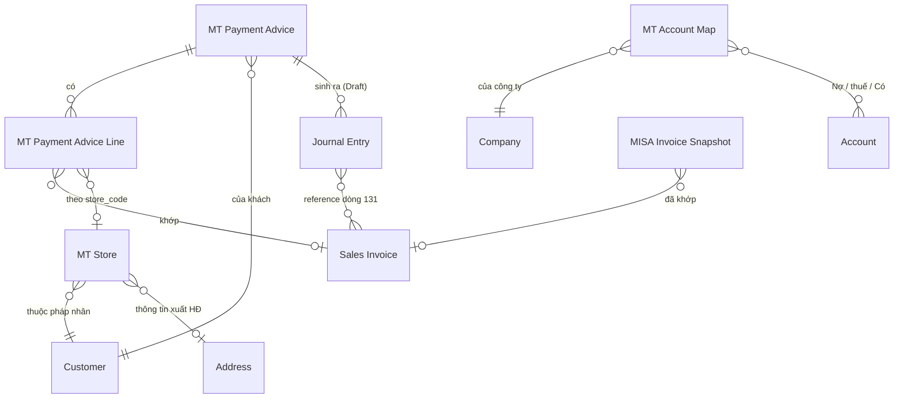

# Thiết kế MT-2 P1 — app `ketoan`, module MT

> Phạm vi: **MT2-A** (parser AEON + Fuji) · **MT2-C** (master `MT Store`) ·
> **MT2-D** (sinh Journal Entry Draft) · **MT2-E** (duyệt JE trên portal).
> Giai đoạn 1 (khai thác nghiệp vụ) bỏ qua — đã có `SOP_ke_toan_MT_RVHG.md` và
> `docs/blueprint/00_blueprint_p0.md`.
>
> Trạng thái: GĐ2 ✅ · GĐ3 ✅ · GĐ4 ✅ (bỏ, có lý do) · **GĐ5–6 CHỜ DUYỆT CUỐI**. Chưa viết code app.

---

## GIAI ĐOẠN 2 — DOCTYPE BLUEPRINT

### 2.0 Quyết định: tạo mới hay tái dùng

Nguyên tắc *Reuse > Create* của nextcode.

| Nhu cầu | Quyết định | Vì sao |
|---|---|---|
| Điểm siêu thị (store) + ánh xạ mã NCC → Customer | **DocType mới `MT Store`** | Có vòng đời riêng (mở/đóng điểm), nhiều bản ghi (Co.op ~120, LOTTE 19, CR 59 tên store), cần list/filter, là master được nhiều nơi tham chiếu |
| Số hiệu TK theo sự kiện × chuỗi | **DocType mới `MT Account Map`** | Nhiều bản ghi (sự kiện × chuỗi × công ty), kế toán tự sửa, không nhồi được vào Single Settings vì là bảng |
| Đánh dấu JE nào do MT sinh ra | **Custom Field trên `Journal Entry`** | Chỉ vài field, JE không có vòng đời riêng do ta định nghĩa — đúng tiêu chí Custom Field |
| Thêm chuỗi AEON, Fuji | **Sửa Select `chain` sẵn có** | Không phát sinh entity mới |
| Liên kết advice ↔ JE | **Custom Field trên JE, KHÔNG thêm bảng con vào advice** | Quan hệ 1-N từ phía JE; truy vấn ngược bằng index rẻ hơn, và JE bị hủy/xóa thì không để lại dòng con mồ côi |
| Ghi nhận thanh toán | **Journal Entry core** — KHÔNG Payment Entry | Ràng buộc SOP mục 0.4 |

**Không tạo**: DocType riêng cho "đợt thanh toán" (đã là `MT Payment Advice`),
DocType riêng cho phí (đã là dòng trong `MT Payment Advice Line`).

---

### 2.1 DocType mới: `MT Store`

- **Module**: MT
- **Naming**: `naming_series:` — `MT-STORE-.#####`
  *Vì sao không `format:{chain}-{store_code}`*: tên chuỗi có dấu chấm và khoảng
  trắng (`Saigon Co.op`, `Central Retail`) → docname xấu và dễ vỡ khi đổi tên
  chuỗi. Ràng buộc duy nhất `(chain, store_code)` ép ở `validate()`.
- **Is Submittable**: No · **Track Changes**: Yes
- **Title Field**: `store_name` · **Search Fields**: `store_code,store_name,vendor_code`

#### Fields

| Fieldname | Label | Type | Options | Reqd | InList | Filter | Ghi chú |
|---|---|---|---|---|---|---|---|
| `chain` | Chuỗi siêu thị | Select | (7 chuỗi, xem 2.4) | ✓ | ✓ | ✓ | |
| `store_code` | Mã điểm | Data | | ✓ | ✓ | | Giữ NGUYÊN VĂN kể cả số 0 đầu (`01019`, `8003`, `590072`) |
| `store_name` | Tên điểm | Data | | ✓ | ✓ | | |
| `customer` | Khách hàng | Link | Customer | | ✓ | ✓ | Pháp nhân xuất hóa đơn của điểm này |
| `address` | Địa chỉ / thông tin xuất HĐ | Link | Address | | | | Nguồn buyer info cho BKCK (MST chi nhánh LOTTE) |
| `tax_id` | MST của điểm | Data | | | | | Chỉ điền khi điểm có MST riêng (LOTTE). Đọc từ Address nếu trống |
| `vendor_code` | Mã NCC của mình tại chuỗi | Data | | | ✓ | ✓ | `7466` LOTTE · `100968` Emart · `2007766` Win · `0000003114` AEON · `27063` Mega · `3003172`/`3006634` CR |
| `active` | Đang hoạt động | Check | | | ✓ | ✓ | default 1 |
| `note` | Ghi chú | Small Text | | | | | |

#### Ràng buộc & tính toán

- `validate()`: `(chain, store_code)` **duy nhất**. Trùng → throw. Đây là khóa
  tự nhiên; thiếu ràng buộc này thì seed chạy hai lần là nhân đôi master.
- `store_code` chuẩn hóa: `strip()` + bỏ `\xa0`, **KHÔNG** ép số — mất số 0 đầu
  là hỏng khớp mã điểm (bài học §H.3 của contract).
- `tax_id` để trống thì đọc `Address.tax_id`/`gstin` khi cần; không sao chép sẵn
  để tránh hai nguồn sự thật lệch nhau.

#### Quan hệ

- Links to: `Customer`, `Address`
- Được đọc bởi: `mt._match_row`, `mt.detect_customer`, `mt_advice.detect_chain`
  (qua `vendor_code`), và MT2-B sau này (buyer info cho BKCK)

#### ⚠ Điểm phải chốt — `vendor_code` là của CHUỖI hay của ĐIỂM?

Đo trên file thật: `vendor_code` **giống nhau cho mọi điểm trong một chuỗi**
(LOTTE `007466` ở cả 19 store; AEON `0000003114` ở cả 6 sheet). Riêng Central
Retail có **hai** mã (`3003172`, `3006634`) nhưng đó là **hai pháp nhân EB**,
không phải hai điểm.

⇒ Đề xuất: giữ `vendor_code` trên `MT Store` (mỗi bản ghi lặp lại giá trị của
chuỗi mình) **và** truy vấn `DISTINCT` khi cần map chuỗi. Không tách bảng riêng
cho vendor_code vì sẽ đẻ thêm một master chỉ có 7 dòng.

---

### 2.2 DocType mới: `MT Account Map`

- **Module**: MT · **Naming**: `naming_series:` — `MT-ACC-.#####`
- **Is Submittable**: No · **Track Changes**: Yes

#### Fields

| Fieldname | Label | Type | Options | Reqd | Ghi chú |
|---|---|---|---|---|---|
| `event` | Sự kiện | Select | `Nhận thanh toán`⏎`Chiết khấu mình xuất`⏎`Phí chuỗi xuất` | ✓ | |
| `chain` | Chuỗi siêu thị | Select | (rỗng = áp cho MỌI chuỗi) | | Để trống là dòng mặc định |
| `company` | Công ty | Link | Company | ✓ | |
| `debit_account` | TK Nợ chính | Link | Account | ✓ | 112 / 5211 / 6411 |
| `tax_account` | TK Nợ thuế | Link | Account | | 33311 / 1331. Trống = không sinh dòng thuế |
| `credit_account` | TK Có | Link | Account | ✓ | 131 |
| `active` | Đang dùng | Check | | | default 1 |

#### Quy tắc tra cứu (quan trọng)

Tìm theo thứ tự, dừng ở dòng đầu tiên trúng:
1. `(event, chain, company)` khớp đủ
2. `(event, chain rỗng, company)` — dòng mặc định của công ty

Không tìm thấy → **throw**, KHÔNG lấy TK mặc định cứng trong code. Sinh JE vào
sai tài khoản còn tệ hơn không sinh.

#### Seed mặc định (patch, theo SOP mục 4)

| event | chain | debit | tax | credit |
|---|---|---|---|---|
| Nhận thanh toán | *(rỗng)* | `112` | — | `131` |
| Chiết khấu mình xuất | *(rỗng)* | `5211` | `33311` | `131` |
| Phí chuỗi xuất | *(rỗng)* | `6411` | `1331` | `131` |

Patch dò account theo **số hiệu đầu** trong Chart of Accounts của công ty
(`account_number LIKE '112%'`…). Không tìm được → tạo bản ghi với account để
trống + ghi log, KHÔNG đoán. Kế toán vào điền.

---

### 2.3 Custom Fields trên `Journal Entry` (qua `create_custom_fields` + patch)

| Fieldname | Label | Type | Options | Ghi chú |
|---|---|---|---|---|
| `custom_mt_source_dt` | Nguồn MT (DocType) | Data | | `MT Payment Advice` / `MT Bang Ke CK` |
| `custom_mt_source_name` | Nguồn MT (bản ghi) | Data | | `search_index=1` |
| `custom_mt_kind` | Loại bút toán MT | Select | `Thanh toán`⏎`Chiết khấu`⏎`Phí` | `in_standard_filter=1` |
| `custom_mt_fingerprint` | Vân tay chống trùng | Data | | `search_index=1`, `read_only=1` |

*Vì sao `Data` chứ không `Link` cho `custom_mt_source_name`*: JE là DocType core,
đặt `Link` trỏ vào DocType của app sẽ khóa việc xóa/đổi tên bản ghi MT và tạo
phụ thuộc ngược không cần thiết. Chỉ cần tra ngược được — `Data` + index là đủ.

**Vân tay** = sha1 của `(source_dt, source_name, kind, payment_date, tổng tiền,
danh sách SI đã sắp xếp)`. Có bản ghi JE mang cùng vân tay và `docstatus != 2`
→ **không sinh lại**. Đây là chốt chống sinh JE trùng khi bấm hai lần.

---

### 2.4 Sửa DocType sẵn có

#### `MT Payment Advice`

| Thay đổi | Chi tiết |
|---|---|
| `chain` Select | Thêm `AEON`, `Fuji` (và `Mega Market` để sẵn cho MT2-B) |
| `status` Select | Giữ nguyên 3 giá trị. **Ngữ nghĩa siết lại**: `Đã ghi nhận` chỉ được đặt khi MỌI JE liên quan đã `docstatus=1` |
| Field mới `je_state` | Select: *(rỗng)* ⏎ `Chưa sinh` ⏎ `Đã sinh nháp` ⏎ `Đã duyệt một phần` ⏎ `Đã duyệt đủ` — read_only, tính lại mỗi lần sinh/duyệt |

`chain` nằm trong DocType JSON (app-owned) → `bench migrate` tự đồng bộ.
`je_state` là field của DocType app, **không phải Custom Field** → cũng theo
migrate, không cần patch. Nhưng `custom_mt_chain` trên `Customer` **là** Custom
Field → **cần patch** để nới options.

#### `Customer.custom_mt_chain`

Nới options thêm `AEON`, `Fuji`, `Mega Market`. → patch mới.

#### Hằng `CHAIN_OPTIONS`

Hiện khai ở **3 nơi** phải khớp nhau: `mt.py`, `install.MT_CHAIN_OPTIONS`, và
Select `chain` trong DocType JSON. MT2-A sẽ **gom về một nguồn** (`install.py`)
và hai nơi kia đọc lại, kèm test khẳng định ba nơi bằng nhau — lệch một chỗ là
gán ra chuỗi không tồn tại.

---

### 2.5 ERD



---

### 2.6 ✅ BA ĐIỂM ĐÃ CHỐT (20/08/2026)

#### Q1 — JE phí: **một bút toán cả cục, ghi tham chiếu đầy đủ**

Ràng buộc "dòng 131 bắt buộc reference Sales Invoice" **chỉ áp cho JE thanh
toán**. Lý do dữ liệu: phí của Central Retail (`D1`), LOTTE (khoản `L`), Emart
(`I1`), AEON (`Costdet`) đều tính theo **kỳ** hoặc **phiếu giao**, không thuộc
hóa đơn bán nào — ép cứng thì 4/5 chuỗi không sinh được JE phí.

Chốt:

| Loại JE | Dòng 131 | Tham chiếu |
|---|---|---|
| **Thanh toán** | ~~1 dòng / Sales Invoice~~ → **1 dòng gộp** *(sửa 20/08/2026, xem dưới)* | ~~reference bắt buộc~~ → không reference |
| **Phí chuỗi xuất** | **1 dòng gộp cả cục** | Không reference SI. Ghi ĐẦY ĐỦ vào `user_remark`: chuỗi · kỳ · số hóa đơn của chuỗi · danh sách khoản trừ · tên bảng kê nguồn |
| **Chiết khấu mình xuất** (MT2-B) | 1 dòng gộp | `user_remark` ghi số BKCK + số hóa đơn CK |

Hệ quả kế toán **phải biết**: JE phí gộp làm **giảm số dư 131 của khách** nhưng
**không giảm outstanding của từng hóa đơn**. Đúng bản chất — chuỗi trừ phí vào
tổng thanh toán của kỳ, không trừ vào một hóa đơn cụ thể. Câu này sẽ hiện ngay
trên màn duyệt JE, không giấu trong tooltip.

Riêng Co.op có 17,75% theo **từng hóa đơn**: vẫn gộp một dòng 131 theo quyết
định trên, nhưng `user_remark` liệt kê chi tiết từng hóa đơn + số tiền trừ, vì
dữ liệu có sẵn — "ghi tham chiếu đầy đủ" đúng nghĩa.

#### ✏️ SỬA Q1 (20/08/2026) — **bút toán thanh toán cũng ghi 1 dòng tổng**

Người dùng chốt: *"131 thanh toán các hóa đơn chỉ cần ghi tổng thanh toán. Đã có
trang gạch hóa đơn thanh toán riêng."*

Đúng, và nó nhất quán với một quyết định đã có từ **MT-1**: ở kênh MT, con số
"đã thu / còn lại" tính từ **chính các dòng bảng kê**, không từ
`outstanding_amount` của ERPNext (xem chú thích `mtOverview` trong `api.js`).
Gắn reference Sales Invoice lên dòng 131 là dựng **cơ chế gạch nợ thứ hai** —
hai nguồn sự thật sẽ lệch nhau ngay kỳ đầu có một hóa đơn bị điều chỉnh.

Bảng cuối cùng: **cả ba loại JE đều ghi Có 131 một dòng tổng cho một pháp nhân,
không reference.**

| | Trước | Sau |
|---|---|---|
| Dòng 131 của JE thanh toán | 1 dòng / hóa đơn, có reference | **1 dòng tổng**, không reference |
| Dòng thanh toán chưa gạch được hóa đơn | **bị LOẠI** khỏi JE (để JE còn cân) → tiền đã về mà không vào sổ | **vẫn vào JE**, kèm cảnh báo |
| Việc gạch hóa đơn | JE reference + màn 'Quản lý thanh toán' (trùng nhau) | chỉ màn 'Quản lý thanh toán' |
| Tra ngược từ JE về hóa đơn | qua reference | qua `user_remark` (liệt kê tối đa 60 hóa đơn + số tiền) |

Đổi này còn **sửa một lỗ mất tiền**: ở bản cũ, dòng thanh toán chưa nối được hóa
đơn buộc phải loại khỏi bút toán để bút toán còn cân — tiền thật đã về nhưng
không được ghi sổ, chỉ có một dòng cảnh báo.

#### Q2 — 1 JE thanh toán / advice ✅

`MT Payment Advice` đã tách theo `payment_date` từ MT-1, nên `advice ×
payment_date` luôn là 1. Advice có nhiều `payment_date` ở dòng con → **throw**,
không tự tách: dữ liệu đã sai từ tầng đọc, sinh JE lên trên là chôn lỗi.

#### Q3 — Central Retail: tên store nằm trong **ngoặc** ở `shipping_address_name` ✅

Đây là nguồn TỐT HƠN file chuỗi: lấy từ **chính ERPNext**, có sẵn link Address,
và là dữ liệu mình kiểm soát.

Quy tắc seed CR:
- Quét `shipping_address_name` của Sales Invoice kênh MT thuộc Customer Central
  Retail (và/hoặc quét thẳng `tabAddress`).
- `store_name` = phần trong **cặp ngoặc cuối cùng** của tên address.
  Lấy ngoặc CUỐI vì tên address có thể chứa ngoặc khác ở giữa.
- `store_code` = tên đã chuẩn hóa (bỏ dấu, upper, khoảng trắng → `_`).
- `address` = chính Address đó → BKCK lấy được buyer info ngay.
- Không tìm thấy ngoặc → **bỏ qua và ghi log**, không lấy cả tên address làm
  store (sẽ đẻ ra store rác trùng nhau).

Với 4 chuỗi có mã thật (LOTTE, AEON, Co.op, Mega) vẫn seed từ file mẫu như cũ.

---

## GIAI ĐOẠN 3 — PERMISSION MATRIX

### 3.0 Nguyên tắc áp dụng cho MT-2

1. **DocType của app** (`MT Store`, `MT Account Map`) → DocPerm ghi thẳng trong
   DocType JSON. Convention "KHÔNG ship DocPerm qua fixtures" của repo nhắm vào
   DocType **core**; DocType do app sở hữu thì JSON chính là nguồn.
2. **DocType core** (`Journal Entry`) → cấp bằng `add_permission` trong
   `install.py`, đúng lối đã dùng cho Sales Invoice/Customer.
3. **Quyền GHI của nghiệp vụ tiền nằm ở kế toán trưởng.** Kế toán MT làm việc
   hằng ngày qua **portal** — nơi mọi thao tác ghi đều đi qua whitelisted method
   có `guard_manager()`. Cấp `write` trên Desk cho `Ke Toan MT` là **vô hiệu hóa
   guard** (đúng lỗi đã mắc và đã sửa ở MT-1 với `MT Payment Advice`).
4. **Không dùng permlevel** ở P1: không có nhóm field nhạy cảm nào cần che riêng
   trong 2 DocType mới. Thêm permlevel khi chưa cần là đẻ ra lỗi khó truy.

### 3.1 `MT Store`

| Role | Lvl | R | W | C | D | Report | Print | Export | If Owner |
|---|---|---|---|---|---|---|---|---|---|
| System Manager | 0 | ✓ | ✓ | ✓ | ✓ | ✓ | ✓ | ✓ | |
| Ke Toan Truong | 0 | ✓ | ✓ | ✓ | ✓ | ✓ | ✓ | ✓ | |
| Accounts Manager | 0 | ✓ | ✓ | ✓ | | ✓ | ✓ | ✓ | |
| Ke Toan MT | 0 | ✓ | | | | ✓ | ✓ | | |
| Accounts User | 0 | ✓ | | | | ✓ | | | |

*Vì sao `Ke Toan MT` không có `write`*: mở/đóng điểm siêu thị là việc **thưa**
(vài lần/năm) nhưng sai thì **định tuyến tiền sai** — store gắn nhầm pháp nhân
là cả kỳ công nợ chạy sang khách khác. Để trưởng chốt.

### 3.2 `MT Account Map`

| Role | Lvl | R | W | C | D | Report | Print |
|---|---|---|---|---|---|---|---|
| System Manager | 0 | ✓ | ✓ | ✓ | ✓ | ✓ | ✓ |
| Ke Toan Truong | 0 | ✓ | ✓ | ✓ | ✓ | ✓ | ✓ |
| Accounts Manager | 0 | ✓ | ✓ | ✓ | | ✓ | ✓ |
| Ke Toan MT | 0 | ✓ | | | | ✓ | |
| Accounts User | 0 | ✓ | | | | ✓ | |

`Ke Toan MT` **có `read`** — cần thấy TK nào sẽ được dùng ngay trên màn xem
trước JE. Giấu đi thì họ duyệt một bút toán mà không biết nó vào tài khoản nào.

### 3.3 `Journal Entry` (core — cấp qua `install.py`)

Ma trận hiện hành (`_SALES_CHANNEL_PERMS`) đã cho `Ke Toan MT` quyền
`DRAFT_DOC` = read/write/create/print/report trên Journal Entry — **không có
`submit`**. Đúng ý đồ: kế toán kênh lập nháp, không tự ghi sổ.

**MT-2 KHÔNG nới quyền này.** Việc duyệt JE trên portal (MT2-E) đi qua
whitelisted method có `guard_manager()`, và bản thân `doc.submit()` chạy dưới
quyền của user — nên **chỉ kế toán trưởng duyệt được**, đúng như hiện trạng
(`Ke Toan Truong` thừa hưởng `FULL_DOC` cho Journal Entry).

| Role | submit JE | Ghi chú |
|---|---|---|
| Ke Toan MT | ❌ | Lập nháp + xem; bấm duyệt sẽ bị guard chặn |
| Ke Toan Hach Toan | ✓ | `FULL_DOC` sẵn có |
| Ke Toan Truong | ✓ | |

#### ✅ Q4 đã chốt (phương án **a**)

Người kế toán phụ trách kênh MT **mang thêm role `Ke Toan Truong`**.
**KHÔNG nới `submit` Journal Entry cho `Ke Toan MT`.**

Hệ quả cho build:
- Ma trận quyền `install.py` **giữ nguyên**, MT-2 không đụng vào.
- `mt.submit_journal_entries()` vẫn `guard_manager()` ở dòng đầu — đúng.
- Tab "Duyệt bút toán" **ẩn nút duyệt** với user không phải chief
  (`ov.can_import` đã là `is_chief()`), giống cách `state.canManage` đang làm.
  Hiện nút cho người không có quyền chỉ tạo một cú bấm để nhận lỗi.
- Khi giao tài khoản cho kế toán MT: **phải gán 2 role**. Ghi vào SOP mục 0.

### 3.4 User Permission

Không đặt User Permission mới ở P1. Lọc theo công ty đã do `mt._company()` lo ở
tầng API (kiểm bằng User Permission trên `Company` nếu có khai).

---

## GIAI ĐOẠN 4 — WORKFLOW BLUEPRINT

### ❌ KHÔNG dùng Workflow doctype — có lý do

Tiêu chí của skill: chỉ dựng Workflow khi DocType có **>3 trạng thái + chuyển
trạng thái theo role**. Đối chiếu:

| Đối tượng | Trạng thái | Kết luận |
|---|---|---|
| `Journal Entry` | Draft → Submitted → Cancelled | **Đã có `docstatus` của core.** Chồng Workflow lên JE là đè lên cơ chế ghi sổ của ERPNext — rủi ro rất cao, lợi ích bằng 0 |
| `MT Payment Advice` | Nháp / Đã đối chiếu / Đã ghi nhận | Là **thuộc tính** phản ánh tiến độ, không có chuyển trạng thái theo role. Đúng định nghĩa "status field", không phải workflow |
| `MT Store`, `MT Account Map` | master data | Không có vòng đời |

⇒ **Bỏ qua giai đoạn 4.** Thay bằng ràng buộc trong controller:

- `MT Payment Advice.status = 'Đã ghi nhận'` **chỉ** khi mọi JE mang
  `custom_mt_source_name = advice.name` đều `docstatus = 1`. Đặt tay trên Desk
  mà chưa đủ điều kiện → `validate()` throw.
- `je_state` (read_only) tính lại từ chính các JE đó, không cho sửa tay.

---

---

## GIAI ĐOẠN 5 — INTEGRATION & HOOKS PLAN

### 5.1 Điểm chạm với ERPNext core

| DocType core | Chiều | Việc |
|---|---|---|
| `Journal Entry` | **GHI** (tạo Draft) | Sản phẩm chính của MT2-D. Không bao giờ `submit()` tự động |
| `Sales Invoice` | ĐỌC | `reference_name` dòng 131 của JE thanh toán; nguồn `shipping_address_name` để seed store CR |
| `Customer` | ĐỌC + custom field | `custom_mt_chain` (đã có, nới options) |
| `Address` | ĐỌC | buyer info cho `MT Store`; nguồn tên store CR |
| `Account`, `Company` | ĐỌC | `MT Account Map` |
| `MISA Invoice Snapshot` | ĐỌC | đã dùng ở MT-1, không đổi |

**KHÔNG đụng**: `Payment Entry` (ràng buộc JE-only), `GL Entry` (chỉ core ghi),
`Stock Entry` (hàng trả đi đường chứng từ trả hàng của ERPNext).

### 5.2 `hooks.py` — chỉ thêm 2 doc_events

```python
doc_events = {
    "Journal Entry": {
        "on_submit":  "ketoan.api.mt_je.sync_advice_state",
        "on_cancel":  "ketoan.api.mt_je.sync_advice_state",
    },
}
```

> **Ghi nhận khi build MT2-D (20/08/2026) — MỘT LỖI TIỀN ĐÃ BỊ CHẶN**
>
> `MT Payment Advice Line.total_amount` lưu số **GIỮ NGUYÊN DẤU** (xem
> `mt._map_rows`), không phải độ lớn. Bản đầu của `mt_je` cộng `abs()` từng dòng
> cho nhóm khoản trừ — đúng với dòng thanh toán (mỗi dòng một hóa đơn riêng)
> nhưng **sai với nhóm gộp**, vì `Sub-Total` mà chuỗi in ra là tổng **đại số**.
> Đo trên file thật, ba nhóm có cả dòng trừ lẫn dòng hoàn:
>
> | Chuỗi · loại | Tổng đại số (đúng) | Cộng độ lớn (sai) | Ghi khống |
> |---|---|---|---|
> | Saigon Co.op · Chiết khấu | 1.338.010.941 | 1.662.373.817 | **324.362.876** |
> | AEON · Phí | 10.424.817 | 11.023.025 | 598.208 |
> | LOTTE · Ghi giảm *(không sinh JE)* | 809.335 | 11.868.813 | 11.059.478 |
>
> Bút toán sai vẫn **CÂN**, con số vẫn trông hợp lý, và không tổng nào trên màn
> hình phát hiện ra — chỉ lộ khi đối chiếu sao kê ngân hàng. Nay `_group_amount`
> dùng `|Σ đại số|`, nhóm dấu lẫn lộn được **gắn cờ** ra tận màn duyệt, và
> `docs/mt/verified/je_plan_check.py` khóa cả ba con số lại.

**Vì sao cần**: `je_state` và `status='Đã ghi nhận'` của advice suy từ docstatus
của các JE. Kế toán hoàn toàn có thể submit/cancel JE **thẳng trên Desk**, không
qua portal. Thiếu hook thì advice đứng mãi ở "Đã sinh nháp" trong khi JE đã ghi
sổ — màn hình nói dối.

Hàm bọc `try/except` + `log_error` toàn bộ: **tích hợp MT hỏng không được chặn
việc ghi sổ**. Cùng nguyên tắc `misa_sync.ensure_ref_id`.

**KHÔNG thêm**: `scheduler_events` (không có việc định kỳ ở P1),
`override_doctype_class`, `jinja` (Print Format của BKCK thuộc MT2-B).

### 5.3 Whitelisted endpoints mới

| Method | Guard | Việc |
|---|---|---|
| `mt_je.preview_journal_entries(advice)` | `guard_mt` | Xem trước JE sẽ sinh: từng dòng, TK, tiền, SI reference. **KHÔNG ghi** |
| `mt_je.create_journal_entries(advice, expected_hash)` | `guard_manager` | Sinh JE Draft. Bắt buộc vân tay từ preview |
| `mt_je.list_advices(...)` | `guard_mt` | Bảng kê + `je_state` của từng cái, lọc chuỗi/kỳ/trạng thái, chia trang |
| `mt_je.list_draft_journal_entries(...)` | `guard_mt` | Danh sách JE do MT sinh (nháp hoặc đã ghi sổ), lọc chuỗi/kỳ/loại, chia trang |
| `mt_je.get_journal_entry(name)` | `guard_mt` | Chi tiết một JE để soi trước khi duyệt |
| `mt_je.submit_journal_entries(names, force_unreconciled)` | `guard_manager` | Duyệt. **try/except + savepoint từng JE**, trả kết quả per-JE |
| `mt_je.delete_draft_journal_entries(names)` | `guard_manager` | Xóa JE **nháp** sinh nhầm |

> **Bổ sung khi build MT2-E (20/08/2026)**
>
> · `get_journal_entry` — duyệt mà không soi được nội dung thì nút duyệt chỉ là
>   một cú bấm mù. Đọc cả JE đã ghi sổ để tra lại sau.
> · `delete_draft_journal_entries` — không có đường xóa là **bế tắc**: sinh nhầm
>   → vân tay chống trùng chặn lần sinh lại → kế toán buộc phải vào Desk, mà
>   `Ke Toan MT` không có quyền xóa ở đó. Chỉ đụng bản nháp; hủy chứng từ đã ghi
>   sổ vẫn là việc của Desk, có vết và có quy trình riêng.
> · `force_unreconciled` — bảng kê chưa tick 'Đã đối chiếu khớp' thì
>   `submit_journal_entries` **từ chối ghi sổ** và trả `needs_confirm` kèm danh
>   sách, cho tới khi người xác nhận có ý thức. Duyệt là ghi sổ; hủy một bút toán
>   đã ghi để lại vết trong sổ cái mà kiểm toán sẽ hỏi.
| `mt_je.get_account_map(company)` | `guard_mt` | Bảng TK đang áp dụng — để màn xem trước nói rõ bút toán vào TK nào |
| `mt_store.preview_seed()` | `guard_mt` | Xem trước danh sách store dựng được |
| `mt_store.commit_seed(expected_hash)` | `guard_manager` | Tạo `MT Store` |
| `mt_store.list_stores(...)` | `guard_mt` | Danh sách điểm, lọc chuỗi/khách/trạng thái, chia trang |
| `mt_store.save_store(...)` | `guard_manager` | Sửa một điểm (gán pháp nhân, địa chỉ, đóng điểm) |
| `mt_store.search_addresses(txt, customer)` | `guard_mt` | Gợi ý địa chỉ để gán, LỌC theo khách |

> **Điều chỉnh khi build (20/08/2026)**: nhóm điểm siêu thị nằm ở module riêng
> `ketoan/api/mt_store.py` và nhóm bút toán ở `ketoan/api/mt_je.py`, thay vì
> nhét thêm vào `mt.py` — mt.py đã ~2.500 dòng
> và lo một việc khác hẳn (đối chiếu bảng kê với hóa đơn). Đúng quy ước
> "1 file = 1 chức năng" của repo. Ba endpoint cuối là bổ sung: seed mà không
> có màn xem/sửa thì master không dùng được, và `save_store` là đường GHI duy
> nhất cho kế toán trưởng (Desk vẫn chỉ-đọc với `Ke Toan MT` đúng như §3.1).

Mọi method **guard ở DÒNG ĐẦU**, `_require_tables()` ngay sau — đúng lối MT-1.

### 5.4 Nguồn seed `MT Store` — từ DỮ LIỆU TRÊN SITE, không ship file mẫu

| Chuỗi | Nguồn seed |
|---|---|
| LOTTE · AEON · Co.op · Mega | `MT Payment Advice Line.store_code/store_name` **đã nạp trên site** — `DISTINCT` theo chuỗi |
| Central Retail | `Address` / `Sales Invoice.shipping_address_name` — lấy phần trong **cặp ngoặc cuối** |
| Win · Emart · Fuji | Không có store trong chứng từ → **không seed**, để trống |

*Vì sao không seed từ `docs/mt/samples/`*: file mẫu là ảnh chụp một kỳ, site có
dữ liệu đầy đủ hơn và luôn mới hơn. Ship dữ liệu mẫu vào patch là đóng băng một
thời điểm rồi lệch dần.

**Preview bắt buộc** trước khi ghi (lối `misa_legacy`): store dựng từ heuristic
(CR lấy trong ngoặc) nên người phải nhìn trước khi tạo master.

### 5.5 Thứ tự phụ thuộc khi build

```
MT2-A (parser AEON+Fuji)   ── độc lập, ship trước, có giá trị ngay
        │
MT2-C (MT Store)           ── cần advice đã nạp để seed
        │
MT2-D (JE Draft)           ── cần MT Account Map + advice đã đối chiếu
        │
MT2-E (duyệt trên portal)  ── cần JE đã sinh
```

---

## GIAI ĐOẠN 6 — PATCH PLAN (thay cho fixtures)

Đã chốt ở BƯỚC 0: **`create_custom_fields` + patch**, KHÔNG fixtures.
Quy tắc bất di bất dịch của repo: **thêm field mới = thêm patch mới**.

`patches.txt` đang ở `v0_0_12`. Dự kiến:

| Patch | Hạng mục | Việc |
|---|---|---|
| `v0_0_13.mt_chain_aeon_fuji` | MT2-A | Nới options `Customer.custom_mt_chain` thêm `AEON`, `Fuji`, `Mega Market`. Select `chain` của `MT Payment Advice` tự theo migrate (DocType app-owned) |
| `v0_0_14.mt_je_custom_fields` | MT2-D | 4 custom field trên `Journal Entry` (`custom_mt_source_dt`, `custom_mt_source_name`, `custom_mt_kind`, `custom_mt_fingerprint`) |
| `v0_0_15.mt_account_map_seed` | MT2-D | Seed 3 dòng `MT Account Map` mặc định cho mỗi Company. Dò account theo số hiệu đầu; không tìm được → tạo dòng với account TRỐNG + log, **không đoán** |

**Không cần patch**: `MT Store`, `MT Account Map`, field `je_state` — đều là
DocType/field do app sở hữu, `bench migrate` tự đồng bộ.

**Không có patch seed `MT Store`**: seed đi qua preview + commit trên portal
(mục 5.4), vì dựng store là heuristic phải cho người nhìn trước.

### Kiểm tra bắt buộc trước mỗi commit

1. `python3 -m py_compile` mọi file `.py` đụng tới
2. `node --check` mọi file `.js` đụng tới
3. `python3 -c "import json; json.load(...)"` mọi DocType JSON
4. **`python3 docs/mt/verified/regression_check.py`** — 5 chuỗi cũ phải vẫn
   đúng từng đồng. Đây là chốt chặn: MT2-A sửa `mt_advice.py` là đụng thẳng vào
   tầng đọc của 5 chuỗi đang chạy
5. Kiểm AST: mọi `@frappe.whitelist` có guard ở dòng đầu
6. Ba nơi khai `CHAIN_OPTIONS` phải khớp nhau

### Commit convention

Một commit / hạng mục, tiêu đề ghi rõ `MT2-A` / `MT2-C` / `MT2-D` / `MT2-E`.
Push cả nhánh `claude/zen-babbage-0vj0eg` và `main`.

---

## ✅ CỔNG DUYỆT CUỐI — TOÀN BỘ THIẾT KẾ P1

| Giai đoạn | Trạng thái |
|---|---|
| 2 — DocType blueprint | ✅ duyệt (Q1·Q2·Q3 chốt ở 2.6) |
| 3 — Permission matrix | ✅ duyệt (Q4 chốt phương án **a**) |
| 4 — Workflow | ✅ **bỏ có lý do** |
| 5 — Integration & hooks | ✅ duyệt |
| 6 — Patch plan | **chờ duyệt** |

Duyệt xong thì chuyển sang `nextcode-build`, thứ tự **A → C → D → E**.

---

## ✅ P1 ĐÃ SHIP (20/08/2026)

| Hạng mục | Commit | Bộ kiểm |
|---|---|---|
| **MT2-A** parser AEON + Fuji, gom `CHAIN_OPTIONS` một nguồn | `4cb04b2` | `regression_check` · `crosscheck_mt2` · `mutation_check` |
| **MT2-C** master `MT Store` + seed từ bảng kê đã nạp | `48105e1` | `store_seed_check` |
| **MT2-D** `MT Account Map` + sinh JE nháp (patch v0_0_14/15) | `1d65ed6` `f676467` | `je_plan_check` |
| **MT2-E** duyệt / xóa bút toán trên portal | `bd420fd` | `je_submit_check` |
| **MT2-B1** đọc file cơ sở tính chiết khấu (Central Retail · LOTTE · Mega) | `303ff6f` | `discount_basis_check` |
| **MT2-B2** bảng kê chiết khấu: lập → chốt cấp số → in → sinh JE | `d029ed0` | `discount_sheet_check` |
| **MT2-B3** hồ sơ thanh toán WinCommerce (xuất Excel + tên file PDF) | `6912873` | `win_dossier_check` |
| **MT2-F** công nợ MT đến hạn theo term (patch v0_0_16) | `899501a` | `debt_due_check` |
| **MT2-B4** đọc Rebate Settlement Emart (PDF) -> BKCK | `32e0f08` | `rebate_pdf_check` · `discount_sheet_check` |
| **MT2-G** đóng hạng mục "khớp tự động dòng Ghi giảm" bằng phép đo | `165cf30` | `clawback_check` |
| **MT2-H** soát trước deploy: 3 lỗi thật, bịt vùng mù "kiểm không bao giờ GHI" | `04a72e2` | `discount_sheet_check` · `rebate_pdf_check` |
| **MT2-I** giao diện xếp lại theo CHUỖI + vòng đời tháng | `26101e7` | `ui_board_check` |
| **MT2-J** bộ lọc chuỗi thật sự lọc — gom về MỘT quy tắc | `7b1aa83` | `chain_filter_check` |
| **MT2-K1/K2/K3** đọc 7 file công nợ Excel để nhập số dư đầu kỳ | `30e5d0b` `c77ba12` `07c5c73` | `opening_check` |
| **MT2-L1** danh sách đợt giao Winmart chưa xuất hóa đơn | `8dee7d8` | — |
| **MT2-L2** đọc phiếu nhập kho Winmart (PDF) + đối soát PO/mã hàng | `8db013e` | `win_grn_check` |
| **MT2-K4** cất số dư đầu kỳ + luật tất toán trước ngày chuyển giao | `fbb77d5` | `opening_store_check` |
| **MT2-M** parser thanh toán Mega Market — chuỗi cuối cùng | *(commit này)* | `mega_check` · `regression_check` · `crosscheck_mt2` |

Chạy toàn bộ, không cần bench:

```bash
for t in regression_check crosscheck_mt2 mutation_check \
         store_seed_check je_plan_check je_submit_check \
         discount_basis_check discount_sheet_check win_dossier_check \
         debt_due_check rebate_pdf_check clawback_check ui_board_check \
         chain_filter_check opening_check win_grn_check opening_store_check \
         mega_check; do
  python3 docs/mt/verified/$t.py
done
```

### Số dư đầu kỳ — một luật ĐỌC, không phải bút toán

Kế toán chốt cách nghĩ ngược: **ghi vào phần mềm những hóa đơn CHƯA được thanh
toán tại ngày chuyển giao, mặc định mọi thứ trước đó đã trả.** Cách đó thu việc
nhập từ 9.497 dòng xuống 1.167 và chỉ phải tin MỘT cột thay vì hai.

Diễn đạt trong code đúng một câu, ở đúng một chỗ (`mt.opening_settled_expr`):

    hóa đơn của chuỗi X · ngày <= ngày chốt của X · KHÔNG có tên trong danh
    sách còn nợ của X   ->   coi như ĐÃ THANH TOÁN.

**Đây là luật ĐỌC, không sinh chứng từ nào.** Không bút toán, không đụng sổ,
không `db_set` lên hóa đơn. Chốt sai thì mở lại là xong — đó là lý do chọn cách
này thay vì đánh dấu lên từng Sales Invoice.

#### Ba bước, cố ý tách rời

| | Làm gì | Ảnh hưởng công nợ |
|---|---|---|
| **Nháp** | đọc file, nối từng dòng sang Sales Invoice, cất lại | **không** |
| **Nối tay** | dòng máy không nối được thì người nối, hoặc đánh dấu `Bỏ qua` | **không** |
| **Đã chốt** | bật luật | **có** |

Gộp bước 3 vào lúc tải file lên là để một lần bấm nhầm cuốn trôi vài tỷ mà không
ai kịp nhìn. Màn hình chốt bày ra **đúng danh sách hóa đơn sắp biến mất** trước
khi hỏi.

#### Vì sao phải nối được hóa đơn thì mới cho chốt

Luật chạy theo **hóa đơn ERPNext**, không theo số hóa đơn trong file. Một dòng
còn nợ không nối được Sales Invoice nào thì nó không GIỮ được hóa đơn nào lại —
và đúng hóa đơn đang còn nợ đó rơi vào vế "không có trong danh sách", tức là bị
coi là đã trả. **Nợ thật biến mất, im lặng.** Nên `validate` chặn chốt khi còn
dòng nhóm `co_hoa_don` chưa nối và chưa ai bảo bỏ qua.

#### Nối dòng sang hóa đơn — đo trước rồi mới viết

Đã kiểm cả 7 file: **không file nào in ký hiệu hóa đơn**, chỉ in SỐ, đệm 0
(`00003333`). Nên không có nhánh "ký hiệu + số" ở đây — dựng ra là code chết mà
đọc vào lại tưởng đang có phép khớp mạnh.

Bù lại, số dư đầu kỳ biết ba thứ mà bảng kê thanh toán không có cùng lúc: chuỗi
của cả file, ngày hóa đơn, tổng tiền. Thu hẹp bằng cả ba, **chỉ nhận khi còn
đúng một ứng viên**, và mọi liên kết máy đề xuất đều để `Cần review`.

Số hóa đơn đánh lại từ 1 theo từng mẫu số — file Co.op có cả `00007709` lẫn
`00000001` — nên "trùng số" là chuyện bình thường, nhận bừa là giữ nhầm hóa đơn
này và tất toán oan hóa đơn kia.

#### Chặn

- **Một chuỗi chốt MỘT LẦN** (chặn ở `validate`, không chỉ ở giao diện). Nhập
  lần hai là cộng đôi — riêng bộ file mẫu là ~5 tỷ.
- Hai dòng nối cùng một hóa đơn -> chặn chốt.
- Ngày chốt sớm hơn ngày ERPNext có dữ liệu -> chặn.
- Xóa bản **đã chốt** -> chặn (mọi hóa đơn quay lại rổ nợ cùng lúc).
- Chuỗi đã chốt mà **chưa gán khách nào** -> `1 = 0`: bản chốt đó không che hóa
  đơn nào. Rỗng là rỗng.
- Chưa có bản chốt nào -> luật trả `0`. Mặc định là **không giấu gì**.

#### Con số mang sang

```
Nợ gộp (7 sheet chính)                      5.059.095.894đ
− ghi giảm chưa cấn trừ (3 sheet phụ)         183.968.726đ
= Nợ ròng                                   4.875.127.168đ
− đơn đã giao CHƯA xuất hóa đơn                46.665.180đ   <- không phải phải thu
= CÔNG NỢ MANG SANG                         4.828.461.988đ
```

Dòng thứ tư là quyết định: 9 dòng WinCommerce không có số hóa đơn, file Excel vẫn
cộng vào `Số còn nợ`. Chưa xuất hóa đơn thì chưa phải khoản phải thu — chúng được
theo dõi riêng ở `MT Win Pending`. `opening_debt` **giữ nguyên** con số đã đối
chiếu với dòng TỔNG CỘNG in trong file; phần tách ra nằm ở `debt_carried`, để cả
hai đều tra ngược lại được.

#### Luật đi vào đâu

| Màn hình | Áp luật? | Vì sao |
|---|---|---|
| Rổ "chưa thanh toán" | **có** | rổ nói về NỢ |
| Công nợ đến hạn (`mt_debt`) | **có** | cùng hàm, để hai màn hình không ra hai số |
| Công nợ theo khách (`outstanding`, `unpaid_count`) | **có** | bọc hai cột nợ, không bọc `invoiced` |
| Rổ "tất cả" · "đã thanh toán" | **không** | vẫn phải tra lại được hóa đơn cũ |
| Khớp bảng kê thanh toán | **không** | bảng kê đến sau vẫn phải nối được hóa đơn cũ |

### Phiếu nhập kho Winmart — chốt bằng hai file PDF thật

SOP §2.2 đòi khớp **PO + hàng hóa** giữa phiếu nhập kho trên hệ Win và đơn trên
ERPNext trước khi xuất hóa đơn. Trước MT2-L2 khâu đó **không tồn tại trong app** —
kế toán mở PDF đọc bằng mắt rồi so tay.

Đo trên `docs/mt/samples/pnk/`:

| | `pnk_4193445648.pdf` | `pnk_4190754676.pdf` |
|---|---|---|
| Số Phiếu | 5195070958 | 5189984522 |
| Số đơn hàng (PO) | 4193445648 | 4190754676 |
| Ngày thực hiện | 30/07/2026 | 11/06/2026 |
| Dòng hàng | 1 dòng · 40 HOP | 5 dòng · 184 HOP |
| Nhà cung cấp | 0002007766 | 0002007766 |

Chốt lại mấy điều dễ sai:

- **Phiếu KHÔNG có tiền**, chỉ có số lượng. Đối soát được PO + mã hàng + số lượng;
  thành tiền vẫn phải lấy theo đơn giá trên hóa đơn. Không dựng phép so tiền nào ở đây.
- Nối sang hóa đơn bằng **hai field của SITE**: `Sales Invoice.custom_po_` và
  `Sales Invoice Item.custom_ma_win`. App này không tạo chúng → phải dò
  `has_column` trước, thiếu thì báo **đích danh field**, không ném lỗi SQL.
- Tên hàng **chứa số** (`…300g`, `…RV 170g`) nên không tách số lượng bằng "lấy số
  cuối"; neo vào **ĐVT** ở cuối dòng.
- Số PO phải ra **chuỗi số nguyên**: `4193445648.0` không khớp `custom_po_` nào.
- Tên kho **có dấu cách** (`1312 WMP_AMBIENT_BINH DUONG1_HANGTHUONG`) → đọc tới
  nhãn kế tiếp, không lấy hai token.
- Một mã có thể nằm **nhiều dòng** ở cả hai phía (Win tách lô, hóa đơn tách theo
  đơn giá) → **cộng dồn theo mã** rồi mới so, nếu không là báo lệch giả.
- Đối soát trả **bốn kết luận tách riêng**, không gộp thành "khớp / không khớp":
  `khop` · `lech_sl` · `thieu_tren_hd` · `thua_tren_hd`. Gộp lại là bắt kế toán
  mở lại PDF đọc tay — đúng việc module này sinh ra để bỏ.
- **Chưa có hóa đơn mang PO đó KHÔNG phải lỗi** — Win chỉ cho xuất hóa đơn *sau*
  khi có phiếu. Nói rõ điều đó thay vì báo đỏ.
- Quét cả hóa đơn **NHÁP** (`docstatus < 2`): đối soát là việc *trước* khi ghi sổ.

Chỗ **duy nhất** module này ghi là dòng `MT Win Pending` cùng PO: đánh dấu
"đã nhận, chờ xuất HĐ" + số phiếu + ngày, có chốt **vân tay phiếu**. Không có đợt
giao nào mang PO đó thì **dừng**, không tự tạo. Đã gắn một phiếu **khác** rồi thì
**dừng hỏi người**, không ghi đè âm thầm. Lệch số lượng thì con người quyết —
xuất hóa đơn theo **số thực nhận**, phần chênh làm xuất trả (SOP §2.2).

### Hồ sơ Winmart — chốt bằng file mẫu thật

- Tên file PDF có **hậu tố `_PF`**: `20260817_2007766_01_PF`. §2.2 của SOP viết
  gọn đã bỏ mất hậu tố này; lấy theo file mẫu, không lấy theo SOP.
- Số thứ tự hồ sơ trong ngày là **hai chữ số** (`_01_`, `_12_`).
- Bảng kê Excel có **header ở dòng 2**, đúng 10 cột theo đúng thứ tự mẫu.
- Cột `Tên File PDF` giống nhau ở mọi dòng → nó định danh **hồ sơ**, không phải
  định danh từng hóa đơn.
- Một hóa đơn chỉ được nộp **một lần**: chặn trùng trong cùng hồ sơ *và* chặn
  hóa đơn đã nằm ở hồ sơ khác (báo đích danh số hồ sơ kia).
- Hồ sơ đã nộp **không xóa được**.

### Công nợ đến hạn — hai chiều sai ngược nhau

Báo cáo này quyết định **gọi điện đòi ai**, nên sai kiểu nào cũng đắt:

| Sai kiểu | Nguyên nhân DUY NHẤT có thể | Chốt chặn |
|---|---|---|
| **Đòi nhầm** hóa đơn chuỗi đã trả | lấy `si.outstanding_amount` | kênh MT không tạo Payment Entry nên nó *không bao giờ* giảm; module dùng chung `_paid_subquery()` với màn hình Tổng quan |
| **Không đòi** hóa đơn đã quá hạn | đoán hạn mặc định 45 ngày | khách chưa khai hạn vào **rổ riêng** `chua_khai_han`, đếm và hiện tiền treo |

**Hạn thanh toán theo KHÁCH, không theo chuỗi.** Central Retail có hai pháp nhân
EB (A030 = 30 ngày, A040 = 40 ngày) cùng mang `custom_mt_chain = Central Retail`.
Bảng tra chuỗi → số ngày sẽ gán sai hạn cho một trong hai, lệch 10 ngày trên
toàn bộ công nợ pháp nhân đó. Vì vậy không có nút "áp hạn theo chuỗi cho tất cả".

Thứ tự xác định hạn: `Customer.custom_mt_credit_days` → `Sales Invoice.due_date`
(chỉ khi nó **lớn hơn** `posting_date`; bằng nhau nghĩa là ERPNext chưa có
Payment Terms, tức *không biết hạn*, không phải "đến hạn ngay hôm xuất") → chưa
khai. Hai nguồn lệch nhau thì **giương cờ** `due_conflict`, không tự chọn rồi giấu.

Patch `v0_0_16` chỉ **vớt** hạn từ `due_date` đã ghi sổ khi khách có ≥3 hóa đơn
và **mọi** hóa đơn cách ngày hóa đơn đúng cùng một số ngày. Lệch nhau → để trống,
kế toán tự khai. Patch không đoán số ngày cho ai.

### Emart — chuỗi duy nhất gửi PDF

`Rebate Settlement` là PDF có tầng văn bản thật (không phải scan), đọc bằng
`pdfminer.six`. File scan sẽ ra 0 ký tự → parser **dừng** và nói rõ, không đoán.

**Ba tín hiệu độc lập nói ai xuất hóa đơn, phải khớp cả ba:**

| Tín hiệu | Mình xuất | Emart xuất |
|---|---|---|
| cột `Rebate type` | `Rebate` | `Fee` |
| tiền tố mã khoản | `AP%…` | `AR%…` |
| cột `Settlement Type` | `Vendor Tax Invoice` | `E-mart Tax Invoice` |

Lệch nhau → **dừng và nêu đích danh dòng**, không lấy hai chọi một. Đây là chỗ
đắt nhất của file: 7 dòng thì chỉ **1** dòng (2.737.350đ) mình được xuất hóa
đơn; 6 dòng còn lại (8.212.050đ) Emart xuất cho mình. Lấy nhầm cả bảy là xuất
khống 8.212.050đ **và** ghi nhận hai lần cùng một khoản.

**Sáu số kiểm tra lấy từ chính file** (kỳ 07.2026, NCC 100968): `Rebate Amount`
2.737.350 · `Fee Amount` 8.212.050 · `Support Amount` 0 · `Total` 10.949.400 ·
`Net Amount` = `Invoice Amount` − `Return Amount` · và từng dòng
`Net Amount × Rate = Settlement Amount`. Phép cuối là phép duy nhất bắt được
việc đổi tỷ lệ một dòng — mọi TỔNG vẫn khớp nguyên vẹn (đã đo bằng đột biến).

Emart chốt **cả kỳ một dòng** trên `All-Store Thiso Retail`, không tách theo
hóa đơn hay điểm bán → BKCK Emart có đúng một dòng, không khớp hóa đơn nào. Đó
là hình dạng thật của chứng từ, không phải parser đọc thiếu.

`Vendor:` trên file là **chính mình** (Hoàng Giang) — cố ý không đọc, đúng bài
học đã sập một lần ở Central Retail. Bên mua lấy từ `Customer` / `MT Store`.

## Hai hạng mục cuối — đóng lại, không phải bỏ dở

### Khớp tự động dòng `Ghi giảm` → **quyết định KHÔNG làm** (đo được)

Câu hỏi: dòng ghi giảm có mang số hóa đơn, có nên tự nối sang Sales Invoice để
hóa đơn bị đòi lại tiền quay về rổ nợ? Đo trên **cả 7 file mẫu thật**:

| Chuỗi | Dòng ghi giảm | Có số HĐ | Ký hiệu | Trùng HĐ thanh toán |
|---|---|---|---|---|
| Saigon Co.op | 126 | 126 | `1K25TAN` `1K25TBD` `1K25TCH` `1K25TDQ` | **0** |
| AEON | 7 | 7 | `K26TBD` `K26TDH` | **0** |
| Central Retail | 2 | 2 | `K26TRT` | **0** |
| LOTTE | 8 | 0 | — | 0 |
| Fuji | 6 | 0 | — | 0 |

**0/135** dòng mang ký hiệu `THG` của mình; **0/135** trùng hóa đơn với một dòng
thanh toán. Số hóa đơn trên dòng ghi giảm là hóa đơn **của chuỗi xuất cho
mình** — nối tự động là gán tiền hóa đơn chuỗi vào hóa đơn của mình.

⇒ Đây là **kết luận**, không phải việc tồn. `clawback_check.py` chạy lại phép đo
mỗi lần, nên kỳ nào chuỗi đổi cách ghi thì nó đổi màu.

Đi kèm: `_paid_subquery` được siết để `paid`/`paid_review` lọc
`row_kind = 'Thanh toán'`. Hôm nay là **no-op** (dòng ghi giảm không thể mang
`sales_invoice`), nhưng nó gỡ một phụ thuộc mong manh: chỉ dựa vào cái chặn ở
`validate` thì ngày nào ai nới cái chặn đó, một dòng ghi giảm sẽ cộng vào **cả**
`paid` **lẫn** `clawed_back` và triệt tiêu nhau — hóa đơn không nhúc nhích, tiền
bị đòi lại biến mất im lặng.

### Parser thanh toán Mega Market → **chặn, chờ file mẫu**

`docs/mt/samples/` chỉ có `Chi tiết doanh số Mega Market.xlsx` (cơ sở tính chiết
khấu, đã có parser ở MT2-B1). **Không có** file *thanh toán* Mega nào. Theo đúng
luật "chưa có mẫu thật thì chưa viết parser" — không đoán cột, không mượn parser
chuỗi khác. `Mega Market` vẫn nằm trong `CHAIN_LABEL` (để gán chuỗi cho khách và
lập BKCK) nhưng cố ý **không** có trong `PARSERS`, và `read_payment_advice` báo
đúng câu đó khi gặp file Mega.

## MT2-H — soát trước deploy

Vùng mù đã biết: cả 12 bộ kiểm đều **stub `frappe`**, nên chúng dựng kế hoạch
chứ **không bao giờ ghi**. Soát lại toàn bộ MT-2 tìm đúng loại lỗi đó.

### Ba lỗi thật

**1. Bảng kê chiết khấu Emart KHÔNG GHI ĐƯỢC** *(nặng nhất — tính năng chết)*

`mt_discount_sheet_line.json` khai `inv_no` **`reqd = 1`**, và controller dòng
còn ném thêm `"Dòng {0}: thiếu số hóa đơn"`. Emart chốt gộp cả kỳ trên
`All-Store Thiso Retail`, dòng BKCK **không có** số hóa đơn — nên
`commit_sheets` chết ở `doc.insert()` với `MandatoryError`. MT2-B4 xanh 27/27
phép vì `discount_sheet_check` chỉ chạy `_build_plan`.

Sửa: bỏ `reqd`, gỡ throw ở cấp dòng, thay bằng quy tắc ở **cấp bảng kê** —
`_check_invoice_numbers`: hoặc **mọi** dòng có số hóa đơn, hoặc **không** dòng
nào có. Lẫn lộn = tầng đọc file sót cột, và đó mới là ca nguy hiểm (dòng vẫn
mang tiền, vẫn cộng vào tổng, nên hóa đơn CK đúng tiền mà bảng kê đính kèm
thiếu căn cứ). Ranh giới đúng là **tính đồng nhất**, không phải sự tồn tại.

**2. `Sub Total` cướp nhãn `Total`** *(sai số chốt cả bảng)*

`label_value` khớp chuỗi con bằng `acc.endswith(want)`. Dòng `Sub Total 999.999`
cho `acc = 'subtotal'`, `endswith('total')` đúng → đọc 999.999 làm `Total`. Đo
được. File mẫu một trang không có dòng cộng phụ nên không lộ; bản nhiều trang
thì lộ, và lộ đúng vào con số chốt. Sửa: khớp theo **ranh giới từ**, cộng
`anchored=True` cho `Total` (nhãn ngắn, `Sub Total` chứa `Total` như một từ
riêng nên ranh giới từ vẫn chưa đủ).

**3. Nhãn lặp làm mất số**

`Net Amount` xuất hiện hai lần: khối đầu trang (kèm số) và tiêu đề cột (không
kèm số). Bản cũ gặp dòng có nhãn mà không có số thì **bỏ cuộc** → thứ tự hai
dòng đó chỉ là may. Sửa: đi tiếp xuống dòng **có nhãn** kế tiếp (không quét số
ở dòng không mang nhãn — đó mới là lấy bừa).

### Đã soi và SẠCH

| Soát | Kết quả |
|---|---|
| Cột SQL trỏ DocType của app | ✅ đúng hết |
| Field qua ORM (`get_all`/`get_value`/`filters`) | ✅ đúng hết |
| `api.js` → chữ ký Python | ✅ 0 tham số lạ |
| Lớp CSS `kt-*` dùng trong JS | ✅ (2 lớp thừa nằm ngoài MT) |
| `field_order` · `module` · `permissions` 9 DocType MT | ✅ `Ke Toan MT` chỉ đọc mọi nơi |
| `hooks.py` doc_events | ✅ hàm tồn tại, đúng chữ ký `(doc, method)` |
| Patch v0_0_13/14/15 idempotent, không throw | ✅ log thay vì làm chết migrate |
| Field `reqd` mà code để trống | ✅ chỉ `inv_no` (đã sửa); Win đã lọc `custom_misa_inv_no != ''` |

### Vùng mù CÒN LẠI — chỉ bench thật mới soi được

Bộ kiểm không thể chạm tới, phải bấm tay sau `bench migrate`:

1. **Cột của DocType CORE.** Kiểm được cột của app; `si.base_net_total`,
   `Address.gstin`, `custom_misa_*` thì phải xem trên site.
2. **Patch chạy thật.** v0_0_15 dò tài khoản theo số hiệu, v0_0_16 vớt hạn từ
   `due_date` — cả hai chưa từng chạy trên dữ liệu thật.
3. **Sinh + duyệt Journal Entry** với account/company/cost center thật.
4. **Tải file Excel về** (`export_dossier` dùng `frappe.local.response`).
5. **Print Format BKCK** dựng Jinja trên bản ghi thật.

## MT2-I — giao diện xếp lại theo chuỗi

**Vấn đề**: bảy tab ngang xếp theo CHỨC NĂNG (thanh toán · chiết khấu · công nợ
chuỗi · bút toán · bảng kê CK · hồ sơ Win · đến hạn). Mỗi tab đúng, nhưng kế
toán MT làm việc theo CHUỖI — hôm nay xử LOTTE cho xong, mai tới Central Retail.
Bảy tab buộc họ tự ghép bảy màn hình trong đầu mới thấy "chuỗi này còn thiếu gì".

**Bố cục mới — hai tầng:**

| Tầng | Nội dung |
|---|---|
| **0 · Bảng chuỗi** | Mỗi chuỗi một thẻ: còn bao nhiêu việc, việc gì, nợ bao nhiêu, quá hạn bao nhiêu. Chuỗi nhiều việc nhất lên trước. |
| **1 · Bàn làm việc** | Vào một chuỗi → các bước theo ĐÚNG thứ tự vòng đời tháng (SOP §1), chỉ hiện bước chuỗi đó thực sự có. |

Bước trong bàn làm việc, theo SOP §1:

| | Bước | Hiện khi |
|---|---|---|
| B3 | Chiết khấu mình xuất | `we_issue_discount` |
| — | Hồ sơ nộp | `has_dossier` (chỉ WinCommerce) |
| B4 | Đối soát thanh toán | luôn |
| B4 | Bút toán | luôn |
| B5 | Công nợ đến hạn | luôn |

**Ẩn bước là quyết định nghiệp vụ, không phải dọn màn hình.** Saigon Co.op
không hiện "Chiết khấu mình xuất" vì chiết khấu 17,75% bị trừ tại nguồn và
**Co.op xuất hóa đơn** — hiện bước đó là mời kế toán xuất một hóa đơn mình không
được phép xuất. Ẩn thì phải kèm **lý do** (`get_chain().steps[].reason`), ẩn câm
là kế toán tưởng portal thiếu tính năng.

**Ba năng lực đọc từ nguồn thật, không chép bảng thứ tư:**
`mt_advice.PARSERS` · `mt_discount_read.DISCOUNT_CHAIN_LABEL` · `mt_win.WIN_CHAIN`.
Thêm parser Mega mà quên sửa bảng chép thì màn hình nói dối về đúng cái vừa làm.

**Ba màn hình liên chuỗi được giữ** vì chúng là việc liên chuỗi thật: duyệt bút
toán hàng loạt · công nợ đến hạn toàn kênh (SOP §5, hàng tuần) · công nợ theo
khách (một chuỗi có nhiều pháp nhân: Central Retail 2 EB, Co.op ~8 đơn vị).

**Dọn được trong lúc làm:**
- Hai thanh chọn rổ chồng nhau ở bước thanh toán (`invoiceTable` tự vẽ một
  thanh, `loadTab` vẽ thanh nữa) → gộp về **một** thanh bốn rổ.
- "Quản lý thanh toán" và "Quản lý chiết khấu" từng là hai tab riêng nên trông
  như hai nghiệp vụ; thực ra là **hai mặt của cùng một file** → nay là hai rổ
  của cùng một bước.
- `state.chain` từng bị ô chọn chuỗi đổi ngầm khi đang ở trong một chuỗi → ô đó
  nay ẩn trong bàn làm việc.
- Bộ lọc khách hàng nay bị xóa khi đổi chuỗi (mang sang chuỗi khác là lọc ngầm).

**`ui_board_check.py`** khóa hợp đồng giữa hai file — loại lỗi này không bao giờ
ném exception: đổi tên `we_issue_discount` ở Python thì `c[...]` ra `undefined`
và bước im lặng biến mất khỏi **mọi** chuỗi.

## MT2-J — bộ lọc chuỗi thật sự lọc

Nhìn thấy bằng mắt trên site: vào bàn làm việc của **Central Retail** mà danh
sách hóa đơn hiện cả AEON, Winmart, Mega Market.

### Lỗi gốc — tham số NHẬN RỒI BỎ QUA

`mt.get_invoices` khai tham số `chain` và chỉ chuyển xuống nhánh khấu trừ; ba rổ
hóa đơn gọi `_invoice_page(...)` **không truyền**, mà hàm đó thậm chí không có
tham số ấy. Không lỗi, không cảnh báo — người gọi tưởng đã lọc. Giao diện xếp
theo chuỗi (MT2-I) biến nó từ "chưa dùng tới" thành "sai ngay trước mắt".

Hóa đơn không mang trường chuỗi: nó thuộc chuỗi nào là do **khách hàng** của nó
thuộc chuỗi nào (SOP §0.2 — Customer = chuỗi).

### Lỗi kèm theo — HAI quy tắc "khách nào thuộc chuỗi nào"

| Nơi | Quy tắc cũ |
|---|---|
| `mt._customer_chain_map()` | field khai thắng → không khai thì suy từ bảng kê → mập mờ thì không thuộc chuỗi nào |
| `mt_win._win_customers` | **chỉ** field khai |
| `mt_debt._fetch` | **chỉ** field khai (`c.custom_mt_chain = …`) |

Khách đã có bảng kê WinCommerce mà kế toán chưa kịp khai field thì hiện là
"WinCommerce" ở màn công nợ nhưng **biến mất** khỏi danh sách gom hồ sơ Win — và
cái mất chính là cái làm hồ sơ nộp tiền. Nay cả ba dùng chung
`mt.chain_customers()`.

`mt_debt._enrich` cũng gán `chain` theo bản đồ thay vì đọc cột thô: nếu lọc và
gộp chạy hai quy tắc thì hóa đơn lọt qua bộ lọc rồi rơi vào nhóm chuỗi rỗng khi
gộp — tiền biến khỏi mọi thẻ chuỗi.

### Lỗi thứ ba — bảng kê chiết khấu nối nhầm hóa đơn chuỗi khác

`mt_discount._si_index(company, chain)` cũng nhận `chain` rồi bỏ qua: nó lập chỉ
mục **toàn bộ** hóa đơn của công ty, khóa theo **số** hóa đơn đã chuẩn hóa
(không kèm ký hiệu). Một số hóa đơn trong file Central Retail có thể khớp **duy
nhất** vào một hóa đơn bán cho khách Winmart → `len(cands) == 1` nên không cờ mập
mờ nào bật, và dòng BKCK đi kèm hóa đơn của chuỗi khác, trên một chứng từ hai
bên ký.

### `_customer_in_clause` — rỗng là rỗng

Chốt quan trọng nhất: danh sách khách rỗng trả về `1 = 0`, **không** phải bỏ qua
bộ lọc. Bỏ qua khi rỗng chính là cách lỗi trên tái sinh — "chuỗi X" hiện toàn bộ
mọi chuỗi. Kèm theo: chuỗi chưa gán khách nào thì bàn làm việc **nói ra**, vì
màn hình trống trông y hệt "kỳ này không có gì".

`chain_filter_check.py` không kiểm "hàm có nhận tham số" mà kiểm **câu SQL phát
ra** có ràng buộc đúng tên khách không, cộng một phép AST quét mọi hàm nhận
`chain` mà thân hàm không dùng tới.
