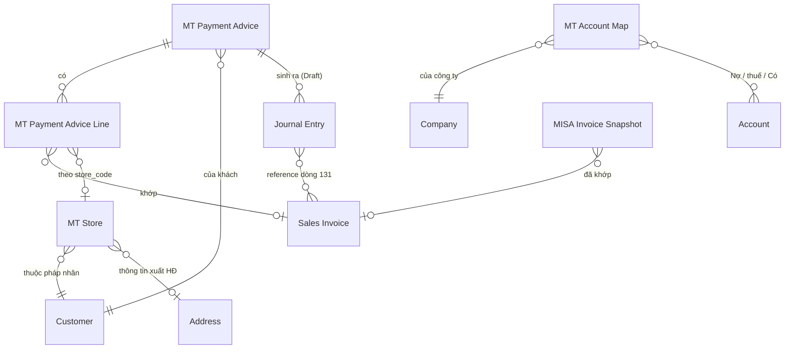

# Thiết kế MT-2 P1 — app `ketoan`, module MT

> Phạm vi: **MT2-A** (parser AEON + Fuji) · **MT2-C** (master `MT Store`) ·
> **MT2-D** (sinh Journal Entry Draft) · **MT2-E** (duyệt JE trên portal).
> Giai đoạn 1 (khai thác nghiệp vụ) bỏ qua — đã có `SOP_ke_toan_MT_RVHG.md` và
> `docs/blueprint/00_blueprint_p0.md`.
>
> Trạng thái: **GIAI ĐOẠN 2 — CHỜ DUYỆT**. Chưa viết code app.

---

## GIAI ĐOẠN 2 — DOCTYPE BLUEPRINT

### 2.0 Quyết định: tạo mới hay tái dùng

Nguyên tắc *Reuse > Create* của nextcode.

| Nhu cầu | Quyết định | Vì sao |
|---|---|---|
| Điểm siêu thị (store) + ánh xạ mã NCC → Customer | **DocType mới `MT Store`** | Có vòng đời riêng (mở/đóng điểm), nhiều bản ghi (Co.op ~120, LOTTE 19, CR 59 tên store), cần list/filter, là master được nhiều nơi tham chiếu |
| Số hiệu TK theo sự kiện × chuỗi | **DocType mới `MT Account Map`** | Nhiều bản ghi (sự kiện × chuỗi × công ty), kế toán tự sửa, không nhồi được vào Single Settings vì là bảng |
| Đánh dấu JE nào do MT sinh ra | **Custom Field trên `Journal Entry`** | Chỉ vài field, JE không có vòng đời riêng do ta định nghĩa — đúng tiêu chí Custom Field |
| Thêm chuỗi AEON, Fuji | **Sửa Select `chain` sẵn có** | Không phát sinh entity mới |
| Liên kết advice ↔ JE | **Custom Field trên JE, KHÔNG thêm bảng con vào advice** | Quan hệ 1-N từ phía JE; truy vấn ngược bằng index rẻ hơn, và JE bị hủy/xóa thì không để lại dòng con mồ côi |
| Ghi nhận thanh toán | **Journal Entry core** — KHÔNG Payment Entry | Ràng buộc SOP mục 0.4 |

**Không tạo**: DocType riêng cho "đợt thanh toán" (đã là `MT Payment Advice`),
DocType riêng cho phí (đã là dòng trong `MT Payment Advice Line`).

---

### 2.1 DocType mới: `MT Store`

- **Module**: MT
- **Naming**: `naming_series:` — `MT-STORE-.#####`
  *Vì sao không `format:{chain}-{store_code}`*: tên chuỗi có dấu chấm và khoảng
  trắng (`Saigon Co.op`, `Central Retail`) → docname xấu và dễ vỡ khi đổi tên
  chuỗi. Ràng buộc duy nhất `(chain, store_code)` ép ở `validate()`.
- **Is Submittable**: No · **Track Changes**: Yes
- **Title Field**: `store_name` · **Search Fields**: `store_code,store_name,vendor_code`

#### Fields

| Fieldname | Label | Type | Options | Reqd | InList | Filter | Ghi chú |
|---|---|---|---|---|---|---|---|
| `chain` | Chuỗi siêu thị | Select | (7 chuỗi, xem 2.4) | ✓ | ✓ | ✓ | |
| `store_code` | Mã điểm | Data | | ✓ | ✓ | | Giữ NGUYÊN VĂN kể cả số 0 đầu (`01019`, `8003`, `590072`) |
| `store_name` | Tên điểm | Data | | ✓ | ✓ | | |
| `customer` | Khách hàng | Link | Customer | | ✓ | ✓ | Pháp nhân xuất hóa đơn của điểm này |
| `address` | Địa chỉ / thông tin xuất HĐ | Link | Address | | | | Nguồn buyer info cho BKCK (MST chi nhánh LOTTE) |
| `tax_id` | MST của điểm | Data | | | | | Chỉ điền khi điểm có MST riêng (LOTTE). Đọc từ Address nếu trống |
| `vendor_code` | Mã NCC của mình tại chuỗi | Data | | | ✓ | ✓ | `7466` LOTTE · `100968` Emart · `2007766` Win · `0000003114` AEON · `27063` Mega · `3003172`/`3006634` CR |
| `active` | Đang hoạt động | Check | | | ✓ | ✓ | default 1 |
| `note` | Ghi chú | Small Text | | | | | |

#### Ràng buộc & tính toán

- `validate()`: `(chain, store_code)` **duy nhất**. Trùng → throw. Đây là khóa
  tự nhiên; thiếu ràng buộc này thì seed chạy hai lần là nhân đôi master.
- `store_code` chuẩn hóa: `strip()` + bỏ `\xa0`, **KHÔNG** ép số — mất số 0 đầu
  là hỏng khớp mã điểm (bài học §H.3 của contract).
- `tax_id` để trống thì đọc `Address.tax_id`/`gstin` khi cần; không sao chép sẵn
  để tránh hai nguồn sự thật lệch nhau.

#### Quan hệ

- Links to: `Customer`, `Address`
- Được đọc bởi: `mt._match_row`, `mt.detect_customer`, `mt_advice.detect_chain`
  (qua `vendor_code`), và MT2-B sau này (buyer info cho BKCK)

#### ⚠ Điểm phải chốt — `vendor_code` là của CHUỖI hay của ĐIỂM?

Đo trên file thật: `vendor_code` **giống nhau cho mọi điểm trong một chuỗi**
(LOTTE `007466` ở cả 19 store; AEON `0000003114` ở cả 6 sheet). Riêng Central
Retail có **hai** mã (`3003172`, `3006634`) nhưng đó là **hai pháp nhân EB**,
không phải hai điểm.

⇒ Đề xuất: giữ `vendor_code` trên `MT Store` (mỗi bản ghi lặp lại giá trị của
chuỗi mình) **và** truy vấn `DISTINCT` khi cần map chuỗi. Không tách bảng riêng
cho vendor_code vì sẽ đẻ thêm một master chỉ có 7 dòng.

---

### 2.2 DocType mới: `MT Account Map`

- **Module**: MT · **Naming**: `naming_series:` — `MT-ACC-.#####`
- **Is Submittable**: No · **Track Changes**: Yes

#### Fields

| Fieldname | Label | Type | Options | Reqd | Ghi chú |
|---|---|---|---|---|---|
| `event` | Sự kiện | Select | `Nhận thanh toán`⏎`Chiết khấu mình xuất`⏎`Phí chuỗi xuất` | ✓ | |
| `chain` | Chuỗi siêu thị | Select | (rỗng = áp cho MỌI chuỗi) | | Để trống là dòng mặc định |
| `company` | Công ty | Link | Company | ✓ | |
| `debit_account` | TK Nợ chính | Link | Account | ✓ | 112 / 5211 / 6411 |
| `tax_account` | TK Nợ thuế | Link | Account | | 33311 / 1331. Trống = không sinh dòng thuế |
| `credit_account` | TK Có | Link | Account | ✓ | 131 |
| `active` | Đang dùng | Check | | | default 1 |

#### Quy tắc tra cứu (quan trọng)

Tìm theo thứ tự, dừng ở dòng đầu tiên trúng:
1. `(event, chain, company)` khớp đủ
2. `(event, chain rỗng, company)` — dòng mặc định của công ty

Không tìm thấy → **throw**, KHÔNG lấy TK mặc định cứng trong code. Sinh JE vào
sai tài khoản còn tệ hơn không sinh.

#### Seed mặc định (patch, theo SOP mục 4)

| event | chain | debit | tax | credit |
|---|---|---|---|---|
| Nhận thanh toán | *(rỗng)* | `112` | — | `131` |
| Chiết khấu mình xuất | *(rỗng)* | `5211` | `33311` | `131` |
| Phí chuỗi xuất | *(rỗng)* | `6411` | `1331` | `131` |

Patch dò account theo **số hiệu đầu** trong Chart of Accounts của công ty
(`account_number LIKE '112%'`…). Không tìm được → tạo bản ghi với account để
trống + ghi log, KHÔNG đoán. Kế toán vào điền.

---

### 2.3 Custom Fields trên `Journal Entry` (qua `create_custom_fields` + patch)

| Fieldname | Label | Type | Options | Ghi chú |
|---|---|---|---|---|
| `custom_mt_source_dt` | Nguồn MT (DocType) | Data | | `MT Payment Advice` / `MT Bang Ke CK` |
| `custom_mt_source_name` | Nguồn MT (bản ghi) | Data | | `search_index=1` |
| `custom_mt_kind` | Loại bút toán MT | Select | `Thanh toán`⏎`Chiết khấu`⏎`Phí` | `in_standard_filter=1` |
| `custom_mt_fingerprint` | Vân tay chống trùng | Data | | `search_index=1`, `read_only=1` |

*Vì sao `Data` chứ không `Link` cho `custom_mt_source_name`*: JE là DocType core,
đặt `Link` trỏ vào DocType của app sẽ khóa việc xóa/đổi tên bản ghi MT và tạo
phụ thuộc ngược không cần thiết. Chỉ cần tra ngược được — `Data` + index là đủ.

**Vân tay** = sha1 của `(source_dt, source_name, kind, payment_date, tổng tiền,
danh sách SI đã sắp xếp)`. Có bản ghi JE mang cùng vân tay và `docstatus != 2`
→ **không sinh lại**. Đây là chốt chống sinh JE trùng khi bấm hai lần.

---

### 2.4 Sửa DocType sẵn có

#### `MT Payment Advice`

| Thay đổi | Chi tiết |
|---|---|
| `chain` Select | Thêm `AEON`, `Fuji` (và `Mega Market` để sẵn cho MT2-B) |
| `status` Select | Giữ nguyên 3 giá trị. **Ngữ nghĩa siết lại**: `Đã ghi nhận` chỉ được đặt khi MỌI JE liên quan đã `docstatus=1` |
| Field mới `je_state` | Select: *(rỗng)* ⏎ `Chưa sinh` ⏎ `Đã sinh nháp` ⏎ `Đã duyệt một phần` ⏎ `Đã duyệt đủ` — read_only, tính lại mỗi lần sinh/duyệt |

`chain` nằm trong DocType JSON (app-owned) → `bench migrate` tự đồng bộ.
`je_state` là field của DocType app, **không phải Custom Field** → cũng theo
migrate, không cần patch. Nhưng `custom_mt_chain` trên `Customer` **là** Custom
Field → **cần patch** để nới options.

#### `Customer.custom_mt_chain`

Nới options thêm `AEON`, `Fuji`, `Mega Market`. → patch mới.

#### Hằng `CHAIN_OPTIONS`

Hiện khai ở **3 nơi** phải khớp nhau: `mt.py`, `install.MT_CHAIN_OPTIONS`, và
Select `chain` trong DocType JSON. MT2-A sẽ **gom về một nguồn** (`install.py`)
và hai nơi kia đọc lại, kèm test khẳng định ba nơi bằng nhau — lệch một chỗ là
gán ra chuỗi không tồn tại.

---

### 2.5 ERD

---

### 2.6 🚩 BA ĐIỂM PHẢI CHỐT TRƯỚC KHI SANG GIAI ĐOẠN 3

#### Q1 — Dòng phí có reference được Sales Invoice không?

Ràng buộc anh đặt: *"Dòng chạm 131 BẮT BUỘC set reference_type/reference_name =
Sales Invoice"*. Nhưng dữ liệu thật **không phải lúc nào cũng cho phép**:

| Chuỗi | Khoản phí/CK | Gắn được SI? |
|---|---|---|
| Saigon Co.op | 17,75% trừ **trên từng hóa đơn** | ✅ được — file cho theo từng dòng HĐ |
| Central Retail | `D1` phí theo **kỳ**, ký hiệu `K26TEB` của EB | ❌ không — không thuộc hóa đơn nào |
| LOTTE | `PHI BAN HANG` / `PHI DICH VU KHAC` theo **store × kỳ** | ❌ không |
| Emart | `I1` phí hỗ trợ theo **kỳ** | ❌ không |
| AEON | `Costdet` theo **phiếu giao**, có số HĐ AEON | ❌ không (theo phiếu, không theo HĐ bán của mình) |

Hệ quả nếu ép cứng: 4/5 chuỗi **không sinh được JE phí**, phải làm tay — mất
gần hết giá trị của MT2-D.

**Đề xuất**: giữ ràng buộc cho **JE thanh toán** (bắt buộc, không ngoại lệ vì
đó là thứ trừ outstanding). Với **JE phí**, dòng Có 131 để **không reference**
khi file không cho biết hóa đơn nào, và ghi số hóa đơn của chuỗi vào
`user_remark` + `custom_mt_source_name`. Riêng **Co.op thì reference được** vì
file cho theo từng hóa đơn → làm đúng.

Hệ quả kế toán cần biết: JE phí không reference sẽ **giảm số dư 131 của khách**
nhưng **không giảm outstanding của từng hóa đơn**. Với 4 chuỗi trên, phần phí
được chuỗi trừ vào tổng thanh toán chứ không vào một hóa đơn cụ thể, nên đây là
phản ánh đúng bản chất — không phải chỗ chấp nhận cho qua.

#### Q2 — JE thanh toán: một JE cho cả đợt, hay một JE cho mỗi ngày?

Brief nói *"1 JE / (advice × payment_date)"*. Nhưng `MT Payment Advice` **đã
tách theo `payment_date`** từ MT-1 (LOTTE 2 kỳ = 2 advice, Co.op 8 kỳ = 8
advice). Vậy `advice × payment_date` **luôn là 1**.

**Đề xuất**: 1 JE thanh toán / advice. Nếu gặp advice có nhiều `payment_date` ở
dòng con (không nên xảy ra) thì **throw**, không tự tách — dữ liệu đã sai từ
tầng đọc, sinh JE lên trên là chôn lỗi.

#### Q3 — `MT Store` seed từ đâu?

File mẫu cho: LOTTE 19 `Store CD` + tên · CR 59 tên store **không có mã** ·
Co.op ~120 mã tiền tố + tên · AEON 6 `STORE CODE` · Mega 1 · Win **không có
store** · Emart **không có store** · Fuji **không có store**.

Central Retail **chỉ có tên, không có mã** → không seed được `store_code`.

**Đề xuất**: seed những chuỗi có mã (LOTTE, AEON, Co.op, Mega). Central Retail
seed với `store_code` = tên đã chuẩn hóa (bỏ dấu, upper, gạch dưới) và đánh dấu
`note = "mã suy từ tên, cần chuẩn lại khi có mã thật"`. Không bịa mã số.

---

## ✅ CỔNG DUYỆT — GIAI ĐOẠN 2

Anh duyệt phần trên (đặc biệt **Q1 · Q2 · Q3**) rồi em sang:

- **Giai đoạn 3** — Permission matrix (Role × DocType mới)
- **Giai đoạn 4** — Workflow (dự kiến **không cần**: JE đã có docstatus, advice
  chỉ cần status field; sẽ nêu lý do rồi bỏ qua)
- **Giai đoạn 5** — Integration & hooks plan
- **Giai đoạn 6** — Patch plan (thay cho fixtures — đã chốt ở BƯỚC 0)
