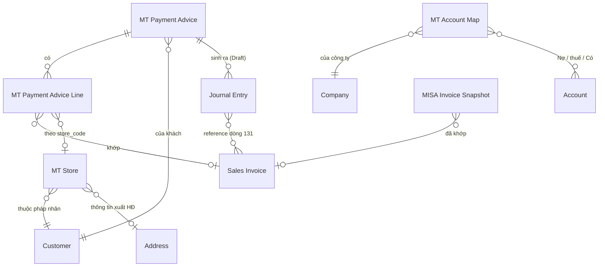

# Thiết kế MT-2 P1 — app `ketoan`, module MT

> Phạm vi: **MT2-A** (parser AEON + Fuji) · **MT2-C** (master `MT Store`) ·
> **MT2-D** (sinh Journal Entry Draft) · **MT2-E** (duyệt JE trên portal).
> Giai đoạn 1 (khai thác nghiệp vụ) bỏ qua — đã có `SOP_ke_toan_MT_RVHG.md` và
> `docs/blueprint/00_blueprint_p0.md`.
>
> Trạng thái: GĐ2 ✅ · GĐ3 ✅ · GĐ4 ✅ (bỏ, có lý do) · **GĐ5–6 CHỜ DUYỆT CUỐI**. Chưa viết code app.

---

## GIAI ĐOẠN 2 — DOCTYPE BLUEPRINT

### 2.0 Quyết định: tạo mới hay tái dùng

Nguyên tắc *Reuse > Create* của nextcode.

| Nhu cầu | Quyết định | Vì sao |
|---|---|---|
| Điểm siêu thị (store) + ánh xạ mã NCC → Customer | **DocType mới `MT Store`** | Có vòng đời riêng (mở/đóng điểm), nhiều bản ghi (Co.op ~120, LOTTE 19, CR 59 tên store), cần list/filter, là master được nhiều nơi tham chiếu |
| Số hiệu TK theo sự kiện × chuỗi | **DocType mới `MT Account Map`** | Nhiều bản ghi (sự kiện × chuỗi × công ty), kế toán tự sửa, không nhồi được vào Single Settings vì là bảng |
| Đánh dấu JE nào do MT sinh ra | **Custom Field trên `Journal Entry`** | Chỉ vài field, JE không có vòng đời riêng do ta định nghĩa — đúng tiêu chí Custom Field |
| Thêm chuỗi AEON, Fuji | **Sửa Select `chain` sẵn có** | Không phát sinh entity mới |
| Liên kết advice ↔ JE | **Custom Field trên JE, KHÔNG thêm bảng con vào advice** | Quan hệ 1-N từ phía JE; truy vấn ngược bằng index rẻ hơn, và JE bị hủy/xóa thì không để lại dòng con mồ côi |
| Ghi nhận thanh toán | **Journal Entry core** — KHÔNG Payment Entry | Ràng buộc SOP mục 0.4 |

**Không tạo**: DocType riêng cho "đợt thanh toán" (đã là `MT Payment Advice`),
DocType riêng cho phí (đã là dòng trong `MT Payment Advice Line`).

---

### 2.1 DocType mới: `MT Store`

- **Module**: MT
- **Naming**: `naming_series:` — `MT-STORE-.#####`
  *Vì sao không `format:{chain}-{store_code}`*: tên chuỗi có dấu chấm và khoảng
  trắng (`Saigon Co.op`, `Central Retail`) → docname xấu và dễ vỡ khi đổi tên
  chuỗi. Ràng buộc duy nhất `(chain, store_code)` ép ở `validate()`.
- **Is Submittable**: No · **Track Changes**: Yes
- **Title Field**: `store_name` · **Search Fields**: `store_code,store_name,vendor_code`

#### Fields

| Fieldname | Label | Type | Options | Reqd | InList | Filter | Ghi chú |
|---|---|---|---|---|---|---|---|
| `chain` | Chuỗi siêu thị | Select | (7 chuỗi, xem 2.4) | ✓ | ✓ | ✓ | |
| `store_code` | Mã điểm | Data | | ✓ | ✓ | | Giữ NGUYÊN VĂN kể cả số 0 đầu (`01019`, `8003`, `590072`) |
| `store_name` | Tên điểm | Data | | ✓ | ✓ | | |
| `customer` | Khách hàng | Link | Customer | | ✓ | ✓ | Pháp nhân xuất hóa đơn của điểm này |
| `address` | Địa chỉ / thông tin xuất HĐ | Link | Address | | | | Nguồn buyer info cho BKCK (MST chi nhánh LOTTE) |
| `tax_id` | MST của điểm | Data | | | | | Chỉ điền khi điểm có MST riêng (LOTTE). Đọc từ Address nếu trống |
| `vendor_code` | Mã NCC của mình tại chuỗi | Data | | | ✓ | ✓ | `7466` LOTTE · `100968` Emart · `2007766` Win · `0000003114` AEON · `27063` Mega · `3003172`/`3006634` CR |
| `active` | Đang hoạt động | Check | | | ✓ | ✓ | default 1 |
| `note` | Ghi chú | Small Text | | | | | |

#### Ràng buộc & tính toán

- `validate()`: `(chain, store_code)` **duy nhất**. Trùng → throw. Đây là khóa
  tự nhiên; thiếu ràng buộc này thì seed chạy hai lần là nhân đôi master.
- `store_code` chuẩn hóa: `strip()` + bỏ `\xa0`, **KHÔNG** ép số — mất số 0 đầu
  là hỏng khớp mã điểm (bài học §H.3 của contract).
- `tax_id` để trống thì đọc `Address.tax_id`/`gstin` khi cần; không sao chép sẵn
  để tránh hai nguồn sự thật lệch nhau.

#### Quan hệ

- Links to: `Customer`, `Address`
- Được đọc bởi: `mt._match_row`, `mt.detect_customer`, `mt_advice.detect_chain`
  (qua `vendor_code`), và MT2-B sau này (buyer info cho BKCK)

#### ⚠ Điểm phải chốt — `vendor_code` là của CHUỖI hay của ĐIỂM?

Đo trên file thật: `vendor_code` **giống nhau cho mọi điểm trong một chuỗi**
(LOTTE `007466` ở cả 19 store; AEON `0000003114` ở cả 6 sheet). Riêng Central
Retail có **hai** mã (`3003172`, `3006634`) nhưng đó là **hai pháp nhân EB**,
không phải hai điểm.

⇒ Đề xuất: giữ `vendor_code` trên `MT Store` (mỗi bản ghi lặp lại giá trị của
chuỗi mình) **và** truy vấn `DISTINCT` khi cần map chuỗi. Không tách bảng riêng
cho vendor_code vì sẽ đẻ thêm một master chỉ có 7 dòng.

---

### 2.2 DocType mới: `MT Account Map`

- **Module**: MT · **Naming**: `naming_series:` — `MT-ACC-.#####`
- **Is Submittable**: No · **Track Changes**: Yes

#### Fields

| Fieldname | Label | Type | Options | Reqd | Ghi chú |
|---|---|---|---|---|---|
| `event` | Sự kiện | Select | `Nhận thanh toán`⏎`Chiết khấu mình xuất`⏎`Phí chuỗi xuất` | ✓ | |
| `chain` | Chuỗi siêu thị | Select | (rỗng = áp cho MỌI chuỗi) | | Để trống là dòng mặc định |
| `company` | Công ty | Link | Company | ✓ | |
| `debit_account` | TK Nợ chính | Link | Account | ✓ | 112 / 5211 / 6411 |
| `tax_account` | TK Nợ thuế | Link | Account | | 33311 / 1331. Trống = không sinh dòng thuế |
| `credit_account` | TK Có | Link | Account | ✓ | 131 |
| `active` | Đang dùng | Check | | | default 1 |

#### Quy tắc tra cứu (quan trọng)

Tìm theo thứ tự, dừng ở dòng đầu tiên trúng:
1. `(event, chain, company)` khớp đủ
2. `(event, chain rỗng, company)` — dòng mặc định của công ty

Không tìm thấy → **throw**, KHÔNG lấy TK mặc định cứng trong code. Sinh JE vào
sai tài khoản còn tệ hơn không sinh.

#### Seed mặc định (patch, theo SOP mục 4)

| event | chain | debit | tax | credit |
|---|---|---|---|---|
| Nhận thanh toán | *(rỗng)* | `112` | — | `131` |
| Chiết khấu mình xuất | *(rỗng)* | `5211` | `33311` | `131` |
| Phí chuỗi xuất | *(rỗng)* | `6411` | `1331` | `131` |

Patch dò account theo **số hiệu đầu** trong Chart of Accounts của công ty
(`account_number LIKE '112%'`…). Không tìm được → tạo bản ghi với account để
trống + ghi log, KHÔNG đoán. Kế toán vào điền.

---

### 2.3 Custom Fields trên `Journal Entry` (qua `create_custom_fields` + patch)

| Fieldname | Label | Type | Options | Ghi chú |
|---|---|---|---|---|
| `custom_mt_source_dt` | Nguồn MT (DocType) | Data | | `MT Payment Advice` / `MT Bang Ke CK` |
| `custom_mt_source_name` | Nguồn MT (bản ghi) | Data | | `search_index=1` |
| `custom_mt_kind` | Loại bút toán MT | Select | `Thanh toán`⏎`Chiết khấu`⏎`Phí` | `in_standard_filter=1` |
| `custom_mt_fingerprint` | Vân tay chống trùng | Data | | `search_index=1`, `read_only=1` |

*Vì sao `Data` chứ không `Link` cho `custom_mt_source_name`*: JE là DocType core,
đặt `Link` trỏ vào DocType của app sẽ khóa việc xóa/đổi tên bản ghi MT và tạo
phụ thuộc ngược không cần thiết. Chỉ cần tra ngược được — `Data` + index là đủ.

**Vân tay** = sha1 của `(source_dt, source_name, kind, payment_date, tổng tiền,
danh sách SI đã sắp xếp)`. Có bản ghi JE mang cùng vân tay và `docstatus != 2`
→ **không sinh lại**. Đây là chốt chống sinh JE trùng khi bấm hai lần.

---

### 2.4 Sửa DocType sẵn có

#### `MT Payment Advice`

| Thay đổi | Chi tiết |
|---|---|
| `chain` Select | Thêm `AEON`, `Fuji` (và `Mega Market` để sẵn cho MT2-B) |
| `status` Select | Giữ nguyên 3 giá trị. **Ngữ nghĩa siết lại**: `Đã ghi nhận` chỉ được đặt khi MỌI JE liên quan đã `docstatus=1` |
| Field mới `je_state` | Select: *(rỗng)* ⏎ `Chưa sinh` ⏎ `Đã sinh nháp` ⏎ `Đã duyệt một phần` ⏎ `Đã duyệt đủ` — read_only, tính lại mỗi lần sinh/duyệt |

`chain` nằm trong DocType JSON (app-owned) → `bench migrate` tự đồng bộ.
`je_state` là field của DocType app, **không phải Custom Field** → cũng theo
migrate, không cần patch. Nhưng `custom_mt_chain` trên `Customer` **là** Custom
Field → **cần patch** để nới options.

#### `Customer.custom_mt_chain`

Nới options thêm `AEON`, `Fuji`, `Mega Market`. → patch mới.

#### Hằng `CHAIN_OPTIONS`

Hiện khai ở **3 nơi** phải khớp nhau: `mt.py`, `install.MT_CHAIN_OPTIONS`, và
Select `chain` trong DocType JSON. MT2-A sẽ **gom về một nguồn** (`install.py`)
và hai nơi kia đọc lại, kèm test khẳng định ba nơi bằng nhau — lệch một chỗ là
gán ra chuỗi không tồn tại.

---

### 2.5 ERD



---

### 2.6 ✅ BA ĐIỂM ĐÃ CHỐT (20/08/2026)

#### Q1 — JE phí: **một bút toán cả cục, ghi tham chiếu đầy đủ**

Ràng buộc "dòng 131 bắt buộc reference Sales Invoice" **chỉ áp cho JE thanh
toán**. Lý do dữ liệu: phí của Central Retail (`D1`), LOTTE (khoản `L`), Emart
(`I1`), AEON (`Costdet`) đều tính theo **kỳ** hoặc **phiếu giao**, không thuộc
hóa đơn bán nào — ép cứng thì 4/5 chuỗi không sinh được JE phí.

Chốt:

| Loại JE | Dòng 131 | Tham chiếu |
|---|---|---|
| **Thanh toán** | ~~1 dòng / Sales Invoice~~ → **1 dòng gộp** *(sửa 20/08/2026, xem dưới)* | ~~reference bắt buộc~~ → không reference |
| **Phí chuỗi xuất** | **1 dòng gộp cả cục** | Không reference SI. Ghi ĐẦY ĐỦ vào `user_remark`: chuỗi · kỳ · số hóa đơn của chuỗi · danh sách khoản trừ · tên bảng kê nguồn |
| **Chiết khấu mình xuất** (MT2-B) | 1 dòng gộp | `user_remark` ghi số BKCK + số hóa đơn CK |

Hệ quả kế toán **phải biết**: JE phí gộp làm **giảm số dư 131 của khách** nhưng
**không giảm outstanding của từng hóa đơn**. Đúng bản chất — chuỗi trừ phí vào
tổng thanh toán của kỳ, không trừ vào một hóa đơn cụ thể. Câu này sẽ hiện ngay
trên màn duyệt JE, không giấu trong tooltip.

Riêng Co.op có 17,75% theo **từng hóa đơn**: vẫn gộp một dòng 131 theo quyết
định trên, nhưng `user_remark` liệt kê chi tiết từng hóa đơn + số tiền trừ, vì
dữ liệu có sẵn — "ghi tham chiếu đầy đủ" đúng nghĩa.

#### ✏️ SỬA Q1 (20/08/2026) — **bút toán thanh toán cũng ghi 1 dòng tổng**

Người dùng chốt: *"131 thanh toán các hóa đơn chỉ cần ghi tổng thanh toán. Đã có
trang gạch hóa đơn thanh toán riêng."*

Đúng, và nó nhất quán với một quyết định đã có từ **MT-1**: ở kênh MT, con số
"đã thu / còn lại" tính từ **chính các dòng bảng kê**, không từ
`outstanding_amount` của ERPNext (xem chú thích `mtOverview` trong `api.js`).
Gắn reference Sales Invoice lên dòng 131 là dựng **cơ chế gạch nợ thứ hai** —
hai nguồn sự thật sẽ lệch nhau ngay kỳ đầu có một hóa đơn bị điều chỉnh.

Bảng cuối cùng: **cả ba loại JE đều ghi Có 131 một dòng tổng cho một pháp nhân,
không reference.**

| | Trước | Sau |
|---|---|---|
| Dòng 131 của JE thanh toán | 1 dòng / hóa đơn, có reference | **1 dòng tổng**, không reference |
| Dòng thanh toán chưa gạch được hóa đơn | **bị LOẠI** khỏi JE (để JE còn cân) → tiền đã về mà không vào sổ | **vẫn vào JE**, kèm cảnh báo |
| Việc gạch hóa đơn | JE reference + màn 'Quản lý thanh toán' (trùng nhau) | chỉ màn 'Quản lý thanh toán' |
| Tra ngược từ JE về hóa đơn | qua reference | qua `user_remark` (liệt kê tối đa 60 hóa đơn + số tiền) |

Đổi này còn **sửa một lỗ mất tiền**: ở bản cũ, dòng thanh toán chưa nối được hóa
đơn buộc phải loại khỏi bút toán để bút toán còn cân — tiền thật đã về nhưng
không được ghi sổ, chỉ có một dòng cảnh báo.

#### Q2 — 1 JE thanh toán / advice ✅

`MT Payment Advice` đã tách theo `payment_date` từ MT-1, nên `advice ×
payment_date` luôn là 1. Advice có nhiều `payment_date` ở dòng con → **throw**,
không tự tách: dữ liệu đã sai từ tầng đọc, sinh JE lên trên là chôn lỗi.

#### Q3 — Central Retail: tên store nằm trong **ngoặc** ở `shipping_address_name` ✅

Đây là nguồn TỐT HƠN file chuỗi: lấy từ **chính ERPNext**, có sẵn link Address,
và là dữ liệu mình kiểm soát.

Quy tắc seed CR:
- Quét `shipping_address_name` của Sales Invoice kênh MT thuộc Customer Central
  Retail (và/hoặc quét thẳng `tabAddress`).
- `store_name` = phần trong **cặp ngoặc cuối cùng** của tên address.
  Lấy ngoặc CUỐI vì tên address có thể chứa ngoặc khác ở giữa.
- `store_code` = tên đã chuẩn hóa (bỏ dấu, upper, khoảng trắng → `_`).
- `address` = chính Address đó → BKCK lấy được buyer info ngay.
- Không tìm thấy ngoặc → **bỏ qua và ghi log**, không lấy cả tên address làm
  store (sẽ đẻ ra store rác trùng nhau).

Với 4 chuỗi có mã thật (LOTTE, AEON, Co.op, Mega) vẫn seed từ file mẫu như cũ.

---

## GIAI ĐOẠN 3 — PERMISSION MATRIX

### 3.0 Nguyên tắc áp dụng cho MT-2

1. **DocType của app** (`MT Store`, `MT Account Map`) → DocPerm ghi thẳng trong
   DocType JSON. Convention "KHÔNG ship DocPerm qua fixtures" của repo nhắm vào
   DocType **core**; DocType do app sở hữu thì JSON chính là nguồn.
2. **DocType core** (`Journal Entry`) → cấp bằng `add_permission` trong
   `install.py`, đúng lối đã dùng cho Sales Invoice/Customer.
3. **Quyền GHI của nghiệp vụ tiền nằm ở kế toán trưởng.** Kế toán MT làm việc
   hằng ngày qua **portal** — nơi mọi thao tác ghi đều đi qua whitelisted method
   có `guard_manager()`. Cấp `write` trên Desk cho `Ke Toan MT` là **vô hiệu hóa
   guard** (đúng lỗi đã mắc và đã sửa ở MT-1 với `MT Payment Advice`).
4. **Không dùng permlevel** ở P1: không có nhóm field nhạy cảm nào cần che riêng
   trong 2 DocType mới. Thêm permlevel khi chưa cần là đẻ ra lỗi khó truy.

### 3.1 `MT Store`

| Role | Lvl | R | W | C | D | Report | Print | Export | If Owner |
|---|---|---|---|---|---|---|---|---|---|
| System Manager | 0 | ✓ | ✓ | ✓ | ✓ | ✓ | ✓ | ✓ | |
| Ke Toan Truong | 0 | ✓ | ✓ | ✓ | ✓ | ✓ | ✓ | ✓ | |
| Accounts Manager | 0 | ✓ | ✓ | ✓ | | ✓ | ✓ | ✓ | |
| Ke Toan MT | 0 | ✓ | | | | ✓ | ✓ | | |
| Accounts User | 0 | ✓ | | | | ✓ | | | |

*Vì sao `Ke Toan MT` không có `write`*: mở/đóng điểm siêu thị là việc **thưa**
(vài lần/năm) nhưng sai thì **định tuyến tiền sai** — store gắn nhầm pháp nhân
là cả kỳ công nợ chạy sang khách khác. Để trưởng chốt.

### 3.2 `MT Account Map`

| Role | Lvl | R | W | C | D | Report | Print |
|---|---|---|---|---|---|---|---|
| System Manager | 0 | ✓ | ✓ | ✓ | ✓ | ✓ | ✓ |
| Ke Toan Truong | 0 | ✓ | ✓ | ✓ | ✓ | ✓ | ✓ |
| Accounts Manager | 0 | ✓ | ✓ | ✓ | | ✓ | ✓ |
| Ke Toan MT | 0 | ✓ | | | | ✓ | |
| Accounts User | 0 | ✓ | | | | ✓ | |

`Ke Toan MT` **có `read`** — cần thấy TK nào sẽ được dùng ngay trên màn xem
trước JE. Giấu đi thì họ duyệt một bút toán mà không biết nó vào tài khoản nào.

### 3.3 `Journal Entry` (core — cấp qua `install.py`)

Ma trận hiện hành (`_SALES_CHANNEL_PERMS`) đã cho `Ke Toan MT` quyền
`DRAFT_DOC` = read/write/create/print/report trên Journal Entry — **không có
`submit`**. Đúng ý đồ: kế toán kênh lập nháp, không tự ghi sổ.

**MT-2 KHÔNG nới quyền này.** Việc duyệt JE trên portal (MT2-E) đi qua
whitelisted method có `guard_manager()`, và bản thân `doc.submit()` chạy dưới
quyền của user — nên **chỉ kế toán trưởng duyệt được**, đúng như hiện trạng
(`Ke Toan Truong` thừa hưởng `FULL_DOC` cho Journal Entry).

| Role | submit JE | Ghi chú |
|---|---|---|
| Ke Toan MT | ❌ | Lập nháp + xem; bấm duyệt sẽ bị guard chặn |
| Ke Toan Hach Toan | ✓ | `FULL_DOC` sẵn có |
| Ke Toan Truong | ✓ | |

#### ✅ Q4 đã chốt (phương án **a**)

Người kế toán phụ trách kênh MT **mang thêm role `Ke Toan Truong`**.
**KHÔNG nới `submit` Journal Entry cho `Ke Toan MT`.**

Hệ quả cho build:
- Ma trận quyền `install.py` **giữ nguyên**, MT-2 không đụng vào.
- `mt.submit_journal_entries()` vẫn `guard_manager()` ở dòng đầu — đúng.
- Tab "Duyệt bút toán" **ẩn nút duyệt** với user không phải chief
  (`ov.can_import` đã là `is_chief()`), giống cách `state.canManage` đang làm.
  Hiện nút cho người không có quyền chỉ tạo một cú bấm để nhận lỗi.
- Khi giao tài khoản cho kế toán MT: **phải gán 2 role**. Ghi vào SOP mục 0.

### 3.4 User Permission

Không đặt User Permission mới ở P1. Lọc theo công ty đã do `mt._company()` lo ở
tầng API (kiểm bằng User Permission trên `Company` nếu có khai).

---

## GIAI ĐOẠN 4 — WORKFLOW BLUEPRINT

### ❌ KHÔNG dùng Workflow doctype — có lý do

Tiêu chí của skill: chỉ dựng Workflow khi DocType có **>3 trạng thái + chuyển
trạng thái theo role**. Đối chiếu:

| Đối tượng | Trạng thái | Kết luận |
|---|---|---|
| `Journal Entry` | Draft → Submitted → Cancelled | **Đã có `docstatus` của core.** Chồng Workflow lên JE là đè lên cơ chế ghi sổ của ERPNext — rủi ro rất cao, lợi ích bằng 0 |
| `MT Payment Advice` | Nháp / Đã đối chiếu / Đã ghi nhận | Là **thuộc tính** phản ánh tiến độ, không có chuyển trạng thái theo role. Đúng định nghĩa "status field", không phải workflow |
| `MT Store`, `MT Account Map` | master data | Không có vòng đời |

⇒ **Bỏ qua giai đoạn 4.** Thay bằng ràng buộc trong controller:

- `MT Payment Advice.status = 'Đã ghi nhận'` **chỉ** khi mọi JE mang
  `custom_mt_source_name = advice.name` đều `docstatus = 1`. Đặt tay trên Desk
  mà chưa đủ điều kiện → `validate()` throw.
- `je_state` (read_only) tính lại từ chính các JE đó, không cho sửa tay.

---

---

## GIAI ĐOẠN 5 — INTEGRATION & HOOKS PLAN

### 5.1 Điểm chạm với ERPNext core

| DocType core | Chiều | Việc |
|---|---|---|
| `Journal Entry` | **GHI** (tạo Draft) | Sản phẩm chính của MT2-D. Không bao giờ `submit()` tự động |
| `Sales Invoice` | ĐỌC | `reference_name` dòng 131 của JE thanh toán; nguồn `shipping_address_name` để seed store CR |
| `Customer` | ĐỌC + custom field | `custom_mt_chain` (đã có, nới options) |
| `Address` | ĐỌC | buyer info cho `MT Store`; nguồn tên store CR |
| `Account`, `Company` | ĐỌC | `MT Account Map` |
| `MISA Invoice Snapshot` | ĐỌC | đã dùng ở MT-1, không đổi |

**KHÔNG đụng**: `Payment Entry` (ràng buộc JE-only), `GL Entry` (chỉ core ghi),
`Stock Entry` (hàng trả đi đường chứng từ trả hàng của ERPNext).

### 5.2 `hooks.py` — chỉ thêm 2 doc_events

```python
doc_events = {
    "Journal Entry": {
        "on_submit":  "ketoan.api.mt_je.sync_advice_state",
        "on_cancel":  "ketoan.api.mt_je.sync_advice_state",
    },
}
```

> **Ghi nhận khi build MT2-D (20/08/2026) — MỘT LỖI TIỀN ĐÃ BỊ CHẶN**
>
> `MT Payment Advice Line.total_amount` lưu số **GIỮ NGUYÊN DẤU** (xem
> `mt._map_rows`), không phải độ lớn. Bản đầu của `mt_je` cộng `abs()` từng dòng
> cho nhóm khoản trừ — đúng với dòng thanh toán (mỗi dòng một hóa đơn riêng)
> nhưng **sai với nhóm gộp**, vì `Sub-Total` mà chuỗi in ra là tổng **đại số**.
> Đo trên file thật, ba nhóm có cả dòng trừ lẫn dòng hoàn:
>
> | Chuỗi · loại | Tổng đại số (đúng) | Cộng độ lớn (sai) | Ghi khống |
> |---|---|---|---|
> | Saigon Co.op · Chiết khấu | 1.338.010.941 | 1.662.373.817 | **324.362.876** |
> | AEON · Phí | 10.424.817 | 11.023.025 | 598.208 |
> | LOTTE · Ghi giảm *(không sinh JE)* | 809.335 | 11.868.813 | 11.059.478 |
>
> Bút toán sai vẫn **CÂN**, con số vẫn trông hợp lý, và không tổng nào trên màn
> hình phát hiện ra — chỉ lộ khi đối chiếu sao kê ngân hàng. Nay `_group_amount`
> dùng `|Σ đại số|`, nhóm dấu lẫn lộn được **gắn cờ** ra tận màn duyệt, và
> `docs/mt/verified/je_plan_check.py` khóa cả ba con số lại.

**Vì sao cần**: `je_state` và `status='Đã ghi nhận'` của advice suy từ docstatus
của các JE. Kế toán hoàn toàn có thể submit/cancel JE **thẳng trên Desk**, không
qua portal. Thiếu hook thì advice đứng mãi ở "Đã sinh nháp" trong khi JE đã ghi
sổ — màn hình nói dối.

Hàm bọc `try/except` + `log_error` toàn bộ: **tích hợp MT hỏng không được chặn
việc ghi sổ**. Cùng nguyên tắc `misa_sync.ensure_ref_id`.

**KHÔNG thêm**: `scheduler_events` (không có việc định kỳ ở P1),
`override_doctype_class`, `jinja` (Print Format của BKCK thuộc MT2-B).

### 5.3 Whitelisted endpoints mới

| Method | Guard | Việc |
|---|---|---|
| `mt_je.preview_journal_entries(advice)` | `guard_mt` | Xem trước JE sẽ sinh: từng dòng, TK, tiền, SI reference. **KHÔNG ghi** |
| `mt_je.create_journal_entries(advice, expected_hash)` | `guard_manager` | Sinh JE Draft. Bắt buộc vân tay từ preview |
| `mt_je.list_advices(...)` | `guard_mt` | Bảng kê + `je_state` của từng cái, lọc chuỗi/kỳ/trạng thái, chia trang |
| `mt_je.list_draft_journal_entries(...)` | `guard_mt` | *(MT2-E)* Danh sách JE Draft do MT sinh |
| `mt_je.submit_journal_entries(names)` | `guard_manager` | *(MT2-E)* Duyệt. **try/except từng JE**, trả kết quả per-JE |
| `mt_je.get_account_map(company)` | `guard_mt` | Bảng TK đang áp dụng — để màn xem trước nói rõ bút toán vào TK nào |
| `mt_store.preview_seed()` | `guard_mt` | Xem trước danh sách store dựng được |
| `mt_store.commit_seed(expected_hash)` | `guard_manager` | Tạo `MT Store` |
| `mt_store.list_stores(...)` | `guard_mt` | Danh sách điểm, lọc chuỗi/khách/trạng thái, chia trang |
| `mt_store.save_store(...)` | `guard_manager` | Sửa một điểm (gán pháp nhân, địa chỉ, đóng điểm) |
| `mt_store.search_addresses(txt, customer)` | `guard_mt` | Gợi ý địa chỉ để gán, LỌC theo khách |

> **Điều chỉnh khi build (20/08/2026)**: nhóm điểm siêu thị nằm ở module riêng
> `ketoan/api/mt_store.py` và nhóm bút toán ở `ketoan/api/mt_je.py`, thay vì
> nhét thêm vào `mt.py` — mt.py đã ~2.500 dòng
> và lo một việc khác hẳn (đối chiếu bảng kê với hóa đơn). Đúng quy ước
> "1 file = 1 chức năng" của repo. Ba endpoint cuối là bổ sung: seed mà không
> có màn xem/sửa thì master không dùng được, và `save_store` là đường GHI duy
> nhất cho kế toán trưởng (Desk vẫn chỉ-đọc với `Ke Toan MT` đúng như §3.1).

Mọi method **guard ở DÒNG ĐẦU**, `_require_tables()` ngay sau — đúng lối MT-1.

### 5.4 Nguồn seed `MT Store` — từ DỮ LIỆU TRÊN SITE, không ship file mẫu

| Chuỗi | Nguồn seed |
|---|---|
| LOTTE · AEON · Co.op · Mega | `MT Payment Advice Line.store_code/store_name` **đã nạp trên site** — `DISTINCT` theo chuỗi |
| Central Retail | `Address` / `Sales Invoice.shipping_address_name` — lấy phần trong **cặp ngoặc cuối** |
| Win · Emart · Fuji | Không có store trong chứng từ → **không seed**, để trống |

*Vì sao không seed từ `docs/mt/samples/`*: file mẫu là ảnh chụp một kỳ, site có
dữ liệu đầy đủ hơn và luôn mới hơn. Ship dữ liệu mẫu vào patch là đóng băng một
thời điểm rồi lệch dần.

**Preview bắt buộc** trước khi ghi (lối `misa_legacy`): store dựng từ heuristic
(CR lấy trong ngoặc) nên người phải nhìn trước khi tạo master.

### 5.5 Thứ tự phụ thuộc khi build

```
MT2-A (parser AEON+Fuji)   ── độc lập, ship trước, có giá trị ngay
        │
MT2-C (MT Store)           ── cần advice đã nạp để seed
        │
MT2-D (JE Draft)           ── cần MT Account Map + advice đã đối chiếu
        │
MT2-E (duyệt trên portal)  ── cần JE đã sinh
```

---

## GIAI ĐOẠN 6 — PATCH PLAN (thay cho fixtures)

Đã chốt ở BƯỚC 0: **`create_custom_fields` + patch**, KHÔNG fixtures.
Quy tắc bất di bất dịch của repo: **thêm field mới = thêm patch mới**.

`patches.txt` đang ở `v0_0_12`. Dự kiến:

| Patch | Hạng mục | Việc |
|---|---|---|
| `v0_0_13.mt_chain_aeon_fuji` | MT2-A | Nới options `Customer.custom_mt_chain` thêm `AEON`, `Fuji`, `Mega Market`. Select `chain` của `MT Payment Advice` tự theo migrate (DocType app-owned) |
| `v0_0_14.mt_je_custom_fields` | MT2-D | 4 custom field trên `Journal Entry` (`custom_mt_source_dt`, `custom_mt_source_name`, `custom_mt_kind`, `custom_mt_fingerprint`) |
| `v0_0_15.mt_account_map_seed` | MT2-D | Seed 3 dòng `MT Account Map` mặc định cho mỗi Company. Dò account theo số hiệu đầu; không tìm được → tạo dòng với account TRỐNG + log, **không đoán** |

**Không cần patch**: `MT Store`, `MT Account Map`, field `je_state` — đều là
DocType/field do app sở hữu, `bench migrate` tự đồng bộ.

**Không có patch seed `MT Store`**: seed đi qua preview + commit trên portal
(mục 5.4), vì dựng store là heuristic phải cho người nhìn trước.

### Kiểm tra bắt buộc trước mỗi commit

1. `python3 -m py_compile` mọi file `.py` đụng tới
2. `node --check` mọi file `.js` đụng tới
3. `python3 -c "import json; json.load(...)"` mọi DocType JSON
4. **`python3 docs/mt/verified/regression_check.py`** — 5 chuỗi cũ phải vẫn
   đúng từng đồng. Đây là chốt chặn: MT2-A sửa `mt_advice.py` là đụng thẳng vào
   tầng đọc của 5 chuỗi đang chạy
5. Kiểm AST: mọi `@frappe.whitelist` có guard ở dòng đầu
6. Ba nơi khai `CHAIN_OPTIONS` phải khớp nhau

### Commit convention

Một commit / hạng mục, tiêu đề ghi rõ `MT2-A` / `MT2-C` / `MT2-D` / `MT2-E`.
Push cả nhánh `claude/zen-babbage-0vj0eg` và `main`.

---

## ✅ CỔNG DUYỆT CUỐI — TOÀN BỘ THIẾT KẾ P1

| Giai đoạn | Trạng thái |
|---|---|
| 2 — DocType blueprint | ✅ duyệt (Q1·Q2·Q3 chốt ở 2.6) |
| 3 — Permission matrix | ✅ duyệt (Q4 chốt phương án **a**) |
| 4 — Workflow | ✅ **bỏ có lý do** |
| 5 — Integration & hooks | **chờ duyệt** |
| 6 — Patch plan | **chờ duyệt** |

Duyệt xong thì chuyển sang `nextcode-build`, thứ tự **A → C → D → E**.
